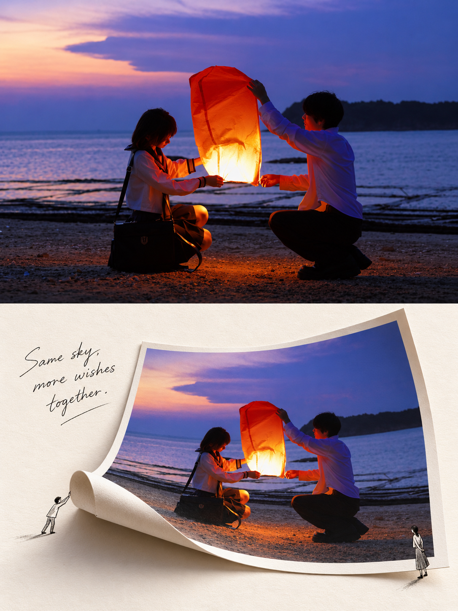
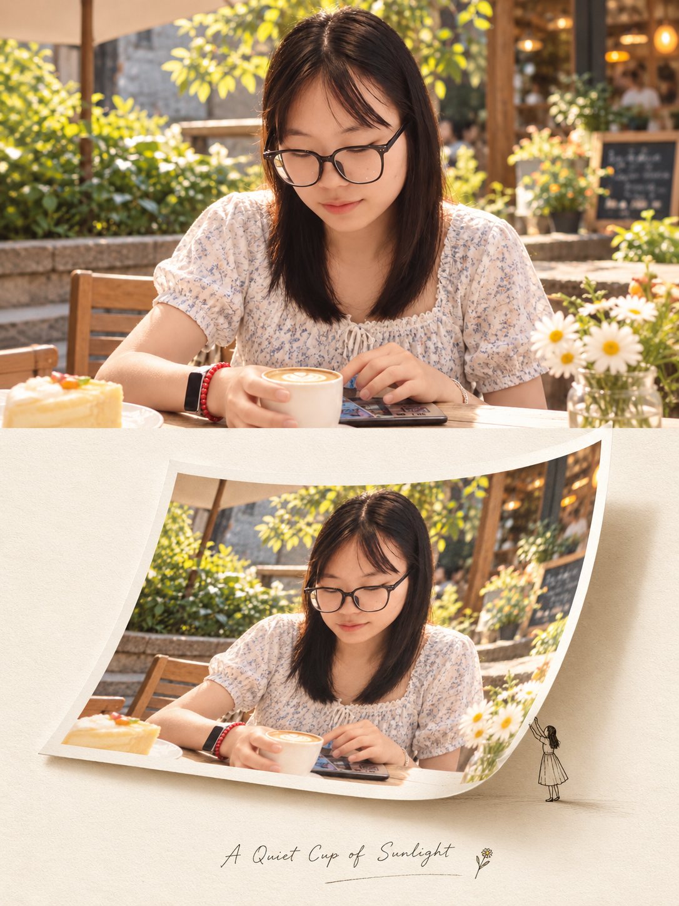

## 立体卷页纸图

请将我上传的每一张参考照片分别、独立处理，为每张照片生成一张独立的 3:4 竖版「真实摄影＋立体卷页纸艺拼贴」上下对照艺术海报。每张输入照片只输出一张完整成品，不得将多张照片拼接、合并、并置或共享同一套图文结构；必须逐张单独分析、单独转化。整张画面采用清晰稳定的上下双联版式，上半部分约占画面高度 47%，下半部分约占画面高度 53%，比例关系应明确、稳定、自然。上下两部分必须始终表现 同一主体、同一场景、同一空间关系，整体融合纪实摄影、旅行杂志、纸张工程、立体书、手工拼贴与 editorial design 的视觉气质。
上半区为 真实摄影展示区，必须以对应上传照片为唯一内容依据，并尽可能忠实保留原图本身的摄影属性。人物、动物、建筑、车辆、植物、器物、山水、天空、水面及其他重要元素的身份、数量、外形、姿态、朝向、比例、位置、遮挡关系、层次、视角、透视、背景、光线、倒影与标志性色彩都应保持不变。不得镜像、不得拉伸、不得裁断主体、不得增删主体、不得重构场景。应根据原图自身特征自然保留其摄影语言，例如广角、标准镜头或长焦视感，保留自然景深、环境光、HDR 层次、空气透视、真实材质、轻微胶片颗粒感与旅行杂志式摄影气质；若原图具有逆光、夜景、雨雾、漏光、黄昏、反射、水汽等独特氛围，也必须完整保留。为了适配 3:4 竖版构图，可以对天空、地面、水面或非主体背景进行少量、自然、无痕的延展，但不得破坏原图的空间逻辑和场景真实性。
下半区为 立体卷页纸艺拼贴区，必须继续以同一张上方照片为唯一视觉依据，并将“同一画面”转化为一个具有真实纸张工程感的立体卷页场景。下半区背景应使用暖象牙白、奶油白或浅米色的厚实艺术纸，纸面带有细腻的纤维、颗粒、轻微压纹、非常克制的轻微泛黄与柔和哑光质感。整体背景必须干净、安静、有呼吸感，不做脏乱做旧，不添加无关装饰，不拼贴杂乱元素，让大面积暖白留白成为版式的重要组成部分。
下半区的核心必须是：将上半部分 同一画面 仿佛完整印制在一张 独立高克重照片纸 上，并把这张照片纸放置在下半区中央偏右的位置。照片纸上的图像必须与上半区保持清晰一致的对应关系，即主体、构图、颜色、方向、比例、空间关系和主要场景逻辑都应一致，让观者一眼看出这是同一张照片被“印在纸上”之后，再被立体地从平面里拉起、翻折、展开。这里的重点不是重新画一张下半区，也不是把照片简单弯曲变形，而是要呈现一种“原本平面的摄影图像从纸页中被立起来”的纸张工程视觉叙事。
这张照片纸必须形成明确的 卷页 / 翻页 / 立体展开 状态。可以让其上部或右侧近似竖直站立，纸面从下缘或左下侧自然弯起，形成一个宽大、柔和、真实的弧形卷页；局部可翘起、下垂、翻折或略微悬空，呈现高克重照片纸在受力后的自然弯曲形态。卷起与翻折时必须清楚表现纸张的厚度、纸芯、边缘层次与纤维断面感，让人明确感受到它是一张真实可触的厚纸，而不是布匹、塑料片、轻薄薄膜或数字蒙版。弯曲区域只允许产生少量、合理的透视变化与轻微形变，用于服从纸张卷曲逻辑，但图像内容本身不得融化、拉长、扭曲、重组或变得不连贯，不可破坏原始画面的主体识别度。
下半区的空间质感必须强调真实的 paper engineering / pop-up book / curled page / layered collage 气质。卷起的照片纸与背景纸面之间应形成柔和、自然、可信的接触阴影，纸张底部、背后和卷曲内侧可带有 AO 环境遮蔽感与渐变投影，以增强纸页被抬起后的真实空间层次。阴影必须柔和、轻透、克制，强调厚纸与底纸之间的距离、重量与接触关系，而不是制造戏剧化强打光或生硬黑影。纸面整体保持半哑光质感，不做镜面反光，不过度数码化，也不渲染成硬折板、塑料片、布料褶皱或假 3D 模型。
下半区应保留足够的大面积暖白留白，使卷页纸艺主体成为被陈列在纸面上的核心对象，而不是填满整个区域。可以选择性加入 0–2 个极简黑色线稿小人，但这些小人必须非常克制，只能作为对卷页纸张进行真实互动的辅助角色存在，而不能成为装饰元素。若加入小人，他们必须与照片纸产生明确、可信的动作关系，例如拉开、推起、撑住、铺平、进入、展开、扶住、观察或从卷页边缘探入。小人应采用极简细线条、黑色轮廓、轻量、安静的编辑式简笔语言，尺寸不宜过大，不可喧宾夺主，也不可做成卡通主角或儿童插图风格。
文字部分只允许极少量介入。在下半区留白区域中，自动生成 一句与参考图主体、地点感、动作、季节氛围或情绪强相关的英文手写短句。这句文字必须根据每张照片单独生成，内容自然、贴合、轻盈，不能使用固定套句，也不得复用上一张图的文案。字体应像细马克笔或签字笔写下的自然手写体，线条轻、清楚、克制，具有温和的人手书写感。除这一句英文短句之外，不增加其他标题、标签、说明、编号或正文，不得生成多余文字、乱码、伪文字、Logo 或水印。
整张海报最终应呈现为：上半区是真实、完整、具有旅行杂志与纪实摄影气质的现实瞬间；下半区则像这同一瞬间被印在一张高克重照片纸上，再从暖白艺术纸面中被拉起、翻折、卷起并立体展开。上下两部分必须保持明确的一致性与对应关系，让观者清楚感受到“真实瞬间从画册纸页里立起来”的视觉叙事。整体气质应高级、克制、清晰、温暖、具有收藏感与设计感，融合纪实摄影、纸张工程、立体书、手工拼贴与 editorial design 的审美，但始终保持画面干净、安静、有呼吸感。
负面提示词：多图拼接、多照片合成、上下内容不一致、主体重复或缺失、身份改变、人物换脸、主体变形、镜像、拉伸、错误透视、错误遮挡、错误方向、原图重构、摄影区插画化、下半区另起炉灶、纸张像布匹、纸张过薄、塑料片质感、硬折板感、数字蒙版感、图像融化、卷曲区域严重拉伸、强烈硬阴影、夸张戏剧化投影、复杂装饰、杂乱拼贴、儿童手工风、卡通、动漫、Q版、赛璐璐、厚重 CG、3D 渲染感过强、脏乱旧纸、过度泛黄、过度做旧、无关小人装饰、文字过多、固定套句、英文乱码、伪文字、Logo、水印、平台角标。

  

**参考图**

   
          
图1
   
   
          
图2
   
 

