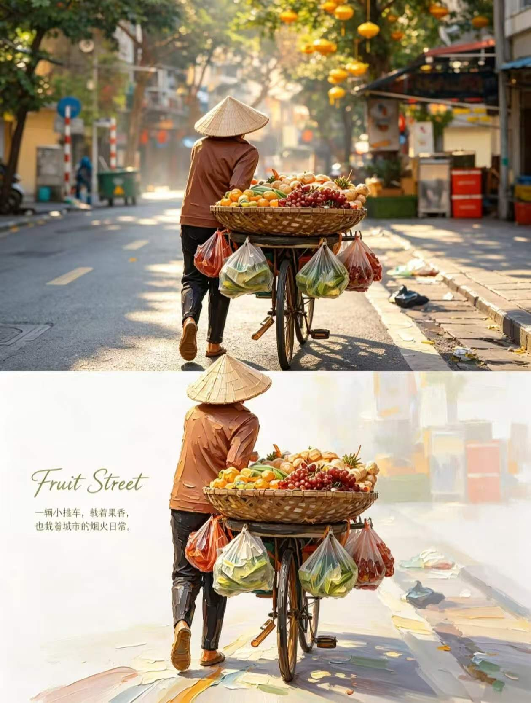
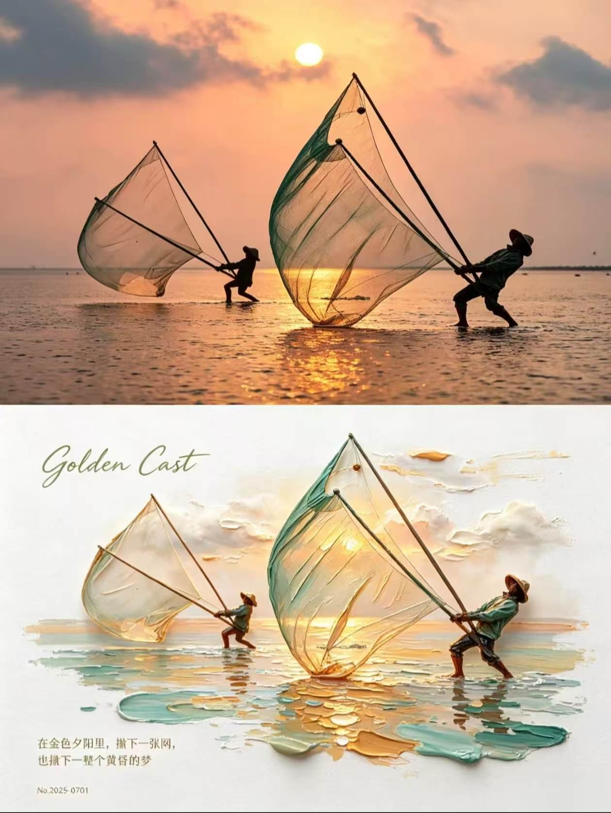

## 3D 厚涂油画图

请将我上传的每一张原始照片分别、独立处理，为每张照片生成一张独立的高级设计海报。每张输入照片只输出一张完整成品，不得将多张照片拼接、合并、并置或共享同一套图文结构；必须逐张单独分析、单独转化。整体统一采用严格的 3:4 垂直构图，画面上下严格按 1:1 等分，上半部分占画面高度约 50%，下半部分占画面高度约 50%，比例不得偏移。整张作品必须是一张完整海报，而不是多图拼贴或多画面组合。

上半部分为真实摄影展示区，必须尽可能忠实保留对应原始照片本身的内容与摄影属性。主体人物、动物或其他核心对象的身份、结构、比例、姿态、神情、叙事关系、真实材质、空间关系、透视关系、自然光影、阴影层次以及原生色彩氛围都应保持不变。只允许进行非常轻微、克制而高级的彩色分级处理，使其达到艺术杂志、独立出版物或展览摄影的质感，例如统一色调、细腻优化反差、压低杂乱感、保留真实层次与现场气息，但不得改变原图内容本身。为了适配画幅，可以对天空、地面或周围环境背景进行少量、自然、无痕的延展，也可以进行合理裁切，但禁止拉伸、扭曲、替换、重塑或重绘主体，不得改变主体结构、姿态与核心构图。

下半部分必须以同一张上方照片为唯一视觉依据，提取原图的核心主题、主体轮廓、姿态、人物或主体之间的叙事关系、视觉重心和整体气氛，并将其重构为一幅 3D 厚涂油画风格的微型风景插画。重点不是机械照搬原图，也不是做成普通平面插画，而是将照片中的主体转化为一个精致、立体、带有雕塑感的微型实体景观。可以对角度、体量比例和局部空间关系做极轻微的艺术化调整，以更好适配“微缩景观”的视觉逻辑，但必须保留原图最具识别性的核心特征，使观者一眼就能感到下半部分与上半部分来自同一张照片、同一主题与同一叙事瞬间。

下半部分的主体应被理解为一个经过提炼与再组织的微型油画实体景观，而不是完整复刻原图的所有细节。复杂背景和次要元素可以删减或概括，只保留最能支撑识别性的主体关系、姿态、轮廓、方向、前后层次和情绪线索。主体既要保留身份识别度，又要呈现出一种被缩微、被陈列、被精心塑造的当代艺术小景感。整体更像一件安放在画纸上的微型厚涂雕塑场景，而不是普通的绘画复制、卡通化缩小版，或写实 3D 渲染模型。

构图上，下半部分应突出大面积留白与集中式主体之间的关系。整体采用明亮白色或暖白色纹理画纸作为基底，形成充足的负空间与呼吸感。主体通常置于下半区中部略偏右的位置，围绕一条清晰但自然的对角视觉轴线展开，使画面兼具稳定性与流动感。主体不宜过大，也不要填满下半区；应保留较大的空白区域，使主体像一件被陈列在展页中的微型油画景观。构图中可以加入半透明、厚涂感明显的色彩条带，作为地面、路径、水面、光带或抽象景观切片，与主体自然互动，共同组织空间关系和视觉节奏。主体、色带与留白之间应形成清晰、轻盈、诗意而现代的版式关系。

下半部分的背景处理必须克制而有气氛。背景不需要完整复制原图实景，而应只保留与主题相适配的自然意象，例如云层、阳光、薄雾、轻微远景或朦胧空间层次，用来衬托主体并增强诗意空间感。背景应轻盈、通透、安静，不可复杂铺满，也不能抢夺主体的视觉中心。水面反光、柔和光斑、延展性的油画笔触与局部发光感可以适度加入，但都必须服从整体微型厚涂景观的统一逻辑，而不是变成表面化特效。

绘画质感必须明确指向厚涂油画与微型实体模型感的结合。整体呈现为厚重堆叠的颜料笔触、多层叠色和强烈而真实的体积感，带有清晰可见的颜料堆积肌理、调色刀刮抹痕迹、起伏粗糙的颜料边缘和真实手工绘画的触感。尤其在水面、云朵、色带、高光、光带与主体边缘等区域，应能看到更加明显的厚涂层次与颜料凸起效果。主体本身需要细腻、立体、可触摸，具备真实油画颜料堆积之后的微浮雕感，但整体仍应保持精致、明快和可陈列的审美，不可做成粗暴、脏乱、厚重压抑的堆料效果。

色彩规则必须从上方原图中提取最鲜亮、最富有生命力、最具有辨识度的原生色彩关系，再进行重新调配与提升，而不是取平均灰调或照搬沉闷综合色。整体应适度提高亮度与色彩纯净度，使画面更清澈、更通透、更具治愈感。可围绕清天蓝、湖绿、嫩草绿、暖黄、珊瑚橙、桃粉等自然鲜活色系展开，但这些颜色必须来自对原图色相记忆与情绪特征的提炼，而不是凭空乱加。整体要保留原图的色彩身份与情绪记忆，同时通过冷暖对比营造阳光、清新、温暖、松弛、富有活力的氛围。大量纯净暖白色应作为呼吸留白和基底存在，使主色调鲜艳但不刺眼。局部可以用暖橙、金黄、淡粉等色作为阳光式点缀，但必须节制、和谐，不可变成廉价糖果色或商业宣传色。

下半部分的文字系统应作为少量、精致的编辑性介入。可在主体周围或留白区域添加少量手写花体英文或英文草书（script），并搭配一句中文短句，用纤细宋体、细体思源宋体或类似的优雅细字呈现。英文文字与中文文字都应根据画面内容自然生成，表达主题气氛、情绪感受或视觉联想，数量必须少而精，不可做成长篇说明。文字应与主体、色带、负空间和视觉轴线形成协调关系，可环绕主体、沿空白区分布，或安静地置于边缘位置，使其成为构图的一部分，而不是突兀的后贴标签。整体文字气质应轻盈、文艺、克制，不可喧宾夺主，也不可出现乱码、伪文字或过度商业化的大标题。

整张海报最终应呈现为：上半部分是真实、细腻、克制、具有高级摄影质感的原始照片；下半部分是基于同一照片转译而来的 3D 厚涂油画风格微型风景插画。整体气质应明亮、清新、温暖、松弛、富有生命力，并兼具艺术展览感、编辑设计感与治愈系微缩景观的想象力。无论原图内容是人物、动物、植物、风景、建筑还是人与环境关系，都必须在“真实摄影”与“厚涂微景观重构”之间建立清晰而高级的身份呼应，避免落入普通 3D 建模、平庸厚涂插画、滤镜化照片改造或廉价可爱风。

负面提示词：多图拼接、画面分割错误、上下比例失调、主体被拉伸、扭曲、重塑、身份改变、叙事关系错误、透视混乱、模糊、低画质、丑化人物、畸形五官、残缺肢体、多人重复、画面压缩、黑边、灰暗脏污色调、褪色老旧滤镜、莫兰迪暗沉风、深棕滤镜、荧光色、廉价糖果色、扁平矢量、卡通动漫、普通数码插画、普通 3D 渲染、塑料质感、金属高光、光滑无笔触、没有颜料堆积、没有调色刀痕迹、厚涂层次不足、背景杂乱、多余物体堆积、水印、Logo、文字乱码、伪文字、过量文字、模板化海报感、商业广告感。

  

**参考图**

   
          
图1
   
   
          
图2
   
 

