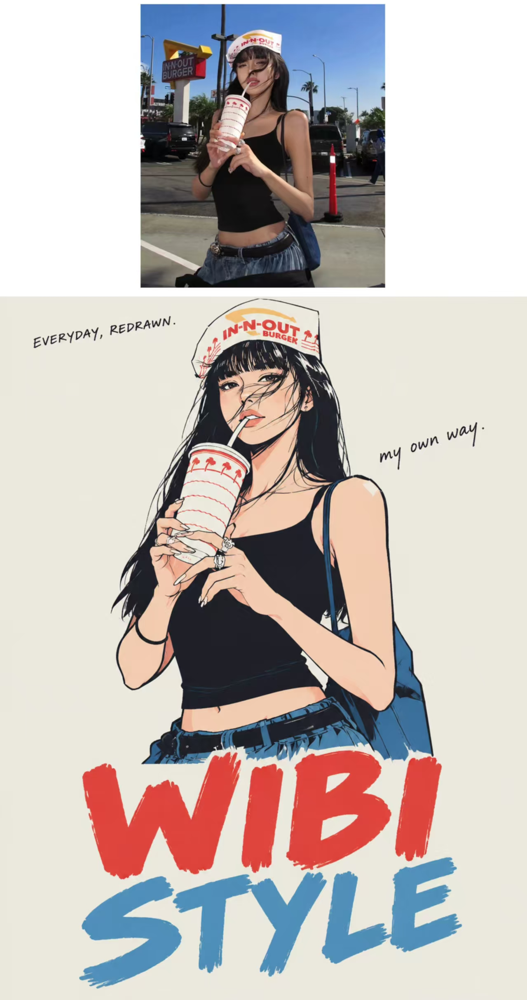
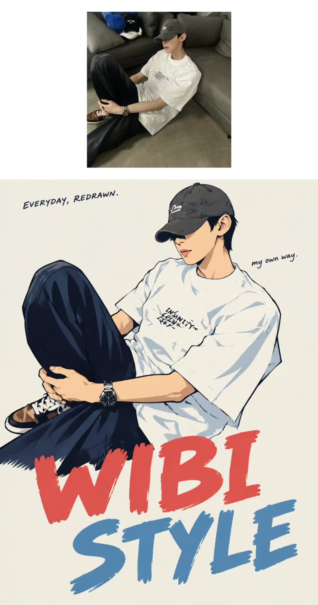

## 日式手绘漫画图

把附件真实单人照片重绘为 3:4 日式手绘时装漫画海报。真实照片决定人物身份、发型、神态、可见身体、动作、服装类别与物件关系；风格图只提供造型、线条、配色和字图排版，不搬用其中角色、衣服或道具。

以脸型、发型外轮廓、表情和姿态作为辨认锚点，重新设计为简洁漫画面形、成束头发和舒展的时装剪影。原有宽松衣服可夸张成蓬起的大块轮廓，手势、接触与遮挡关系沿用照片；只画照片中可见的身体范围。墨黑 #02030B 线条有提按、顿挫与轻微不齐，褶皱仅留结构转折，色块连续平涂，阴影合并为少量硬边色面。肤色、发色保留身份特征。

浅灰米白 #ECEDE5 纸底留出大幅空白；暖红 #E9444B 用于原有衣物的醒目色面及主标题，灰蓝 #5296BD 作局部与第二行标题，红多蓝少。背景归纳为纸底，仅保留解释动作所需的接触面。人物在中上部，文字在下部，共同适配方形画布。

文字为可替换示例：上方墨黑细小手写引题 “EVERYDAY, REDRAWN.”；下方两行手刻粗字 “WIBI”（暖红）和 “STYLE”（灰蓝），各一次；头肩旁用更小的墨黑随手字写 “my own way.”。字形、字距与基线略不齐，内部印色完整。人物下缘可局部压住首行大字，品牌字须可读。用户指定的主标题、引题或小注逐项替换原文并保留大小写与标点；未指定的沿用示例，要求去掉的留白。只呈现最终文案。

整体像轻薄墨线与少色印刷的独立时装海报。避免写实人体描摹、补出照片外的身体、逐根发丝、密排线、立体渲染、复杂背景、伪文字与额外装饰。

  

**参考图**

   
          
图1
   
   
          
图2
   
 

