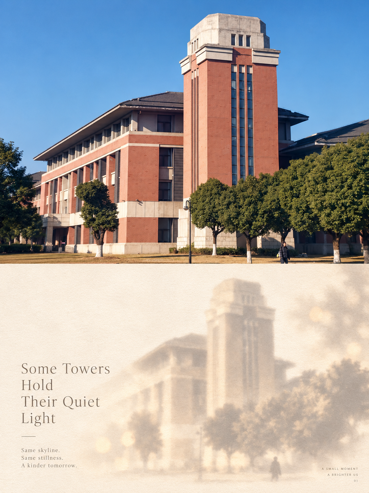
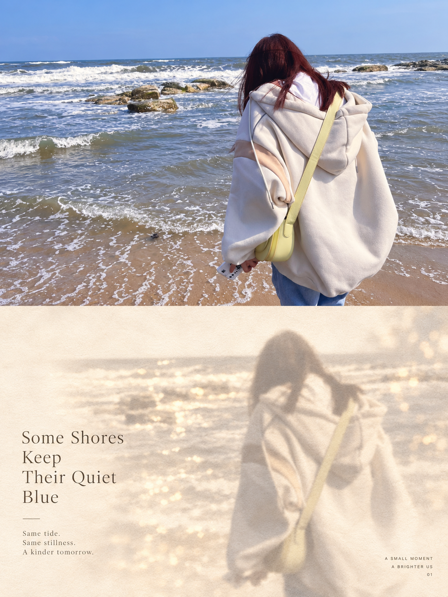

## 日系社论海报

请将我上传的每一张照片分别、独立处理，为每张照片生成一张独立的 3:4 竖版「PHOTO + DREAMY SHADOW MEMORY」日系社论海报。每张输入照片只输出一张完整成品，不得将多张照片拼接、合成、并置或共享同一套图文内容；必须逐张单独分析、单独转化。整张画面严格上下 1:1 等分，上半区占画面高度约 50%，下半区占画面高度约 50%，形成清晰、安静的“真实摄影 / 光影记忆投射”上下对照关系，不采用左右分栏、多格拼贴或复杂框架。

上半区为原始照片展示区，必须尽可能完整、忠实地保留对应原照片本身。人物、动物、植物、建筑、器物或其他主体的身份、数量、结构、比例、姿态、表情、互动关系、空间位置、透视关系、真实材质、自然光影、景深与原生色彩氛围均应保持不变。上半区采用 full-bleed 满幅摄影展示，可根据 3:4 版式进行自然、合理的等比裁切或对非主体背景做极少量无痕延展，但不得拉伸、扭曲、移动、替换、重塑或重绘主体，也不得新增无关元素。只允许进行非常轻微、克制的高级摄影调色，使照片具有温暖、柔和、艺术杂志般的完成度；若原图本身具有夕阳、逆光或暖光特征，可适度强化 golden-hour 的金色空气感，但不得凭空改变原照片真实光线方向或重新制造不存在的夕阳效果。

下半区必须以同一张上方照片为唯一视觉依据，将原照片的主体关系、主要轮廓、构图重心、空间位置与视觉节奏转译为一幅**柔焦阴影投射 / blurred shadow projection**式的记忆画面。下半区不是将照片简单模糊，也不是重新绘制完整写实场景，而是像上方真实瞬间被光线投射到纸面上后留下的一层朦胧记忆：主体与关键环境元素化为低对比、边缘扩散、略带空气感的灰色或暖灰色剪影与光影轮廓，保持与上方原图大致相同的构图关系和主体方向，使观者能够清楚感受到上下两部分来自同一个瞬间。

下半区主体投影必须保留原图最具辨识度的姿态、轮廓、人数或主体数量以及相互关系，但应主动舍弃琐碎细节。人物不描绘具体五官，动物不刻画毛发细节，建筑与植物不追求精确纹理，而是通过柔和的阴影块面、半透明光晕、模糊边缘与少量负形留白来呈现。整体像隔着磨砂玻璃、薄纸或柔焦镜片看到的记忆投影，朦胧但不混乱，抽象但仍可辨认。禁止出现硬边黑色剪影、强烈轮廓描边、高反差人物影子或恐怖感阴影。

下半区以温暖的 off-white、warm ivory 或浅奶油白纹理艺术纸作为基底，纸面应干净、轻盈、具有极细腻的自然纸张纤维与微弱颗粒，但不能泛黄过重、脏污或做成旧纸效果。阴影投射主要使用扩散的柔灰、暖灰、浅褐灰或极淡的照片综合色，与纸面自然融合。整体低对比、低饱和、柔和通透，形成安静的光感与空气感。

光影处理可加入极少量 hazy glow、柔焦光斑、微弱 sparkling bokeh 和非常细腻的 film grain，使下半区像一段逐渐褪入光线中的记忆。光斑应细小、稀疏、自然，可在主体附近或大面积留白中形成轻微闪烁感，但不可变成明显的数码特效、镜头炫光或梦幻星星装饰。所有光效都应保持低对比和克制，让画面有轻微的时间停顿感，而不是制造浓重的电影特效。

下半区必须保留充分留白。柔焦主体和阴影场域应集中在与上方照片视觉重心相呼应的位置，不需要填满整个区域。主体边缘可以逐渐扩散、消隐并融入暖白纸面，让负空间成为构图的重要组成部分。整体需要形成安静、克制、有呼吸感的日本独立出版物式版面，而不是满版照片滤镜或复杂视觉拼贴。

文字系统采用极简、克制、精致的 Japanese editorial layout。下半区左下区域设置一个纤细、优雅的英文衬线主标题，标题控制在约 3–4 行，每行较短，根据照片中的人物关系、环境、动作、情绪或记忆感自动提炼主题，可采用类似 “Some [theme from image] Stay” 的自然句式，但不得机械固定同一个词，也不得虚构无法从照片判断的具体事实。标题整体应细、轻、疏朗，字号适中偏小，保持明显留白，不使用粗黑标题或商业广告字体。

主标题下方加入一条极短、极细的水平线作为视觉停顿，再排布 3 行非常小的英文辅助文字。辅助文字可采用 “Same ___. / Same ___. / A kinder tomorrow.” 这一节奏逻辑，根据照片内容分别提炼两个与画面相关的简短词语或状态，使其读起来自然、克制、有温度。第三行可保留 “A kinder tomorrow.” 或根据画面气质生成意义相近的短句，但整体应保持简洁、温柔、具有轻微希望感。所有文字必须清晰、正确、可读；如果无法稳定生成准确文字，则宁可减少文字或保留对应空白，不得出现乱码、错拼、伪文字或无意义字符。

下半区右下角加入一组极小的 uppercase 微型说明文字，保持三行结构：“A SMALL MOMENT / A BRIGHTER US / 01”。字号必须很小、字距略微拉开、视觉存在感很弱，作为出版物式索引标记存在，不得抢夺主标题或主体视觉重心。除以上规定文字之外，不得添加其他标题、说明、日文假字、品牌信息、Logo、日期、水印或无意义微型文字。

整张海报最终应呈现为：上半部分是一段真实、完整、具有高级摄影品质的现实瞬间，下半部分则像这段现实被时间和光线柔化以后留在暖白纸张上的模糊投影。上下具有明确的同源关系，却在视觉语言上形成“现实 / 记忆”“清晰 / 朦胧”“当下 / 余韵”的诗意对照。整体应具有 minimal Japanese editorial、independent magazine、quiet memory poster、soft photographic poetry 的气质，安静、温柔、克制、现代、略带怀旧感，但不陈旧、不甜腻、不商业化。

负面提示词：多图拼接、多照片合成、左右分栏、上下比例错误、摄影区域被重绘、改变人物身份、改变人物五官、主体数量错误、主体姿态错误、主体被拉伸、主体变形、重新打光原照片、凭空制造夕阳、下半区直接复制模糊照片、写实人物重画、硬边黑色剪影、高反差投影、恐怖阴影、普通双重曝光、复杂拼贴、厚重渐变、霓虹光效、强烈镜头光斑、大片炫光、过量 bokeh、星星装饰、卡通、动漫、Q版、普通矢量插画、3D 渲染、塑料质感、重度复古滤镜、深棕旧照片、脏污纸面、过度泛黄、纸张破损、排版过满、粗黑大标题、商业广告字体、文字过多、日文伪文字、英文乱码、错误拼写、无意义字符、Logo、水印、二维码、平台 UI、粗黑边框、低清晰度。

  

**参考图**

   
          
图1
   
   
          
图2
   
 

