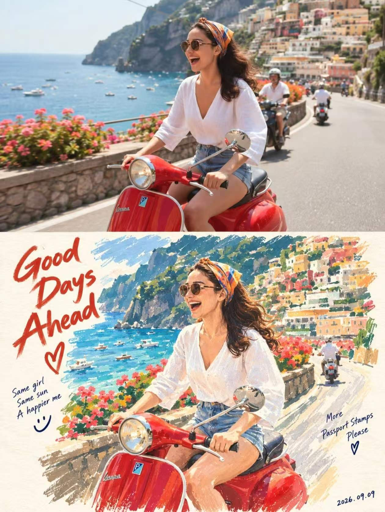
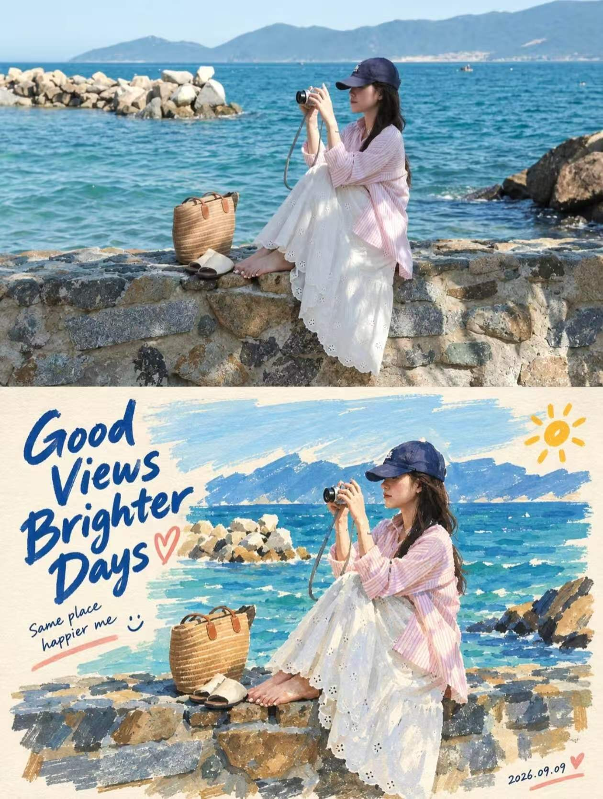

## 丙烯马克笔图

仅基于当前上传的单张照片，为这张照片生成一张竖版 3:4 的「PHOTO + HAND-PAINTED MARKER MEMORY POSTER」。如果后续用于批量处理多张照片，也必须始终遵守“一张原照对应一张独立成品”的原则，不得拼接多图，不得共享同一画面，不得把不同照片中的人物、服装、动作、物件或场景相互借用、替换或混合。上传照片是唯一视觉依据，禁止引用、拼接、替换、虚构或嫁接其他图片中的人物、服装、动作、道具、背景和场景信息。

整体版式采用严格的 3:4 竖版构图，画面上下约 50:50 分区，上半部分与下半部分各占画面高度约 50%。中间必须保留一条干净、平直、明确的水平边界，使观者能够清晰辨认出“上方真实照片、下方手绘重画”的双区结构。这条边界应整洁利落，但不必过度装饰，不要做成厚重相框、拼贴胶带或复杂分割设计，整体仍需保持简洁、现代、像一张被精心编辑过的纪念页。

上半部分为原始照片展示区，必须完整保留原始照片，并忠实保持其真实摄影属性。人物身份、五官特征、脸型、神态、表情、视线方向、发型、姿势、手势、服装、身体比例、随身物件、人物之间的关系、环境内容、空间透视、光线方向、阴影层次、原始色彩氛围与整体构图都应保持不变。只允许进行极轻微、克制的综合色彩调整，例如轻微统一色调、适度柔化杂色、保持更精致的视觉完成度，但不得重绘上半部分，不得磨皮，不得美化改脸，不得改动人物姿态或原始瞬间，不得替换背景，也不得新增原图中不存在的重要元素。

下半部分必须将同一瞬间重新绘制为高保真的人物手绘插画，并且与上半部分保持强烈、清晰、可一眼识别的对应关系。人物必须与上方保持同一身份、同一人数、同一表情、同一动作、同一手势、同一发型、同一服装、同一物件关系、同一场景方向和同一叙事瞬间，尤其要保证人脸高度相似，不得画成另一个人，不得任意年轻化、卡通化、偶像化或风格化变脸。若画面中有多人，也必须准确保留人物之间的相对关系、距离感与互动状态；若画面中有人物与道具、宠物、交通工具或环境结构，也应保留其关键对应关系。

下半部分的插画语言应表现为高级、真实、可感知手工痕迹的 marker memory poster 风格，主要使用粗头马克笔、丙烯马克笔、不透明水粉和干刷效果共同完成。整体必须呈现明显的手工绘制质感，而不是光滑的数码插画或均匀的 AI 厚涂。人物面部可通过蜜桃色、珊瑚粉、奶油色、暖橙、暖棕等偏暖色块，以大块、短促、明确的笔触来塑造体积、肤色与表情关系，强调笔触堆叠与色块组织，禁止使用平滑数字渐变。头发应使用黑色、棕色、藏青色或接近原图发色的粗笔触概括，保留发型轮廓和重量感。服装需要保留原图中最重要的版型、颜色关系与穿着状态，并以大面积、不完全均匀的马克笔色块来呈现，保留清晰的块状笔触、颜料覆盖痕迹与手工停顿感。

下半部分的背景不应完整复制原照片实景，而应基于原照片提取最关键的环境色彩、空间方向和结构暗示，再以大胆、不规则、经过概括的色块重新组织背景。背景只需保留能够帮助识别场景气氛和空间关系的少量信息，例如天空与地面的大关系、室内外的方向感、建筑或景物的轮廓暗示、色彩层次或简单平面结构，而不必逐项描绘全部细节。整体要让人物或主体仍然是下半区最强的视觉中心，背景作为简化后的支撑环境存在，避免做成繁复写实场景，也避免完全脱离上方照片。

下半部分的承载材质应为暖象牙白、暖米白或偏柔和的艺术纸底，必须保留可见纸张颗粒、颜料摩擦感、笔触压痕、叠色痕迹、局部露白、干刷纹理和轻微的不均匀覆盖，使画面具有真实手绘纪念页、旅行速写本或艺术家现场记录页的触感。纸面应干净、温暖、有手工气息，但不能过度做旧、过度泛黄、脏污或破损。整体更像高质量手工纸上的真实绘制，而不是廉价草稿纸、电脑纹理贴图或塑料感画布。

构图上，下半部分的人物或核心主体应占下半区约 70%–85% 的视觉比重，形成明确而稳定的主角关系，同时在人物周围保留适度留白，让画面具有呼吸感，不显得拥挤。主体不宜过小，也不要塞满整个下半区；要有一种“艺术家用手绘重新记住这一瞬间”的集中感与纪念感。若原图中存在重要配角、物件或环境线索，可适度纳入，但必须服从主角与整体简化逻辑。

文字系统应根据照片内容自动生成一句自然、轻松、带有生活感、幽默感、亲密感或旅行感的英文短句，内容每次可以变化，不固定句子，也不应机械重复。主句应像旅行手账、朋友纪念页、现场写生记录或生活片段注释，语气真诚自然，不要太广告化、太文学化或太口号化。主句使用较大的手写粗马克笔字体，带有自然起伏、不完全工整的书写感，可放置在下半部分适当位置，与插画共同形成一个手写纪念页的整体。可额外加入 1 句极小的辅助文字，用作轻微补充或注释，但必须非常克制，不可喧宾夺主。

此外，可加入 1 至 3 个极简手绘符号作为纪念页式点缀，例如心形、小太阳、笑脸、简短下划线、小箭头或类似的轻量手绘标记。这些符号必须数量极少、尺寸不大、风格松弛自然，只起到轻微增强手写感和亲密感的作用，不能变成幼稚装饰、贴纸堆砌或密集手账元素。右下角必须以极小的手写数字加入生成当日系统日期，格式固定为 YYYY.MM.DD，数字应低调、自然、像手工写上的记录标记，不可做成醒目的印章或大标题。

整体最终效果应像“真实照片与艺术家现场手绘纪念页被编排在同一张纸上”，上半部分记录真实瞬间，下半部分记录情绪记忆与手工再现。整张海报应同时具备真实感、识别度、手工触感、轻松温暖的人情味和一定的编辑设计感。关键词气质可以理解为：editorial marker portrait、acrylic gouache、paint marker、broad chisel marker strokes、opaque color blocks、visible brush texture、handmade sketchbook、travel journal illustration、warm off-white paper、spontaneous hand lettering、imperfect handmade texture、highly recognizable portrait。整体应自然、温暖、鲜活、可亲，像一本旅行手账或朋友纪念册中的高级手绘页面，而不是普通商业插画海报。

负面提示词：多图拼接、多照片合成、借用其他图片人物、替换服装、虚构动作、虚构物件、虚构场景、改变人物身份、改脸、美颜磨皮、五官失真、人物不像、错误人数、错误表情、错误手势、错误服装、错误物件关系、背景错乱、原图重绘、上半部分插画化、普通数码插画、平滑数字渐变、光滑厚涂、3D 渲染、CG 光效、照片滤镜、卡通风、动漫风、Q版、可爱头像风、时尚广告插画风、复杂写实背景复刻、过量装饰、贴纸堆砌、手账碎片过多、票据元素、邮票元素、印章泛滥、文字过多、口号式文案、固定句子重复、印刷字体、机械字体、无意义小字、伪文字、过量符号、幼稚涂鸦、脏污纸面、做旧过度、泛黄严重、破损纸张、Logo、水印、品牌标识、平台角标、低清晰度、廉价效果。

  

**参考图**

   
          
图1
   
   
          
图2
   
 

