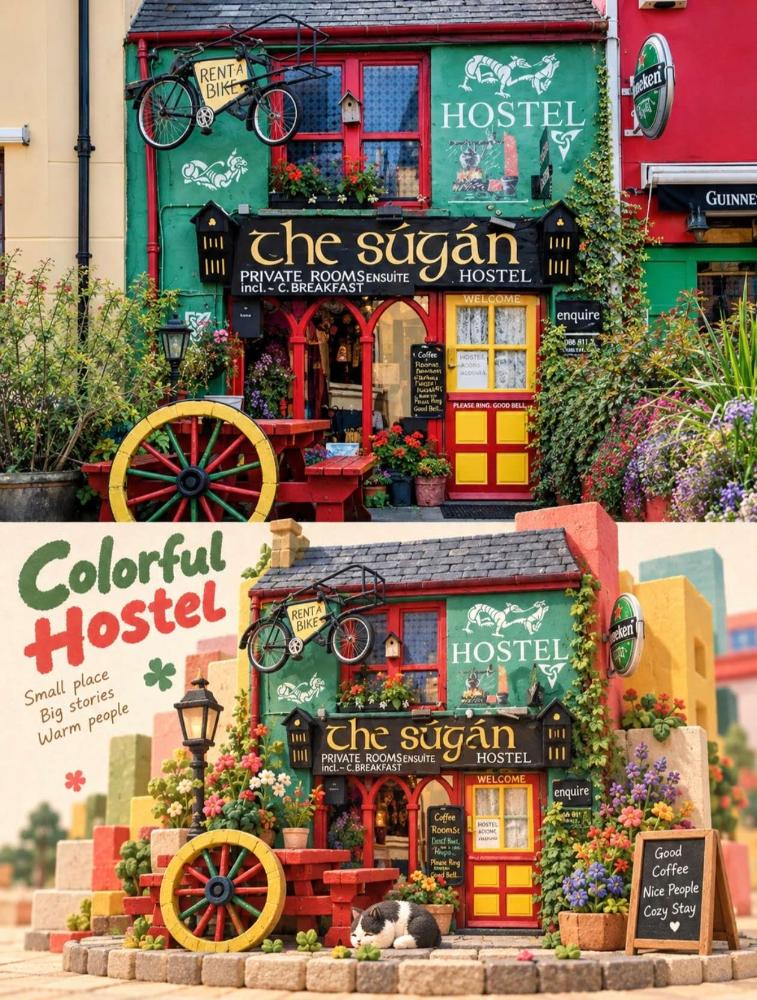
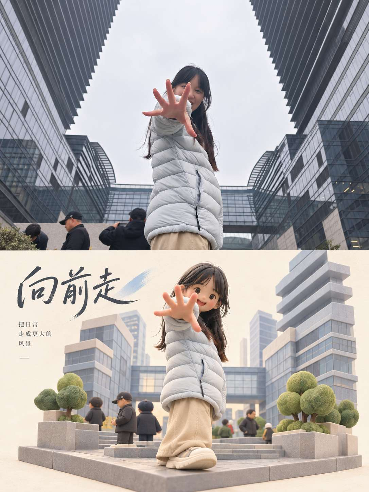

## 治愈系积木雕塑图

请将我上传的每一张照片分别、独立处理，为每张照片生成一张独立的 3:4 竖版高级设计海报。每张输入照片只输出一张完整成品，不得将多张照片拼接、合并、并置或共享同一套图文结构；必须逐张单独分析、单独转化。整张画布上下严格按 1:1 划分，上半区占画面高度约 50%，下半区占画面高度约 50%，比例不得偏移。上下两区之间应具有清晰、明确、干净的分界关系，但不需要做成厚重边框或复杂装饰线，使整张海报保有现代、克制、编辑化的版式气质。

上半区为真实摄影展示区，必须使用对应原始照片作为唯一来源，并尽可能忠实保留原图的内容与摄影属性。主体身份、结构、轮廓、比例、姿态、动作、服装、配饰、人物或物体之间的关系、空间关系、透视、真实材质、自然光影、景深层次以及原有色彩氛围均应保持不变。为了适配 3:4 竖版构图，可以进行自然裁切，或对天空、地面及非主体环境背景进行少量、合理、无痕的延展，但不得拉伸、扭曲、移动、替换、重塑或重绘主体，也不得新增无关元素。上半区只允许进行非常轻微、克制的高级摄影调色与画面净化，例如统一色调、细腻压缩高光、优化影调层次与减少杂乱感，使其呈现出艺术杂志、独立出版物或展览摄影的精致感，但不能破坏原照的真实现场感。

下半区必须以同一张上方照片为唯一视觉依据，将原始照片内容按照“解构、筛选、提炼、重构”的逻辑，转化为具有 3D / isometric 空间感的治愈系积木雕塑场景。下半区不是对原图的完整翻版，也不是简单做成立体玩具，而是需要先提取照片中最具识别性的主体、轮廓、姿态、叙事关系、视觉重心、结构轴线、曲线走势、体量比例、前后穿插、层叠遮挡与负空间关系，再通过圆润、简洁、具有触感的模块化体块重新组织。可以主动删减次要细节，不必机械复刻全部信息，但最终画面必须让人一眼就能感受到它与上半区原图之间清晰、明确的对应关系，能够辨认出这是同一主体、同一场景经过高度设计化后的三维转译。

下半区的主体应被理解为一个经过抽象与重组后的治愈系雕塑主景。构图需根据不同照片内容自适应设计主体的位置、朝向、大小、裁切方式、疏密关系与留白比例，而不是套用固定模板。可以通过大小不同的体块、高低错层、前后穿插、局部悬浮、拼接、叠放、嵌套、穿越或自然错位来建立节奏与空间感，使主体既保留原图中的身份特征与结构逻辑，又具有当代艺术玩具般的雕塑感、想象力和轻盈秩序。整体应表现为经过审美提纯的立体造型语言，避免把原图简单拆件、像素化、机械模块化，也不要做成直接照搬乐高语法的复制品。最终应该更像一件小型、精致、带情绪和性格的当代设计雕塑，而不是儿童积木堆砌。

下半区的空间组织应强调清晰的体量关系与适度的 isometric / 立体透视感。主体可以由少量主模块和少量辅助模块构成，整体体量要集中，视觉重心明确，不能过于碎裂或铺满。可以保留 1–3 个最关键的辅助环境线索，用于提示场景身份、动作趋势或空间氛围，但它们必须服从主景，不可喧宾夺主。主体不必做成复杂、写实的大场景，而应像一个被提纯后的立体记忆标本、微缩景观或安静陈列的积木雕塑对象，既有三维感，又有版式上的克制与呼吸感。

下半区配色必须从上方原图中分析和提炼，而不是套用固定流行色卡。需要识别原照中最有生命力与辨识度的主色关系，同时综合判断综合色温、明度层级、冷暖呼应与关键点色，再将这些信息调制为更柔和、清澈、明亮、具有空气感的治愈系配色。必须保留原图的色相身份与情绪记忆，但可适度提高整体明度、降低刺眼反差、净化灰脏杂色，使色彩更整洁、更通透、更有设计感。颜色组织应以主色面积、辅助色层次、同源深浅变化以及少量鲜活点色来建立节奏，做到丰富但不杂乱，可爱但不甜腻，清新但不幼稚。不得强行加入原图中完全不存在且破坏整体情绪的新颜色，也不要使用过多碎色、霓虹色、高饱和撞色或廉价糖果色。

积木雕塑的材质应呈现为细腻哑光、柔和漫反射的表面质感，并带有轻微的纸浆感、木质感、粉蜡感或柔性材料触感。块体边缘应圆润、顺滑但不过度工业化，阴影应轻柔、克制、自然，只用于帮助表现体积与层次，不制造强烈戏剧性灯光。整体应让人感受到它像一种温和、精致、可触摸的设计材料，介于纸艺、木艺、粉质雕塑和高品质艺术玩具之间。避免塑料高光、金属反射、镜面质感、厚重 CG、过度写实渲染和廉价玩具感，也不要做成粗糙的装配件展示图或工业建模效果。

文字部分应建立一个轻盈、高级、克制的编辑式微排版系统。根据照片中的光影、动作、空间、情绪或象征意义，为每一张海报分别提炼一个 2 到 5 个词的标题，作为画面的主标题。再搭配少量辅助文字，可包括状态词、地点感短语、编号、方向词或极简注释，但不得使用年份，也不要做成密集说明。文字内容应与该照片的视觉线索相关，而不是机械重复同一套文案。排版可以沿积木边缘、模块缝隙、视觉轴线或负空间区域排列，也可以与体块发生穿插、遮挡、对齐、嵌入或错位，使文字成为构图的一部分，而不是后期贴上的说明标签。整体排版应小而精、弱而准，既带有独立出版物的设计感，又不压过视觉主体。

整张海报的最终气质应呈现为：上半区是真实、细腻、克制的摄影图像，下半区是对同一场景或主体进行高度提炼后的 3D / isometric 治愈系积木雕塑重构。整体应温柔、轻盈、童趣、安静、精致，有想象力但不幼稚，有艺术玩具感但不过度可爱化，有设计感但不模板化。无论原图内容是人物、动物、植物、建筑、器物、交通工具还是自然景观，都必须在“真实摄影”与“积木雕塑转译”之间建立清晰而高级的身份呼应，避免复杂背景堆砌、信息过满、体块滥用、普通商业海报感和单纯装饰化表达。

负面提示词：多图拼接、多照片合成、共享同一套文字、上下比例错误、分区不清、主体被拉伸、主体变形、主体被替换、错误透视、错误空间关系、原图内容被篡改、无关元素新增、机械拆件、简单像素化、乐高式直接复制、积木堆满画面、复杂场景塞满、体块碎裂过多、普通玩具海报、儿童玩具包装风、幼稚卡通风、Q版、动漫风、可爱过头、廉价糖果色、霓虹色、高饱和撞色、塑料高光、金属反光、厚重 CG、廉价 3D 渲染、工业建模感、过强阴影、戏剧化打光、模板化排版、商业广告感、文字过多、年份、日期、伪文字、Logo、水印、品牌标识、平台角标、低清晰度、廉价效果。

  

**参考图**

   
          
图1
   
   
          
图2
   
 

