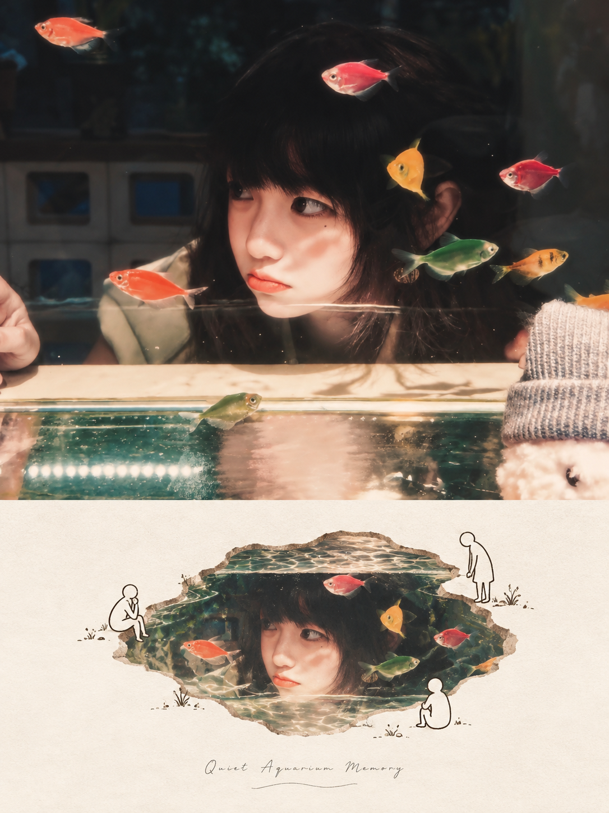
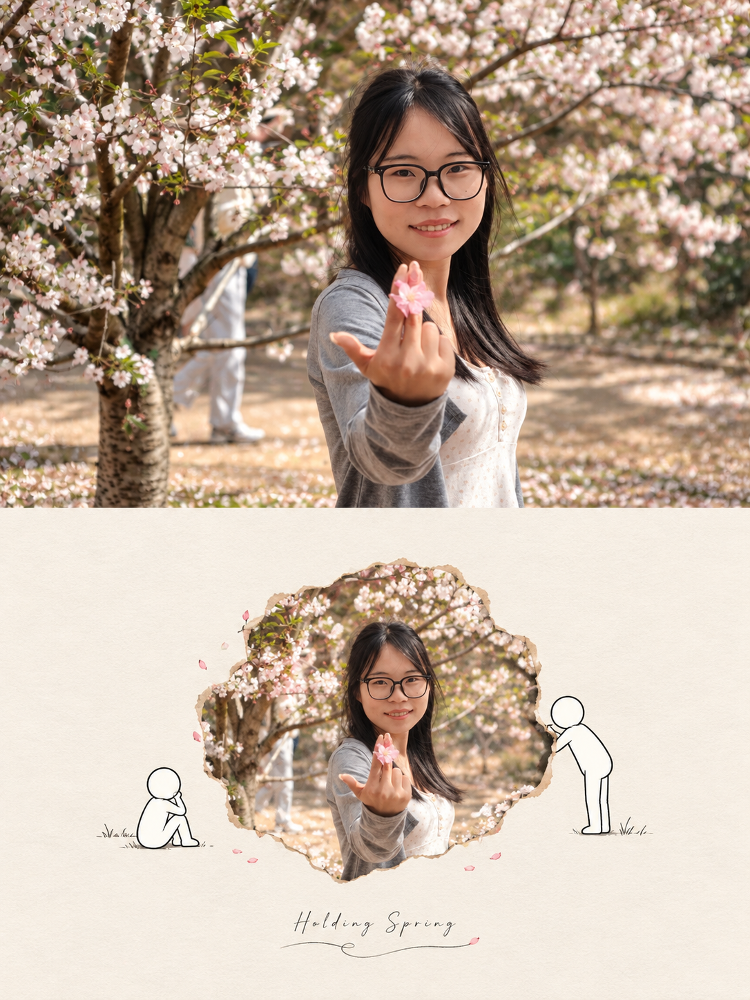

## 洞口切面图

请将我上传的每一张照片分别、独立处理，为每张照片生成一张独立的高级设计海报。每张输入照片只输出一张完整成品，不得将多张照片拼接、合并、并置或共享同一套图文结构；必须逐张单独分析、单独转化。整张画面统一采用严格的 3:4 竖版构图，上下严格按 1:1 对半划分，上半区占画面高度约 50%，下半区占画面高度约 50%，比例不得偏移，形成清晰、稳定、克制的上下对照关系。
上半区为原始照片展示区，必须尽可能忠实保留对应原图本身的摄影属性。人物、动物、建筑、植物、器物、景观或其他主体的身份、数量、结构、比例、姿态、表情、互动关系、空间位置、透视关系、真实材质、自然光影、景深以及原有色彩氛围均应保持不变。只允许进行非常轻微、克制而高级的摄影调色与画面净化，使其更接近独立摄影杂志、艺术出版物或展览摄影的质感，例如统一色调、细腻梳理高光与暗部层次、适度压低杂乱感，但不得改变主体内容本身。为了适配竖版构图，可以对边缘环境进行少量、自然、无痕的延展或合理裁切，但不得拉伸、扭曲、替换、移动、重塑或重绘主体，不得新增无关元素。
下半区必须以同一张上方照片为唯一视觉依据，将照片中最具识别度和最值得被记住的核心主题、主体关系、轮廓特征、空间线索与情绪气氛重新提炼，并转化为一张极简留白式概念场景插画 / 写实切面式混合媒介海报。下半区不是普通插画，也不是任意重新创作，而是要从上方原图中提取最具叙事性和隐喻感的视觉记忆点，再压缩进一个小体量、集中式的核心场景之中，使观者一眼就能感到它与上半区原照之间的明确对应关系。
下半区的整体背景应为纯净、温暖的暖白、米白或浅米色纸面，只有极淡、克制的纸张质感，不出现复杂纹理、装饰图案或多余背景信息。整个下半区必须保留大面积留白，上下左右都要有充足空白，绝不满构图，绝不让主体顶天立地或贴边铺满。主体区域整体高度通常不超过下半区高度的约 55%，应更像一件被安静陈列在纸面中央的概念小景，而不是一个填满版面的插画主体。留白应成为构图的重要组成部分，为画面带来呼吸感、静默感与高级编辑气质。
下半区画面中心应设置一个不规则、有机、自然边缘的“切面 / 水坑 / 洞 / 地块”形状。这个形状像纸面上被自然挖开、剖开或显露出内部世界的一块区域，边缘可带有轻微土层、岩石、草坡、泥边、地表断面或自然剥离感，但必须克制、简洁、自然，不做成夸张的漫画裂口、粗重洞边或戏剧化爆裂效果。整个中心形状应当是下半区唯一明确的核心视觉容器，其轮廓可以略微不规则，但整体仍需优雅、干净、有机，具有当代概念插画感。
这个中心形状的内部场景必须直接来源于上方原始照片的核心内容，而不是任意替换。应根据每张照片的实际内容，从中提取最有辨识度的主体、环境关系或视觉记忆，转化为一个写实、精致、清澈、具有真实光影与自然细节的小型内部世界。例如，如果原图是人物与街景，可提炼为一个微型街景切面；如果原图是海边、湖面、水下或自然景观，可提炼为一个清澈的水域或地貌切片；如果原图是建筑或城市空间，可提炼为一个俯瞰式或剖面式城市小景；如果原图是树林、草地、山石、动物或局部生态环境，也应转化为对应的微型真实场景。内部场景必须保留原图的综合色彩、真实质感、自然明暗和关键结构线索，呈现出高清摄影感或精细数字绘画般的清澈写实质地，但不能脱离原图去虚构全新的内容。
下半区中心形状外部，需要加入 1–3 个极简黑色线条人物，作为对内部场景进行观察、互动或隐喻回应的角色。这些人物应采用高度克制的极简简笔语言：圆头、极细黑色单线身体、白色填充、无表情、无复杂五官、无写实细节，线条干净、轻巧、冷静，具有现代极简插画感。人物尺寸比常规随手涂鸦小人略大，但仍必须保持极简与轻盈，通常单个人物高度约占整张画面高度的 10%–18%，在手机端也能清晰辨认动作与姿态，但不能过大到压过中心主体，也不能过小到失去存在感。
这些线条人物的动作不需要固定单一模板，但必须根据上方照片内容与下方内部场景的性质，自然生成与之相关的互动或观察关系。人物可以站在切面边缘观察、俯身探看、垂钓、牵引、照料、坐卧、停留、对话、凝视、搬运、陪伴，或与中心场景产生轻微而有意味的关系；如果原图更偏向诗意、风景或抽象氛围，也可以仅让人物静静围绕、注视或守候。动作必须简洁、自然、有隐喻感，不要夸张表演，不要做成固定重复姿势，更不要让人物喧宾夺主。整体要像一种“人类与记忆切片之间的安静相遇”，而不是漫画剧情表演。
除中心切面和人物之外，画面周围只允许加入极少量极简黑色线条小草、短线符号、几笔地面暗示或极轻微的环境提示，用来帮助人物站立、平衡或呼应整体气息。这些符号必须非常克制、数量极少、细小而安静，不可发展成繁复的插画场景，不可堆叠装饰，也不可加入大量无关物体。整个下半区应始终保持“少元素、高留白、强隐喻”的版式逻辑。
文字部分仅作为极少量编辑性介入。可在下半区底部居中位置加入一行小号、精致、疏朗的英文手写标题，标题内容应根据上方照片和下方场景自动提炼，语气简洁、含蓄、有概念感，例如对照片主题、情绪或视觉隐喻的轻微命名。字距应稍微拉开，字号必须较小，不可抢夺主体，也不可变成广告式标题。标题下方可加入一条极细、手绘感的波浪线作为微弱装饰与停顿。如果画面气质更适合纯视觉表达、没有必要加入文字，则宁可省略标题或留出空白，也不要生成无意义英文、错误拼写、乱码或伪文字。
整张海报最终应呈现为：上半区是真实、完整、细腻、克制的原始摄影瞬间；下半区则是从同一照片中提炼出的一个小型、写实而诗性的“记忆切面”，嵌入纯净留白纸面之中，并由极简线条人物与之发生安静的观察或互动关系。整体气质应偏向现代概念插画、极简主义、艺术微喷、混合媒介海报与独立出版视觉：写实与简笔形成明确反差，画面干净、克制、有呼吸感、有隐喻、有观看停顿感，同时保持高级设计感与收藏感。
负面提示词：多图拼接、合成多照片、网格分屏、左右拼版、上下比例错误、原图主体被拉伸、主体变形、人物换脸、动作被改变、主体被移动、摄影区域插画化、中心形状过大、主体贴边、满构图、顶天立地、留白不足、复杂背景、复杂纹理、过量装饰、写实人物、卡通人物、Q版、动漫风、全写实照片、全手绘插画、3D 渲染、塑料质感、厚重 CG、版画、丝网印刷、复古滤镜、高饱和撞色、灰脏沉闷、发旧泛黄、霓虹发光、粗重黑边、彩色线条、中心场景与原图无关、人物动作固定重复、人物过小、人物过细、儿童插画感、土味概念图、文字过多、英文乱码、伪文字、Logo、水印、平台角标、黑边、低清晰度。

  

**参考图**

   
          
图1
   
   
          
图2
   
 

