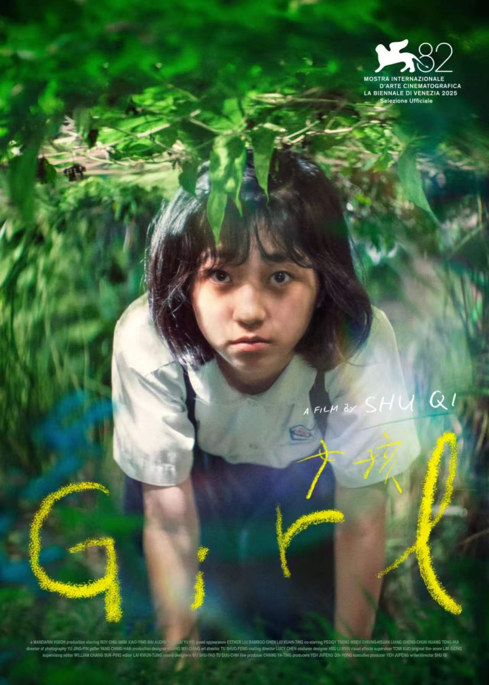

## 电影海报人物人物

请将我上传的两张图片作为同一张成品的参考素材进行处理：第一张图片为主图海报，第二张图片为人物面部参考图。最终只输出一张完整成品，不拼接、不合成多画面。整体必须以第一张电影海报为绝对主体。

替换数量以第二张参考图中的人物数量为准：第二张图里有几个人，就在第一张海报中选择相同数量的重要人物进行对应换脸；其余人物全部保持不变。

核心要求：第二张图中每个人物的脸，必须原样、完整、直接替换到海报对应人物脸部位置上，人物五官面貌不得有任何改动。
重点强调：不要为了适配海报而改变第二张图中人物的脸本身。 不允许修改或重塑参考人物的五官面貌，包括但不限于：脸型轮廓、眉眼特征、眼距、鼻型、鼻翼、嘴唇、下颌线、面部骨相、肤色、神态气质，以及所有可识别个人特征。若参考人物佩戴眼镜、墨镜、耳饰、鼻饰、面部贴饰或其他脸部装饰，也必须原样保留，不得删除、替换、简化、移动或改变样式。

允许调整的只有“放置位置上的贴合”，例如把第二张图中的脸准确放到第一张海报人物原本的脸部区域中，并与原海报的头部位置、画面尺寸和边缘衔接自然融合；但绝不能因此改动参考脸本身。也就是说：可以贴过去，但不能改脸。

除脸部替换外，第一张海报中的其他内容全部保持不变，包括：整体构图、人物姿势、动作、身体比例、头部朝向、视线方向、服装、配饰、手部、身体、背景、道具、场景、光影、色彩、胶片感、标题文字、排版、logo、特效和整体版式。不要改变海报人物原本的动作、角度和镜头关系，不要重新设计画面。

最终效果应呈现为：第一张电影海报整体完全不变，只把海报中对应人物的脸，替换成第二张参考图中的人物脸部；参考脸本身不做任何修改，不因适配海报而改变五官和脸部装饰。 成品必须自然、真实、无拼贴痕迹、无明显 AI 痕迹。

负面提示词：修改参考人物五官、改变脸型、改变眉眼、改变鼻型、改变嘴唇、改变下颌线、改变肤色、改变面部骨相、改变神态、去掉眼镜、改变眼镜样式、删除面部装饰、移动面部装饰、美颜、磨皮、瘦脸、年轻化、重塑脸部、为了适配海报而改脸、只保留部分五官特征、串脸、重复用脸、漏替换人物、改变人物动作、改变人物姿势、改变头部朝向、改变视线方向、改变服装、改变背景、改变排版、改变文字、改变 logo、双脸、重影、脸部错位、边缘穿帮、融合断层、拼贴痕迹、模糊、低清晰度、塑料质感、水印、乱码、额外 logo。

  

**参考图**

   
          
原图
   
   
          
改图
   
 

