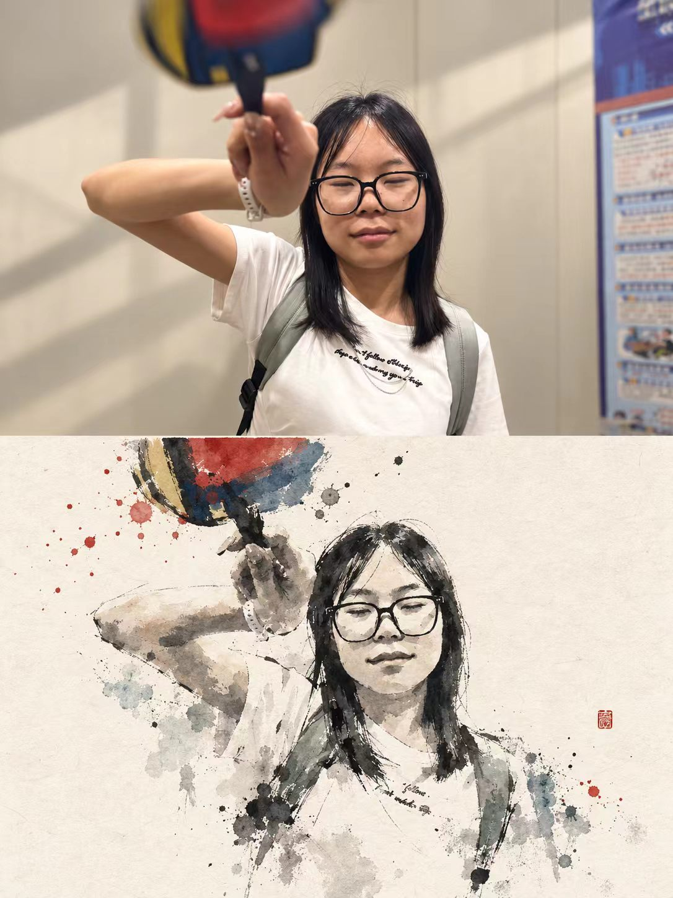
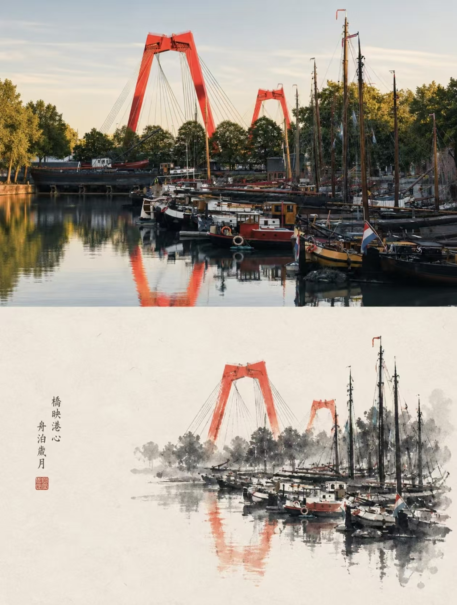

## 明信片画风图

请将每一张上传的原始照片分别、独立处理，为每张照片生成一张独立的海报。每张输入照片只对应一张最终成品，不得将多张照片拼接、合成、并置或共享同一套图文内容；必须逐张单独分析、单独转化。整体统一采用 3:4 竖版构图，画面上下分为两个严格对等的区域，上半区与下半区各占画面高度约 50%，上下比例保持 1:1，不设置明显分隔线，让“真实照片”与“水墨重构”自然衔接，同时形成清晰而克制的上下对照关系。

上半区为原照实拍展示区，必须尽可能忠实保留上传照片本身的内容与摄影属性。主体身份、结构轮廓、比例、姿态、空间关系、透视关系、真实材质、自然光线、阴影方向以及原始色彩氛围都应保持不变。只允许进行非常轻微、克制的高级调色与画面净化，使其更接近艺术杂志、独立出版物或展览摄影的精致质感，例如适度统一色调、轻微压缩高光、减少杂乱感、保留细腻层次，但不得改变画面本身的结构与叙事。为了适配竖版构图，可以对非主体背景进行少量、自然、无痕的延展，也可以做合理裁切，但不得拉伸、扭曲、重塑、移动、替换或重绘主体，不得改变主体的结构、姿态和核心构图。

下半区为极简水墨重构区，必须以同一张原照为唯一主要视觉依据，将原照中的主体、轮廓、结构走势、透视关系、节奏和整体气氛重新提炼，并转化为一幅极简的水墨材料感景观。重点不是复制照片细节，也不是做一张写实水墨翻版，而是从原照中提取最有记忆点、最具辨识度的核心视觉信息，进行概括、删减、提炼与重新组织，只保留最能支撑识别性的结构、轮廓、空间层次与神韵。最终效果必须让观者一眼就能感受到它与上半区原照之间的对应关系，但下半区应明显呈现为经过高度提炼的水墨转译，而不是简单描摹或滤镜化处理。

下半区的整体基底应为米白、暖白、宣纸白或自然纸色，具有细腻、真实、不过分夸张的纸张纤维、轻微纸浆纹理和柔和自然的材料肌理，画面干净、安静、通透，不做旧、不脏污、不泛黄过重。主体及其相关空间关系需要通过水墨晕染、干湿交叠、飞白、渗化、积墨、断墨、留白等方式来重构，形成安静、克制、诗性、当代东方气质的视觉语言。可以有墨色在纸面上自然铺展、收束、散开与停顿的节奏，但所有笔墨痕迹都应服务于结构与气息，而不是堆砌技法效果。删去次要细节，只保留最有辨识度的轮廓、结构转折、前后层次、空间走势与气息流向，不追求写实完整，而强调概括、留韵与节制。

用墨体系应以黑、灰、淡墨为主，层层递进，浓淡有节奏，形成清晰但不僵硬的视觉层次。主体核心区域应更凝练、更集中，墨色更有分量与抓力；越靠近边缘，越可以逐渐松散、断开、消隐、逸散，与大面积留白自然衔接，形成呼吸感与空间余韵。允许从原照中提取最有生命力、最能代表情绪或视觉焦点的颜色，作为少量点染或设色使用，但不得机械复制原图全部色值，也不要让设色压过墨色本身。色彩可转化为清澈的青灰、远山蓝、柔金、暖黄、朱砂红、淡青绿等较为克制的东方色系，用于强调主体焦点、节奏节点或局部情绪，但整体仍必须以墨色与留白为主导。避免灰脏沉闷、发旧发褐、俗艳配色、过度设色和装饰性彩墨效果。

构图上，下半区主体通常只占画面宽度或整体视觉体量的约 30%–45%，其余部分需保留大面积留白。留白不是空白背景，而是整张画面结构的重要组成部分，是呼吸、停顿、气韵与版式秩序的一部分。主体可以偏心放置、贴边、悬置、轻微裁切，或在画面一侧形成重心，再由留白平衡整体视觉张力，但必须保持不对称平衡与高级编辑感。宁可删减信息，也不要填满画面；宁可留出空隙，也不要把所有景物都画出来。下半区的主体应像一枚安放在纸面上的水墨章印，或像一件陈列于展页中的东方材料作品，具有安静、独立、被凝视的存在感。

文字部分只允许极少量、克制的编辑介入，不预设固定标题、编号或模板化说明。可以根据照片中的主体、地点感、时间感、动作、情绪或隐喻，提炼少量字词或一句极短的短句，安静地置于留白区域或主体边缘，作为编辑性提示。文字应疏朗、简洁、有呼吸感，与留白和画面节奏相协调，不可喧宾夺主，不可形成信息堆积，也不要使用大段说明、密集小字或过强的排版设计。整体更接近展览海报中的静默文字介入，而不是商业宣传文案。

整张海报的最终气质应呈现为：上半区是真实、细腻、克制的摄影图像，下半区是对同一场景进行高度提炼后的当代东方极简水墨重构。整体强调大面积艺术留白、小尺度主体、小型章印感、材料感墨色、安静的编辑排版以及展览海报的高级气质。无论原照内容是人物、建筑、植物、道路、海景、山景、船只、车辆还是城市空间，都必须在“真实摄影”和“水墨转译”之间建立明确而高级的身份呼应，避免复杂背景、真实细节堆砌、装饰性过强、文字过多、模板化排版与填满式构图。

负面提示词：多图拼接、多照片合成、共享同一套文字、上下比例错误、明显分隔线、主体被拉伸、主体变形、主体被替换、错误透视、错误空间关系、写实水墨临摹、普通国画复制、传统山水套图、照片直接水墨滤镜、细节照搬、复杂背景堆砌、信息过满、留白不足、装饰纹样过多、花鸟边饰、卷轴感过强、书法作品感过强、印章堆砌、过量题字、模板化排版、商业海报感、普通插画感、卡通化、动漫风、Q版、3D 渲染、CG 光效、塑料质感、数码渐变、脏污旧纸、泛黄纸面、咖啡渍、烧边、灰脏沉闷、俗艳配色、过度设色、伪文字、Logo、水印、品牌标识、平台角标、低清晰度、廉价效果。

  

**参考图**

   
          
图1
   
   
          
图2
   
 

