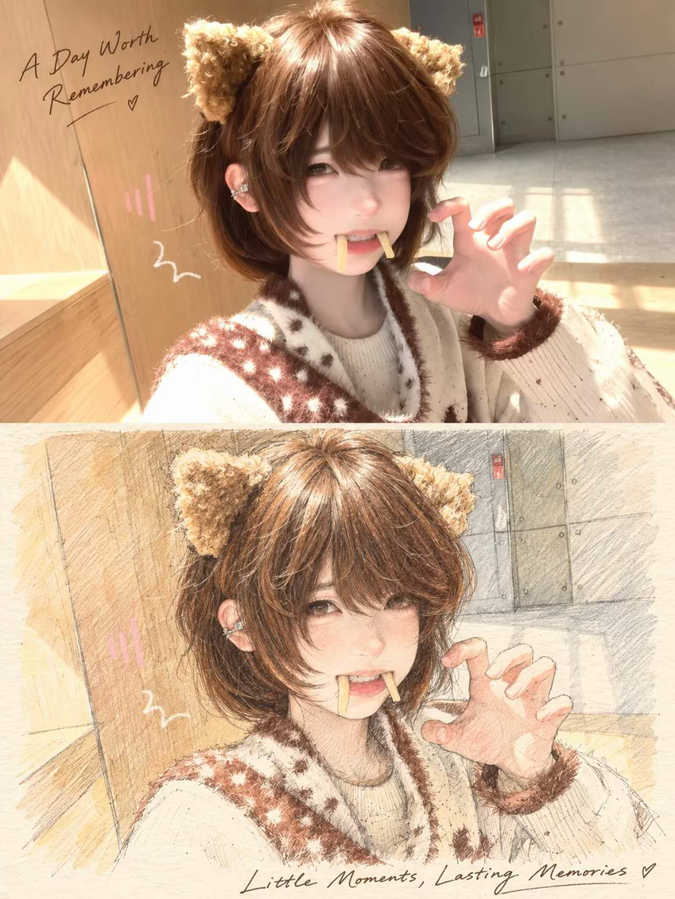
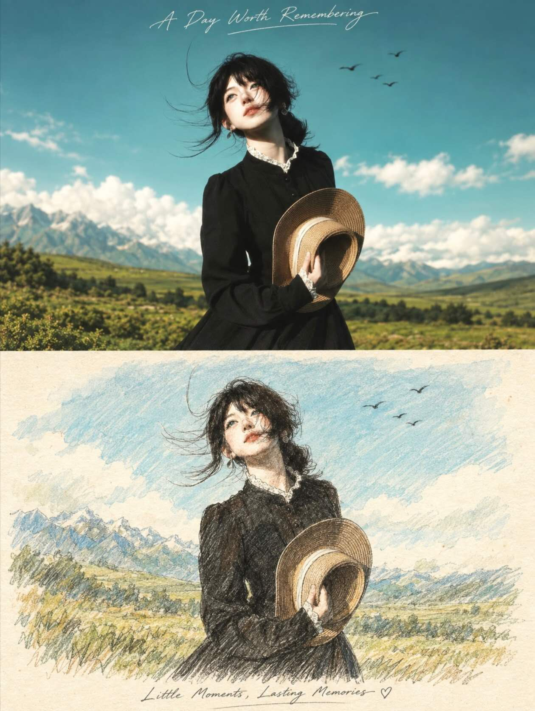

## 细钢笔 / 彩铅图

请将上传照片制作成一张独立高级旅行日志海报，一图一报，不与其他照片拼接。整体采用3:4竖版构图，画面上下严格 1:1，各占 50%。

上半部分保留原始照片，最大程度保持主体身份、五官、发型、姿态、服饰、建筑、景物、透视、比例、自然光影、原有色彩与构图关系，仅做轻微高级调色，呈现旅行杂志与独立摄影刊物质感。为适配画幅可自然延展边缘环境，但不得拉伸、扭曲、换脸、移动主体、改变动作或新增人物与物体。

下半部分将上方同一瞬间、同一场景重构为 Travel Journal Mirror Sketch / Pen & Colored Pencil / Light Watercolor Illustration。人物、建筑、景物的相对位置、尺度、朝向、视线与空间关系须高度对应上方照片，使上下能够一眼对应；允许真实手绘产生的轻微偏差、删减和概括，但不要机械描边或直接套素描滤镜。

绘画以细钢笔/铅笔结构线＋彩铅排线为主体，只加入少量透明水彩薄染。线条自然、松弛，带轻微断线、重描、不完全闭合和交叉排线；建筑保留必要结构细节，人物、植物与远景适度概括。背景使用暖奶油白或象牙色纸张，明显保留纸纤维、铅笔颗粒、彩铅摩擦纹理与轻微手工痕迹。水彩仅用于天空、水面、植物和局部光影，不做大面积厚重覆盖。

下半部分颜色必须从上方照片提取并适度降低饱和度，保持原有冷暖关系，不新增杂乱高饱和颜色。整体像城市速写、旅行画册、艺术家旅行日记与独立出版物。可在上半区域顶部留白处加入一句手写短标题，如 A Day Worth Remembering；在下半区域底部留白处加入一句短句，如 Little Moments, Lasting Memories。字体像真实钢笔自然书写，轻盈、优雅、略有笔压变化，可配极小日期、下划线或爱心，但必须克制。

整体气质：温暖、怀旧、松弛、文艺、旅行感、真实手作感、收藏级旅行日志质感。

负面提示词：照片滤镜式素描，直接描边，机械复刻，精致数码插画，厚重水彩，油画，动漫，赛璐璐，3D渲染，人物换脸，人物移位，建筑变形，新增人物，新增景物，改变原场景，过度锐化，塑料质感，过饱和，复杂拼贴，儿童手账，大量装饰，大段文字，商业模板感，AI感过强。

  

**参考图**

   
          
图1
   
   
          
图2
   
 

