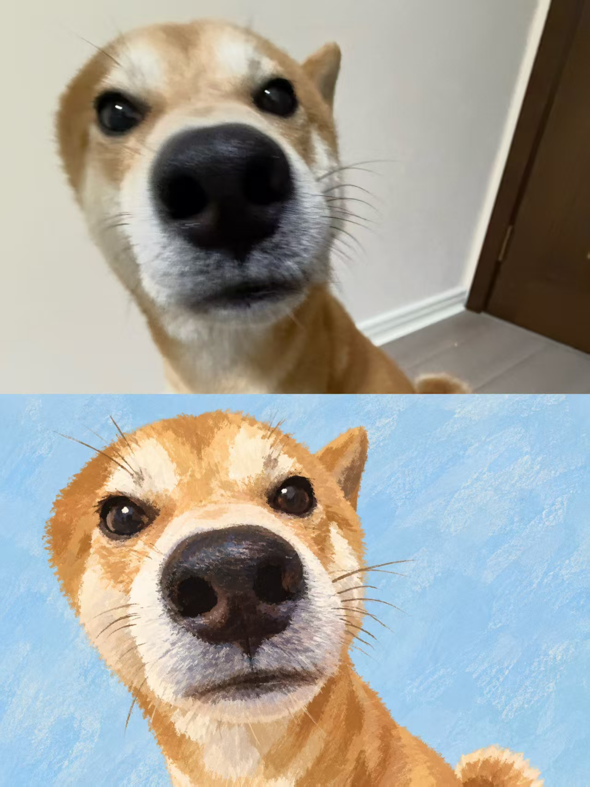
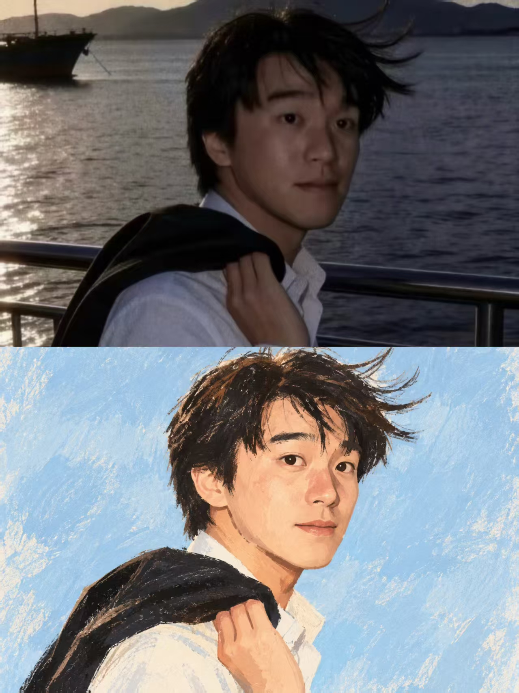

## 蜡笔手绘图

基于上传原图进行纯风格转换。不是照片转绘、半写实数字肖像或粉彩滤镜，而是将人物重新翻译成明显的当代手绘刊物风肖像插画。

必须保持高辨识度，辨识度来自：脸型轮廓、五官相对位置与间距、头部角度、视线、原始表情、嘴巴开合状态、发型轮廓与分缝、关键碎发、肩膀方向、姿势及痣/雀斑等特征点。禁止换脸、美颜、改龄、改人种、改性别气质、改表情、改发型、替换成通用模板脸。不要照片级复刻，允许明显二维化、色块化、笔触化和适度概括。目标是“像本人，但不像照片”。

整体采用 contemporary editorial illustration / lifestyle magazine 风格，融合数字水粉、干性粉彩、柔彩铅、粉笔颗粒和干刷。使用哑光色块、不均匀颜料、粗糙手工边缘、少量排线、不规则笔触和轻微自然不对称。第一眼必须明确是手绘插画。

主动降低写实度，约20%真人结构、80%插画重构。脸部主要由4–7块柔和哑光色块构成，不用真实光影或连续渐变塑造体积。皮肤为浅米桃/淡杏/暖象牙，配少量鲑粉腮红、淡桃眼周和暖桃鼻部；去除毛孔、油光、摄影纹理、真实高光和精细阴影。

眼睛轻微放大但不动漫化，保持原始视线和不对称；暖米白眼白、深棕瞳孔、极简虹膜、小高光、不规则上眼线，禁止写实虹膜和湿润玻璃感。眉毛用粗糙深棕短笔触。鼻子高度简化，仅用1–3块暖桃色和少量深棕鼻孔表示，不做真实鼻梁建模。嘴巴严格保持原图形状、开合和情绪，用珊瑚红/鲑红唇形及酒红棕口腔色块，禁止写实唇纹、牙龈和口腔细节。

头发严格保留分缝、轮廓、方向和关键碎发，用巧克力棕/咖啡棕/红棕大色块铺底，再叠少量干刷和彩铅线，禁止写实高光和逐根发丝。服装保留款式轮廓并大幅简化，白衣用暖米白，仅少量笔触表现褶皱。

删除原实景背景，替换为统一浅粉蓝/淡天蓝手绘背景，仅保留极轻微水粉刷痕与颜料变化，无景物、文字、图案、景深和数码渐变。

禁止 photorealism、semi-realistic portrait、3D、Pixar、anime、manga、vector、漫画勾线、写实皮肤、写实眼睛、塑料质感、顺滑渐变、重阴影、高对比、完美对称、美颜重塑和AI通用脸。

最终标准：第一眼是原创手绘刊物插画，第二眼能立刻认出原图人物；若像真人照片、写实数字肖像或照片加粉彩滤镜，则视为失败。

  

**参考图**

   
          
图1
   
   
          
图2
   
 

