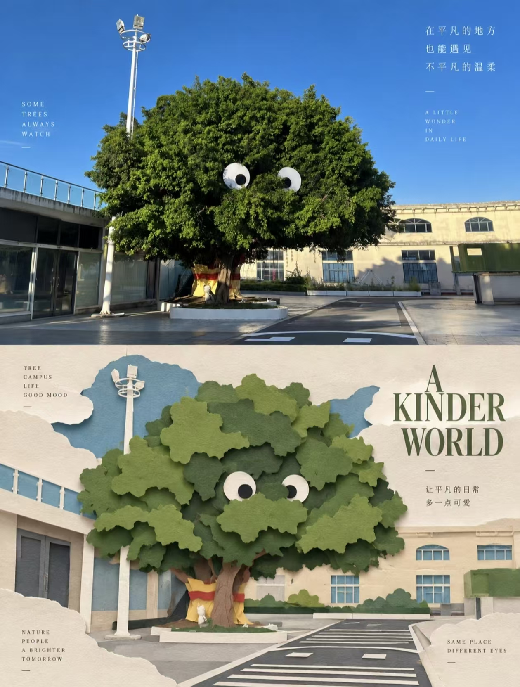
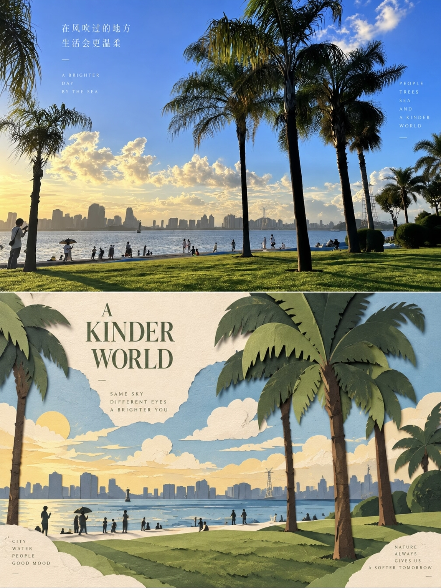

## 社论风格海报图

请将每一张上传的照片分别、独立处理，为每张照片生成一张独立的社论风格海报。每张输入照片只输出一张对应成品，不得将多张照片拼接、合成、并置或共享同一套图文内容；必须逐张单独分析、单独生成。整体统一采用严格的 3:4 纵向构图，并水平分为上下两个完全相等的区域，上半部分与下半部分各占画面高度约 50%，上下比例保持 1:1，不绘制明显分隔线，让两部分在版式上自然衔接，同时形成明确的视觉对照。

上半部分为原始照片展示区，必须尽可能忠实保留原图内容与摄影属性。主体身份、结构、比例、姿态、朝向、空间关系、透视、真实材质、自然光线、阴影变化以及原有色彩氛围均应保持不变。只允许进行非常轻微、克制的社论级色彩校正，使画面具有艺术杂志、独立出版物或展览摄影的精致感，例如统一色调、细腻控制高光与反差、略微压低杂色并强化整体影调气质，但不得改变原始内容本身。为了适配竖版构图，可以对天空、地面或周围环境背景进行少量、自然、无痕的延展，也可以进行合理裁切，但不得拉伸、扭曲、替换、移动或重绘主要主体，不得破坏场景原有真实性。

下半部分需要以同一张照片为唯一视觉依据，将照片中最具辨识度的主体、轮廓、姿态与空间关系重新转译为一张极简、克制、具有高级社论感的分层纸切割 / 纸艺构图。下半区必须保留与上方照片之间清晰可辨的主题呼应，让观者一眼能够识别这是对同一场景或主体的纸艺再诠释，而不是脱离原图的自由创作。不要机械复制每一个细节，也不要将照片直接简化成普通剪影；应从原图中提炼最关键的轮廓、比例、结构和姿态，通过折叠、切割、分层、重叠与留白来重新组织视觉关系，使主体既简洁又明确。

下半部分应只保留一个主要主体作为视觉锚点，主体必须清晰、集中、有识别度，避免多个焦点同时争夺注意力。若原始场景较复杂，只需提取少量最有代表性的辅助环境元素，并将它们压缩为前景、中景和背景中的少数纸层，用来支持主体身份与空间感。可以通过尺度对比、负空间、干净对齐、前后层次与留白的控制，建立清晰、稳定、安静的社论构图。主体应能被迅速识别，而整体画面仍保持克制、平衡与高级感，避免堆叠过多层数、过多碎片化细节或装饰化纸工效果。

配色必须从上方原始照片中提取最具辨识度、最有代表性的颜色，再将其提炼、压缩为有限而和谐的纸艺调色板。整体应以温暖的象牙白、浅米白或浅色纸张作为基础底色，并搭配少量更强烈但不过分跳脱的强调色、更深的结构色、柔和的过渡层色，以及极有限的高光色。颜色必须克制、统一、具有编辑设计感，不得出现过多碎色、廉价手工色彩、霓虹色、高饱和撞色或复杂渐变。层次变化应更多依赖纸张颜色深浅、纸层叠压关系与自然阴影，而不是依赖数码发光、空气渐变或 CG 光效。

纸艺材质应明确呈现为高质量哑光卡纸或艺术纸，带有轻微可见的纸纤维、干净利落的切割边缘、适度真实的折叠痕迹，以及在自然漫射光线下形成的柔和接触阴影。整体应强调真实手工纸艺的触感品质，但必须控制在平面或浅层立体的纸艺范围内，避免变成厚重复杂的 3D 雕塑、悬浮纸艺装置、塑料质感模型或廉价工艺纸手作。阴影应柔和、浅淡、自然，服务于层次辨识，而不是制造戏剧化灯光效果。纸层关系要清楚，但不宜过厚、过硬、过深。

文字部分应建立一个精致、现代、克制的社论排版系统。根据照片中主体的身份、位置、动作、材质、情绪、气氛或象征意义，为每一张海报分别生成一个简短的主标题。再搭配 2–4 组较小的辅助文本，用于补充结构感与节奏感。辅助文字可以是对象名称、方位信息、数字编号、序列标记、类似坐标的数字、方向词、状态词、材质描述、分类标签，或一句极简、含蓄的诗意短语，但不得使用任何年份或日期，也不得机械重复相同内容。主标题应承担情绪与身份表达，辅助文本则增强版式组织与社论气质。

排版必须自然融入下半部分的纸艺构图之中，而不是后期生硬贴上。文字可以沿纸层边缘、主体轮廓、几何轴线或负空间区域排布，也可以使用水平或垂直排版、轻微旋转、宽松字距、边缘对齐、角落安放、横截面布局、内嵌排版或局部重叠的方式，使文字与纸艺层次产生互动。主标题可以带有非常轻微的纸切割感、压印感或折纸式处理，但必须克制；辅助文本则应保持纤细、现代、精确、安静，不喧宾夺主。整体文字数量应少而精，具有高级社论设计的节奏和呼吸感，而不是广告式大字报或模板化信息排布。

最终整体效果应呈现为：上半部分是真实、精致、克制的摄影图像，下半部分是基于同一照片转译而来的极简分层纸切割 / 纸艺重构。整张海报要同时具备优雅、平衡、触感丰富、具有艺术指导感和明显社论风格的气质，在真实摄影与纸艺再诠释之间形成高级而清晰的呼应关系。画面应简洁、安静、现代、结构明确，避免装饰堆砌、廉价工艺风、商业宣传模板感和表面化的“手作可爱风”。

负面提示词：多图拼贴、多照片合成、共享同一套文字、上下比例错误、明显分隔线、主体被拉伸、主体变形、主体被替换、错误透视、复杂场景堆叠、多重焦点、普通照片滤镜、普通矢量插画、廉价手工卡纸风、儿童手工课风格、过度装饰、过多纸层、纸片碎裂堆积、复杂渐变、霓虹色、高饱和撞色、塑料质感、光泽感过强、CG 光效、3D 渲染、厚重立体纸雕、悬浮纸艺装置、模型感、粗重阴影、戏剧化打光、商业广告海报感、模板化排版、过量文字、伪文字、Logo、水印、品牌标识、年份、日期、脏污旧纸、做旧过度、低清晰度、廉价印刷感。

  

**参考图**

   
          
图1
   
   
          
图2
   
 

