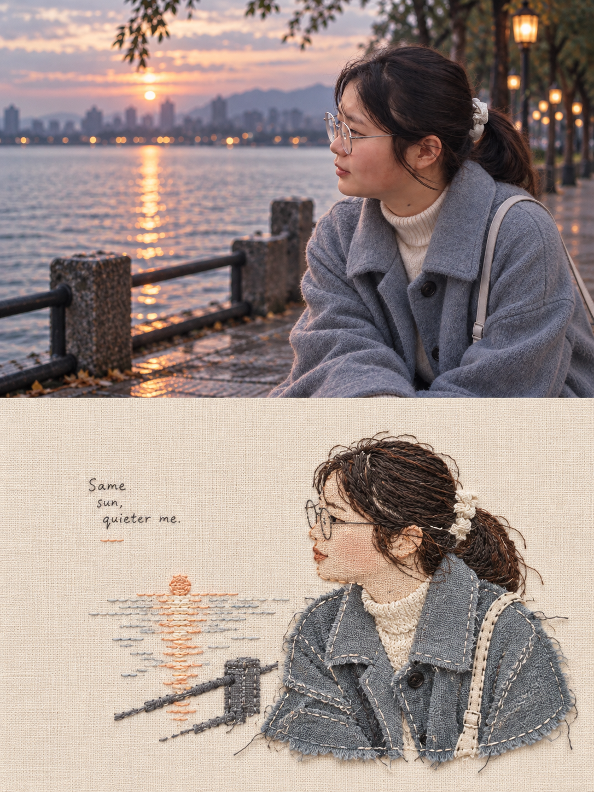
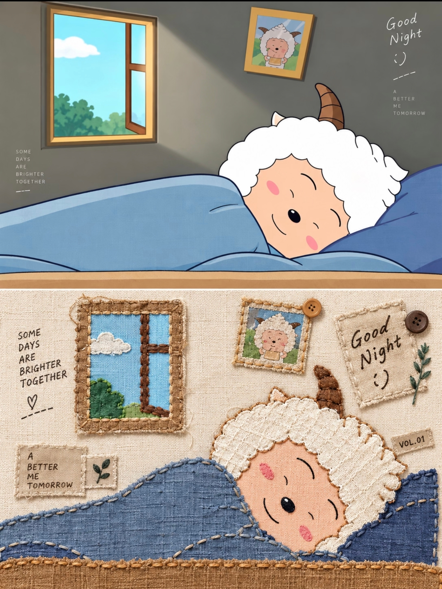

## 缝线刺绣图

请将我上传的每张照片分别制作成一张独立的高级设计海报，一图一报，不拼接。整体采用3:4竖版构图，上下两个区域高度严格 1:1，各占 50%。
上半部分保留原始照片，保持主体身份、结构、姿态、真实质感、自然光影与原有色彩氛围，仅做轻微高级调色，呈现艺术杂志与独立出版物质感；为适配画幅可自然延展环境，但不得拉伸、扭曲或改变主体。
下半部分只提取最具识别性的主体轮廓、姿态、发型、服饰、道具与叙事关系，重构为缝线刺绣风 / Embroidery Collage / Hand-stitched Poster。不要复制原场景，不保留全部背景与细节，只保留最关键的视觉记忆点。
风格必须明显呈现一眼可见的刺绣与拼布效果，不是细腻插画。主体由大块布片拼接+粗针脚缝线组成，明确表现贴布绣、拼布、毛边布块、外露线头、布边不齐、缝线压边、针脚轨迹。使用放大的回针、锁链针、平针、十字针，针脚要粗、密度低、间距可见，远看也能看出是布和线做成的。局部可加入纽扣、小布标、标签缝线，但要克制。
下半部分以大面积暖白、米白或浅亚麻布底留白为核心，主体只占较小比例，可偏心、贴边或局部裁切，宁可少做也不要填满。背景仅保留极少量必要元素，不形成第二中心。
配色严格克制：仅使用2–3种主色+深灰/黑色线迹+暖白布底色。若原图颜色复杂，主动舍弃大部分颜色，只保留最关键的一组色彩记忆点，整体低饱和、统一、干净、有手作温度。
可加入少量布标式文字、日期、编号或简短手写短句，轻巧落在留白处。整体气质：质朴、手作、复古、治愈、安静、收藏感。
负面提示词：
精致唯美插画，细腻数码绘画，梦幻绘本风，平滑渐变，光滑矢量，蕾丝感过强，细节过多，看不出针脚，看不出布料，缝线太细，刺绣不明显，复制原场景，满版构图，主体过大，高饱和多色，3D渲染，商业模板，AI塑料感。

  

**参考图**

   
          
图1
   
   
          
图2
   
 

