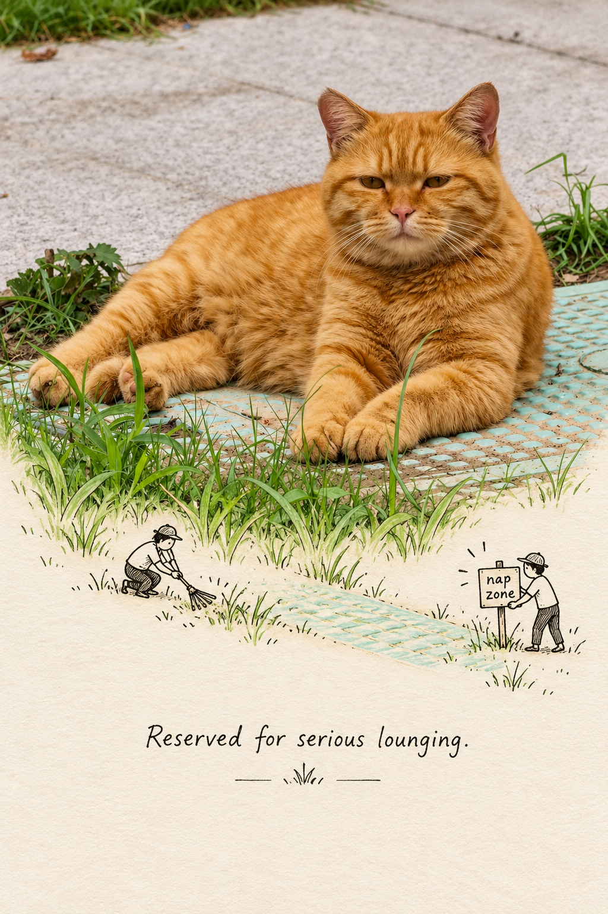
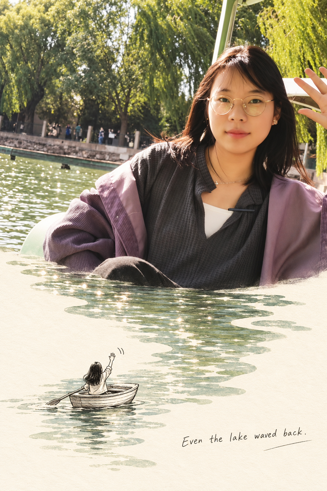

## 手绘扩展图

请将我上传的每一张照片分别、独立处理，为每张照片生成一张独立的 **2:3 竖版摄影 + 手绘融合作品**。每张输入照片只输出一张完整成品，不得将多张照片拼接、合成、并置或共享同一套画面结构；必须逐张单独分析、单独构思。整张作品必须仅基于对应上传照片展开，禁止引用、拼接、替换或虚构其他图片中的人物、动物、服装、物件、建筑或场景信息。画面的核心不是简单拼贴，而是从原照片中提取最具辨识度、最适合展开互动叙事的原生元素，并据此为每一张照片定制一个专属、轻巧、温暖、可一眼读懂的小故事。故事内容必须随着不同照片的场景、主体与气氛灵活调整，不得机械复用同一套路或同一动作关系。

整体采用严格的 2:3 竖版构图。画面上半部分约占整张海报的 45%–55%，下半部分为浅奶油色纸面区域，两者共同构成“真实照片邂逅纸上小故事”的融合作品。上半部分必须保留原始照片的真实摄影属性，忠实呈现主体、景物、空间关系、透视、光线、色彩、材质、清晰细节和现场氛围。为了适配竖版构图，可以对原图做合理裁切，或对非主体背景进行少量、自然、无痕的延展，但不得替换主体，不得重绘摄影区域，不得把上半部分插画化，也不得改变原图的核心叙事关系。上半部分必须保持真实、清晰、细腻、完整，具有自然摄影质感，而不是照片滤镜化处理。

下半部分应呈现为干净、安静、具有轻微纸张肌理的浅奶油色纸面，整体色调柔和克制，可带有非常轻微的纸纤维与纸面纹理，但必须干净、清爽、自然，不做旧、不脏污、不做复杂拼贴。上下两部分的交界不得是生硬笔直的水平切线，而必须根据原照片中最合适的主体轮廓、环境边缘或空间走势自然起伏，让照片与纸面之间形成一种顺势衔接、仿佛摄影空间自然延伸到纸上的感觉。这个边界可以顺着山体、树冠、地平线、建筑轮廓、水面边缘、草坡起伏、桌面物件边缘或其他合适的原生形态变化，但必须整洁、清晰、自然，不可杂乱破碎，也不可做成粗暴撕纸边或复杂拼贴边缘。

上下区域之间必须至少建立一处清晰而巧妙的视觉关联，使上方实拍照片不仅是“展示”，还真正成为下方手绘故事中的场景来源、互动对象或叙事道具。整个作品的关键不在于画很多元素，而在于让上方真实世界与下方纸上故事之间形成一个自然、聪明、轻盈的连接点。这个连接方式必须依据原图内容择优设计，而不是强行套模板；应优先复用原图中本来就存在的结构、线条、物件、纹理或空间特征，而不是额外加入抢夺视觉焦点的大量新道具。

如果原图中包含叶片、花枝、藤蔓、绳索、电线、桥梁、栏杆、树枝、轨道、扶手或其他具有延伸潜力的线性元素，那么应优先沿这些元素在原图中的真实走向，让它们自然跨越照片与纸面的交界，延伸到下方手绘区域。延伸时必须保持与原图位置、方向、弯曲关系和尺度逻辑的连续性，看起来像摄影中的元素顺势进入了纸面世界。下方的手绘人物可以围绕这一延伸元素进行互动，例如抓握、悬挂、搭乘、攀爬、照料、整理、站立、凝望、依靠或与之发生轻微叙事关系。所有延伸线条都应与原图形态无缝衔接，不要突然改变方向、厚度或性质，也不要画成生硬的装饰线。

如果原图主体是海面、池水、湖面、草地、云层、天空、沙地、雪地或其他大面积、较均匀、具有整体纹理感的场域，那么可以从上方实拍区域中提取其局部影像特征，在下方纸面上生成边缘柔和、轮廓整洁的摄影剪影式场域。这个摄影剪影既不是随意切出来的硬边贴图，也不是大面积复制照片，而是一个经过精简和柔化的、能承接故事动作的影像形状。下方小人可在这个剪影内部或边缘开展与场景逻辑相符的活动，例如划船、垂钓、踏浪、散步、园艺、放风、捡拾、观望或其他轻量叙事动作。剪影的色彩、明度与故事内容必须和上方照片呼应，形成同一空间被延长到纸面上的感觉，而不是像突兀的拼贴素材。

如果原图主体为动物、建筑、车辆、船只、特色环境、街道空间、窗台场景或某种强识别对象，那么下方故事应优先围绕原图中已经存在的元素设计互动。可以让手绘小人与动物对望、喂食、陪伴、观察，可以让小人与建筑形成测量、攀爬、清扫、标注、驻足、凝视等关系，也可以围绕门窗、台阶、桌面、路灯、椅子、器物边缘等现有结构展开轻微叙事。整体原则是：**优先复用原图已有信息，只做最少、最聪明的补充**，不要新增过多无关道具，不要让手绘部分喧宾夺主，更不要让故事脱离上方照片本身。

手绘人物应控制在 1–3 人之间，具体人数由故事需求决定，但必须克制，避免过多人导致画面嘈杂。人物采用疏朗、灵动、清晰的黑色钢笔简笔风格绘制，线条应保留真实手绘的不完全规则感，轻微起伏和停顿感自然可见，但整体必须干净、准确、可读。人物姿态、服饰、动作和身份感需要与原图场景相协调，例如旅行、散步、工作、观察、玩耍、照料、等待、互动等，动作应简洁但有叙事性。单个手绘人物的高度通常约占整张画面高度的 6%–9%，既不能小到手机端无法辨认，也不能大到压过照片主体。轮廓与动作必须在小尺寸浏览时依然清晰可识别。

人物绘制允许搭配极少量辅助元素来完成叙事，例如动作辅助线、细绳、简易工具、小凳子、小网兜、小船、小伞、花洒、钓竿等，但这些道具必须极简、轻量，只服务于动作说明，不可喧宾夺主，也不能像儿童绘本那样画得过满。禁止写实人像、厚重漫画风、复杂卡通五官、夸张表情包化处理，也不要使用难以辨认的极小符号、过多装饰性图标或密集手账元素。手绘人物应该像在高质量纸面上自然画出的黑色钢笔小人，轻巧、有趣、带一点诗意和幽默，而不是幼稚涂鸦。

整张作品需要预留充足留白，尤其是下半部分的纸面区域应保持呼吸感和安静感，让观者视线能够从上方真实照片中的主体，自然顺着延伸元素、交界轮廓或摄影剪影落到下方小人的动作上。留白不是空缺，而是叙事节奏与设计感的一部分。不要将下半部分填满，不要堆叠太多故事细节，也不要让纸面区域变成繁杂插画页。整个构图应轻盈、聪明、精致、有观看节奏，像一张被精心设计过的“照片与故事相遇”的艺术纪念页。

文字部分只在纸面空白处加入一句贴合场景的简短英文手写短句，内容应根据每张照片自动生成，语言自然、轻松、温柔，可带一点幽默感、旅行感、日常感或轻微诗意，但不能空泛口号化，也不能固定重复。文字应采用自然清晰的手写英文风格，像钢笔或细头马克笔写在纸上，字迹清楚可读，位置低调而准确，不遮挡人物动作，也不覆盖关键摄影元素。整张画面不需要额外的大段文案、说明性标签、复杂标题系统或多语言堆砌，保持一句短句即可，必要时只可辅以极少量标点或轻微强调。

整张作品最终应呈现为：上方是真实、细腻、完整的摄影画面，下方是浅奶油纸面上的极简手绘小故事，二者通过至少一处巧妙的视觉连接自然联通，形成一种“实拍照片掉进纸上想象力”的轻盈叙事感。整体气质应温柔、聪明、清爽、轻松、带一点幽默和诗意，既有设计感，又保留手绘的自然温度。画面必须边缘干净、细节清晰、叙事明确，不得模糊，不加多余边框、拼贴网格、软件界面、截图痕迹或无关 UI 元素。

负面提示词：多图拼接、多照片合成、共享同一故事模板、上下区域比例错误、生硬直线切割、撕纸拼贴感过强、摄影区域插画化、替换原图主体、改变原图构图、人物或动物身份错误、透视错误、模糊、低清晰度、下半部分元素过多、故事杂乱、儿童绘本堆满风、厚重漫画风、写实人像小人、Q版、动漫风、复杂卡通表情、手账碎片泛滥、贴纸风、无关道具大量新增、摄影剪影边缘生硬、连接关系牵强、手绘人物过小难辨认、手绘人物过大喧宾夺主、文字过多、英文乱码、伪文字、遮挡主体、边框、拼贴网格、软件 UI、水印、Logo、平台角标、低画质、压缩痕迹、黑边。  

  

**参考图**

   
          
图1
   
   
          
图2
   
 

