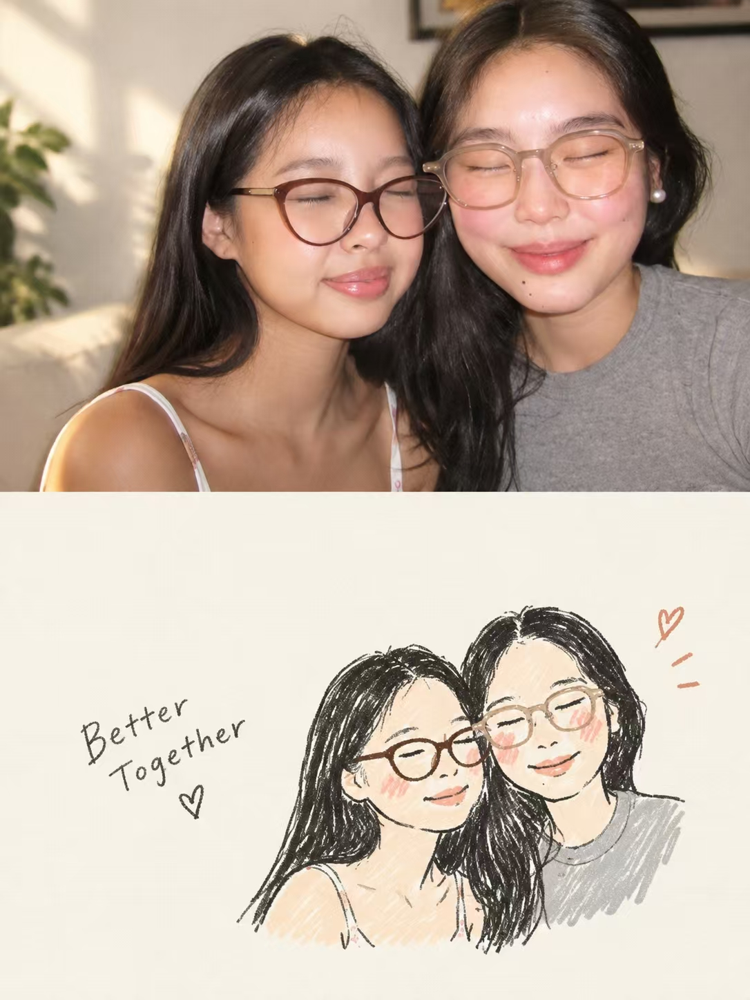
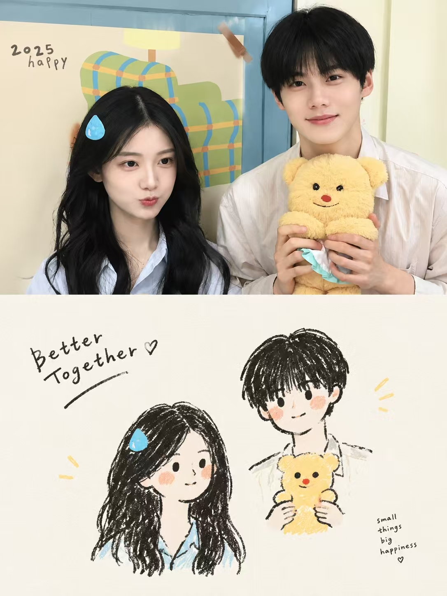

## 线条手绘图

请将我上传的每张照片分别制作成一张独立的高级设计海报，一图一报，不拼接。整体采用3:4竖版构图，上下两个区域高度严格 1:1，各占50%。上半部分保留原始照片，保持主体身份、结构、姿态、真实质感、自然光影与原有色彩氛围，仅做轻微高级调色，呈现艺术杂志与展览图像质感；为适配画幅可自然扩展环境，但不得拉伸、扭曲或改变主体。下半部分只提取最具识别性的主体、轮廓、结构、姿态与叙事关系，重构为 Hand-drawn Doodle Lifestyle Illustration / Naïve Illustration / Marker Drawing。

不要保留所有对象，不复制原场景，不完整还原全部人物、服饰、背景和道具，须主动删除大多数无关信息，并通过删减、重组、裁切与尺度变化重新导演画面。造型简化、符号化、松弛有个性，使用轻微抖动、断续、不完全规整的手绘线条，以及马克笔、蜡笔、油画棒般的自然涂色，允许轻微越线、露白和手工误差，不追求写实比例、完整透视和精细描绘。

下半部分必须以超大量有意识留白为核心，实体图形只占较小比例，其余空间主动留空；主体可偏心、贴边、悬置或局部裁切，宁可少画，也绝不填满。配色严格克制，仅使用 2–3 种主色＋黑/深灰线条＋暖白纸底；若原图颜色复杂，主动舍弃大部分颜色，只保留最关键的一组色彩记忆点，整体少色、轻色、净色、统一色。图形与文字必须整体排版，先建立隐形网格、视觉轴线与阅读路径；文字可贴近主体轮廓、顺势排列、落在负空间中，形成错位、穿插和不对称呼应，避免机械居中、上下堆叠和固定模板。文字不限语种，仅保留少量有意义的字词或短句，使用轻巧自然、略带字宽差异与笔压变化的手写字体，可用一个稍明显短句配合极小辅助文字，但不要菜单式标题、长段文案或满版文字。整体追求稚拙的画、成熟的构图、聪明的图文关系、超大量留白与少色克制的高级感，像高级独立杂志、生活方式 editorial illustration 或艺术出版物，而不是儿童手帐。

负面提示词：保留全部背景、保留全部角色、复制原场景、多人物全量复刻、色彩过多杂乱、高饱和糖果色、满版构图、主体过大、随机小图标堆积、儿童手帐感、廉价卡通感、复杂透视、精细写实描摹、厚涂、赛璐璐、3D 渲染、机械工整线稿、正式商业海报排版、长段文字、信息堆积、模板化设计、AI塑料感。

  

**参考图**

   
          
图1
   
   
          
图2
   
 

