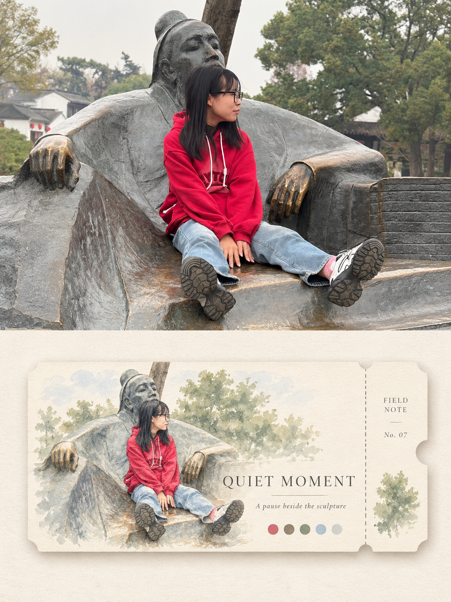
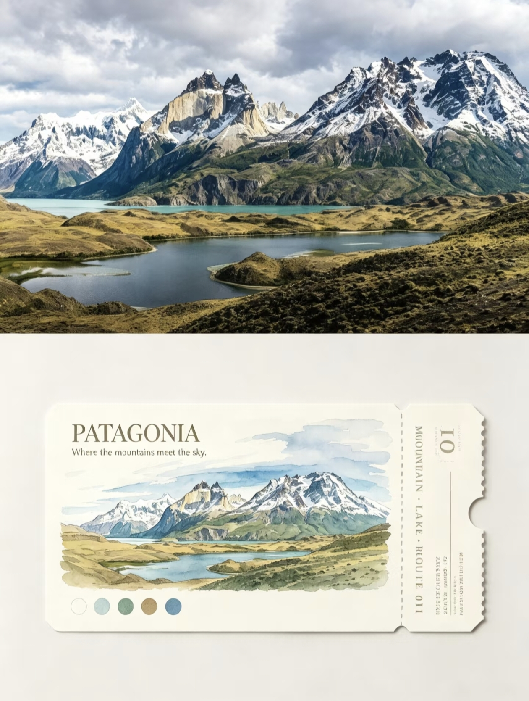

## 插画纪念票

请将我上传的每一张照片分别、独立处理，为每张照片生成一张独立的“摄影 + 插画纪念票卡”设计作品。每张输入照片只对应一张完整成品，不得将多张照片拼接、合成、并置，也不得混用不同照片中的人物、动物、建筑、交通工具、植物或其他主体；必须逐张单独分析、单独设计。整张作品只以对应原始照片为唯一视觉依据，从照片中提取最值得被记住的主体、环境、光线、场景关系、辨识度最高的轮廓以及代表性色彩，再将这些视觉记忆转化为一张具有收藏感、旅行感与独立出版气质的纪念票卡。

整体采用竖版上下分区构图，上半部分与下半部分各占画面高度约 50%，形成清晰、安静的“真实摄影 / 纪念票卡”上下对照关系。上下两区不做复杂分割，也不使用拼贴网格、厚重边框或装饰性框架。整体版式强调留白、秩序、轻盈感与收藏品气质，使上方真实照片与下方设计票卡自然呼应，而不是两个互不相关的画面。

上半区为原始照片展示区，必须尽可能忠实保留上传照片本身的摄影属性。主体身份、人物外观与姿态、动物形态、主要景物、建筑结构、地形走势、岸线、物件关系、空间透视、自然光影、真实材质、景深以及原有色彩氛围均应保持不变。为了适应竖版构图，可以对照片进行自然、克制的等比裁切或留边处理，也可对天空、地面及非主体环境进行少量自然延展，但不得拉伸、扭曲、替换、移动或重绘主体，不得新增原图中不存在的人物、建筑、交通工具或其他重要景物。只允许进行非常轻微、精致的摄影调色与画面净化，使其更接近艺术杂志、独立出版物或展览摄影的质感，同时保留原始照片的真实性与现场感。

下半区使用浅米白、奶油白、象牙白或极浅暖灰色纸张作为背景，保持干净、柔和、安静，并带有非常轻微的纸张纤维与自然纸面肌理。下半区不铺满画面，而应保留充分留白，并在中央或略偏下的位置放置一张横向的纪念票卡。票卡整体约占下半区宽度的 55%–75%，通常控制在约 65% 左右，四周必须保留明显、均衡的负空间，使票卡像一件被安静陈列在出版物页面中的收藏纸品，而不是填满整个区域的商业票券。

票卡本身采用奶油白、象牙白或柔和自然纸色，材质接近高品质哑光艺术纸或轻薄卡纸，具有细微纸纤维、利落但不机械的裁切边缘、非常轻微的纸张厚度，以及柔和自然的接触阴影。整体应有真实纸品触感，但保持平整、克制、精致，不做成厚重 3D 模型，也不要使用塑料质感、金属反光或光泽卡片效果。

票卡的一侧设置一个清晰但简洁的可撕票根结构，通过细密的竖向虚线、规律的微型穿孔、半圆缺口或非常克制的规则齿边表现。可撕结构必须一眼可辨，但不应过分强调，不要做成真实交通票据的复杂防伪纹样或商业票券。它是一张基于旅行记忆设计的艺术纪念票卡，而不是真实车票、登机牌或门票。

票卡的核心插画必须基于上方同一张照片进行重新提炼。先从原图中筛选最有记忆点、最具辨识度的主体以及少量必要环境信息，删减杂乱背景和次要细节，再转译为通透、轻盈、克制的旅行插画。人物照片应保留人物最具辨识度的外观、姿态与互动关系；动物应保留核心轮廓、姿势和物种识别特征；风景应保留主要地形、建筑轮廓、岸线、道路、水面、植物关系与空间走势。不得凭空增加原图不存在的重要人物、建筑、车辆、船只或景观。

插画风格以轻盈通透的水彩与轻彩铅旅行插图为主，可以出现细腻的透明设色、柔和叠色、少量纸面留白、轻微彩铅结构线以及自然手工笔触，但整体必须简洁、精致、有出版物感。不要机械照搬原照片的全部真实细节，而应通过概括、删减与轻度艺术化，使插画像一段被重新记录下来的旅行记忆。人物、建筑或风景的核心轮廓必须保持清晰可辨，但细节可以适当弱化，让插画与真实照片形成“摄影记录现实 / 插画记录记忆”的呼应关系。

票卡的配色必须从上方原照片中提取约 3–5 种最具有辨识度的代表性色彩，再进行适度净化和柔化，形成统一、低至中等饱和度的旅行插画配色。保留原图的综合色温与情绪记忆，但避免机械复制所有颜色，也不要引入与原照片无关的强烈新色。色彩应清澈、自然、具有空气感和纸面感，可以适度降低过强饱和度，使整体更像收藏插画、旅行手账或独立出版物，而不是商业宣传图。

在票卡插画下方或适当留白位置排列 3–5 个小型圆形配色点，这些圆点直接对应从原照片中提炼出的代表性色彩。圆点尺寸应很小、间距整齐、视觉克制，作为一种“色彩记忆索引”参与设计，而不是装饰性彩点堆砌。它们应与插画和票卡的整体配色保持一致，不能使用随机颜色。

文字系统保持极简、克制、清晰。票卡可加入 1 行简短英文主标题，以及 1 行更小的英文副标题。主标题应根据照片中的主体、环境、光线、动作、情绪或旅行氛围自然提炼，语言简短、有记忆感和收藏感；副标题则用于补充一小段情绪、状态或场景提示。字体宜采用优雅的衬线字体、细窄大写字体或具有独立出版感的现代字体，强调少字、清晰、疏朗与可读性，不使用粗重大字或商业广告字体。

可撕票根区域只保留非常少量的概念性纪念文字，例如 VOYAGE、OPEN AIR、MEMORY、FIELD NOTE、PASSAGE、MOMENT，以及简短的序列编号或纪念编号，用来强化“旅行纪念票卡”的收藏属性。这些内容只是概念设计，不代表真实交通信息，也不要虚构具体地点、真实日期、交通线路、票价或其他无法从照片中确认的事实。若文字无法稳定、正确地呈现，则宁可减少文字或保留干净留白，也不要生成乱码、错误拼写、无意义字符或大量伪文字。

整张作品最终应呈现为：上半部分是真实、细腻、保留原始空间与情绪的摄影图像，下半部分是在浅色纸面中安静陈列的一张横向插画纪念票卡。票卡从同一张照片中提取最值得被记住的主体、场景、色彩与氛围，再将它们压缩为轻盈水彩 / 彩铅插图、可撕票根、少量英文排版与 3–5 个色彩记忆点，形成一种“把真实旅行瞬间收藏成一张票”的视觉概念。整体应温柔、精致、安静、克制、有旅行感、出版物感与收藏纸品气质，而不是普通车票设计、商业宣传物或复杂手账拼贴。

负面提示词：多图拼接、多照片合成、混用不同照片主体、改变人物身份、改变人物姿态、人物变形、动物变形、错误建筑、错误地形、虚构交通工具、虚构重要景物、拉伸照片、错误透视、摄影区域插画化、复杂背景堆砌、票卡过大填满画面、留白不足、真实车票仿制、真实登机牌仿制、复杂防伪纹样、商业票券设计、复杂拼贴、手账装饰泛滥、邮票堆砌、标签堆砌、儿童卡通、Q版、动漫风、厚重油画、厚重水彩晕染、3D 渲染、塑料质感、金属质感、光泽卡片、廉价复古、过度做旧、脏污旧纸、过度泛黄、高饱和撞色、随机配色点、商业广告海报感、文字过多、虚构真实地点、虚构日期、错误英文、乱码、伪文字、Logo、水印、二维码、平台角标、软件 UI、黑边、低清晰度。

  

**参考图**

   
          
图1
   
   
          
图2
   
 

