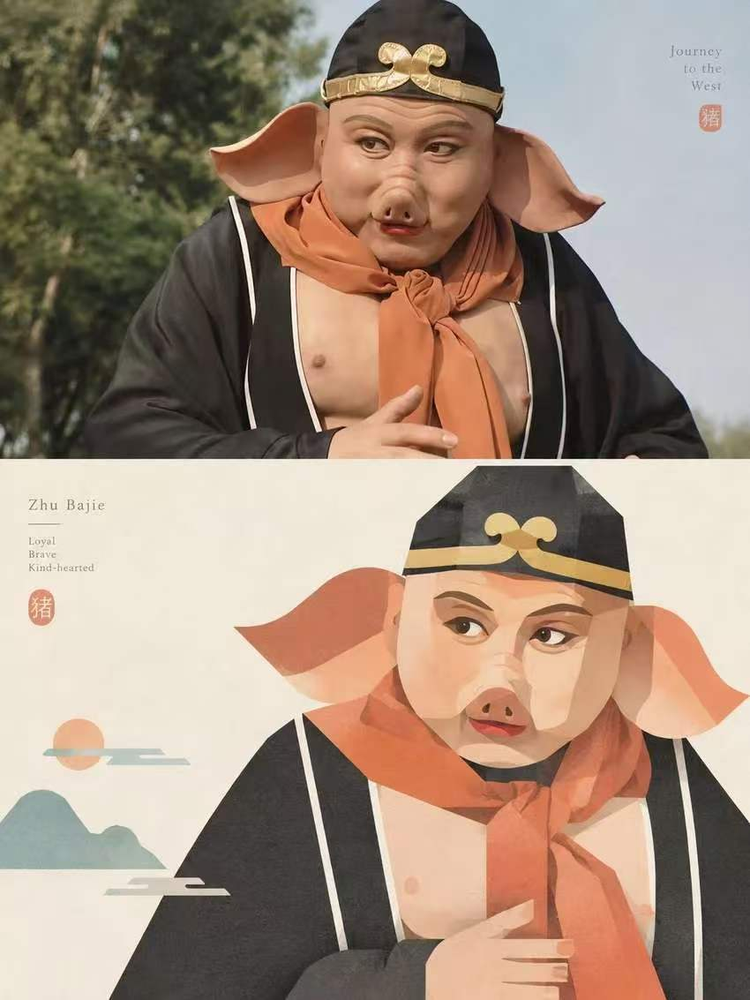
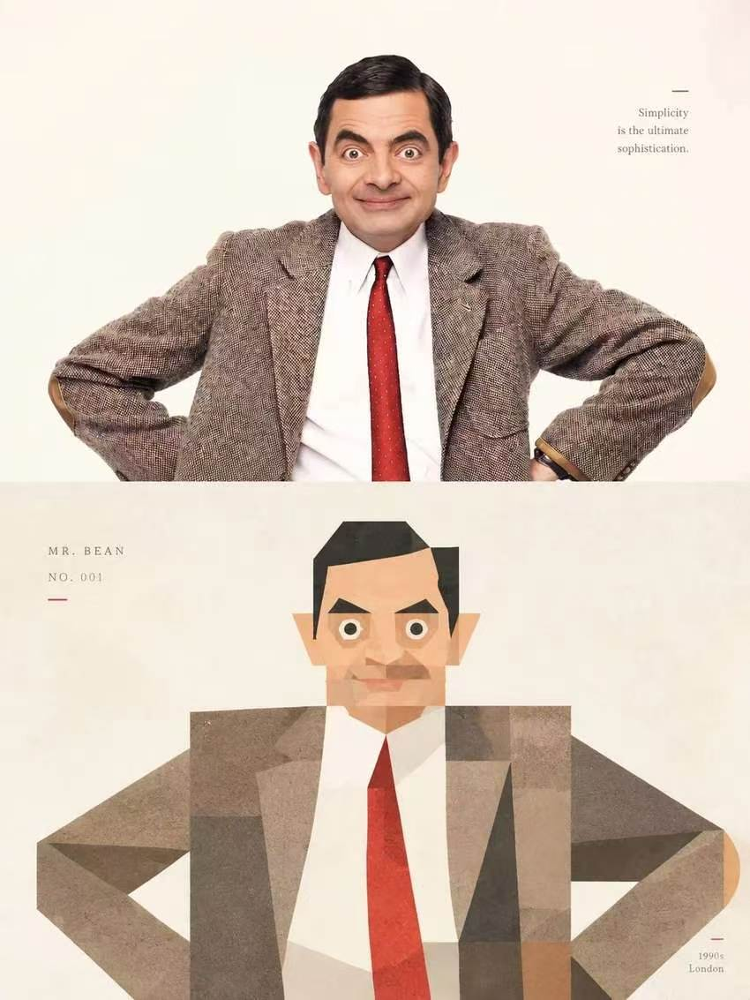

## 简约几何画风图

3:4 竖版高级设计海报。每张上传照片单独成稿，单图单张，不得多图拼接。

画面采用上下严格 1:1 分区结构，上下各占画面 50%。上半部分保留原始照片，准确呈现原图主体的身份特征、结构关系、姿态动作、真实质感、自然光影与原有色彩氛围，仅进行轻微而克制的高级调色，使其呈现出接近艺术杂志、摄影书或展览图像的视觉质感。为适应 3:4 竖版画幅，可对原照片环境进行自然延展，但不得拉伸、扭曲、变形或改变主体本身，必须保证主体的真实性与可识别性。

下半部分基于上半部分照片内容进行再创作：提取其中最具识别性的主体、轮廓、结构、姿态、重心、关系与气质线索，重构为一幅方块化、模块化、几何解构式插画。该部分不是对原图的完整复制，也不是写实描摹，而是删去无关细节，仅保留最能代表主体身份与气质的“视觉记忆点”，通过几何概括、形状切分、块面叠压与拼贴式重组重新建构图像，使观者能够一眼对应上方原照片。

整体造型强调方块感、模块感、几何秩序感与完整大块面。拆分方式应克制而明确，不要切成大量零碎小片，不要形成松散破碎的拼装感；应使用更少、更大、更完整的几何单元来组织形象，例如：矩形、方形、圆角方块、椭圆、三角形以及少量不规则块面。不同题材均需转化为统一的模块化几何语言：

- 人物：可概括为方形或圆角方形面部、清晰下颌线、块面化五官与发型结构  
- 建筑：转化为整体量块、立面分区、窗洞节奏与结构转折  
- 动物、植物、器物、景观：同样提炼为具有秩序感和识别度的几何形体

允许适度夸张与提炼，但必须保持成熟、克制、简洁、清晰，避免琐碎、幼稚、松散或拼贴过度分裂。

视觉语言采用：扁平色块 + 拼贴构成 + 现代主义几何形式。色块应具有如同纸片拼接般的构成感，形成清晰、有秩序、富有设计感的剪贴关系。复杂背景应大幅删减，只保留少量必要的辅助形状，不形成第二视觉中心，不干扰主体识别。

构图强调小尺度主体与大面积留白的关系。主体可根据原图的方向、比例、动态、重心和结构走势自由安排位置，可居中、偏心、贴边或局部裁切。整体需保持主次分明、疏密有致、重心稳定，重视正负形关系、块面轻重、空间呼吸感与版面节奏，呈现安静、克制、具有编辑感的海报构图。

材质表现为温和的纸张颗粒感与轻微版画/艺术印刷质感。下半部分色块表面应保留细腻纸感、柔和噪点与轻微印刷肌理，整体接近纸本拼贴、丝网印刷或艺术微喷作品的视觉感受。避免出现光滑矢量感、3D 渲染感、照片滤镜感或过度数字精修痕迹。

配色从上半部分原照片中提取 2–4 种最具辨识度、最能体现主体气质的颜色，并将其整理为更高级、更统一的视觉系统。颜色可适度提亮、提纯、去灰，转化为如 奶油白、杏色、蜜桃粉、珊瑚橙、雾蓝、灰绿、鼠尾草绿、暖棕、柔紫 等轻盈、现代、耐看的色块关系。整体要求：

- 主色明确但不刺眼
- 辅色温柔且有层次
- 气质干净、温暖、时髦、亲和
- 避免土黄、脏灰、暗褐、荧光色、廉价糖果色与杂乱配色

文字可少量介入，语种不限。可依据主体的身份、地点、情绪、象征或主题提炼出简短标题、小注、编号或说明性文字。文字应当小、轻、克制、精致，落在留白处或边角位置，与图形形成细腻的图文关系；避免大标题堆砌、强商业感排版或喧宾夺主的文字设计。整体画面应建立统一而鲜明的视觉语言：大块面几何解构、克制拼贴、柔和高阶配色、纸本颗粒、充足留白与编辑式排版共同构成完整风格。无论对象是人物、建筑、动物、植物、器物还是景观，都必须保持其清晰身份识别，同时统一于模块化几何秩序之中。

避免：写实描摹、照片照搬、过碎切割、零散小块、复杂透视、密集细节、幼稚拼贴、卡通感、Q版感、3D 感、光滑矢量感、照片滤镜感、模板化海报、廉价文创感、过度装饰、杂乱背景、商业标题堆砌、低级配色、荧光色、脏灰土黄、过度精修、主体变形、拉伸扭曲、多图拼接。

  

**参考图**

   
          
图1
   
   
          
图2
   
 

