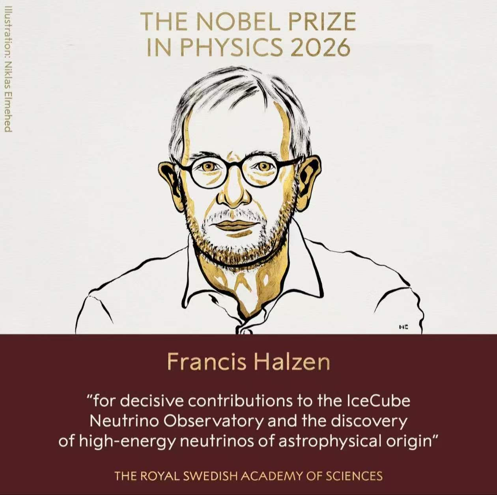
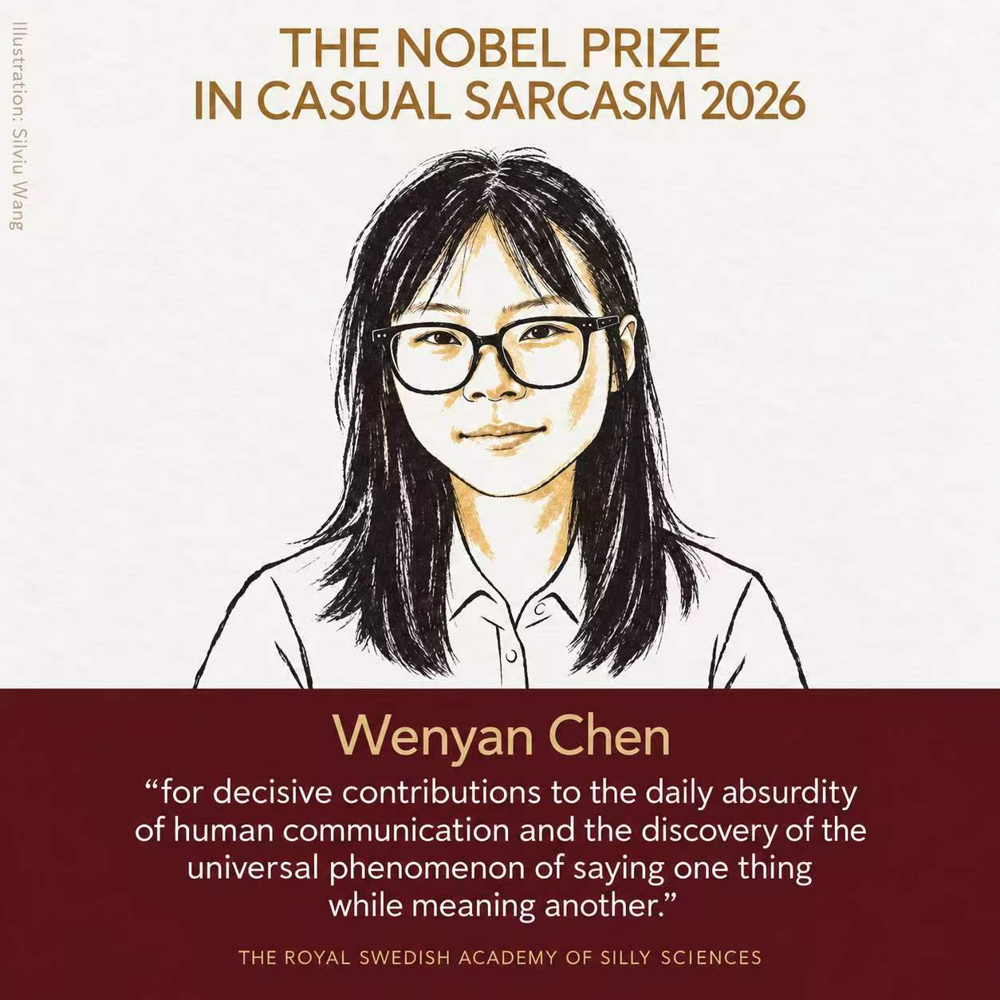

## 诺贝尔奖风格图

请严格参考第二张图片，对输入的第一张图片中的人物进行生成，制作成一张 1:1 方形构图的极简诺贝尔奖公告风格人物海报。整体画面分为上下两个区域：上方为浅米白色留白背景中的人物插画区，下方为深酒红色信息区。整体气质庄重、学术、安静、克制，版式简洁，留白充足，不添加多余装饰。

请保留输入图片中人物的身份特征、脸型、五官关系、发型、眼镜、服装外轮廓、姿态与神态，使人一眼可以认出原人物；但表现方式必须改为 高度概括的极简手绘肖像插画。人物以 黑色手绘线条 为主，只允许搭配 少量哑光金色块面点缀，除此之外 不要涂色。不要真实肤色，不要大面积填色，不要渐变，不要阴影渲染，不要素描排线，不要水彩、厚涂、彩铅或照片质感。

人物必须简化处理：五官用准确、简洁、有表现力的黑色线条概括；头发只用少量概括性的黑色线条表现整体走势与发型轮廓，不要逐根描绘，不要过细，不要复杂发丝细节；衣服只保留最必要的外轮廓、领口和少量结构线，不要褶皱细节，不要布料纹理，不要针织质感，不要细密线条。整体人物要疏朗、克制、平面化，避免细节堆积。

人物采用胸像或半身像居中构图，尺寸适中，不要过大，四周保留充足留白，整体呼吸感强。上方背景为接近白色的浅暖米白色纸张质感，干净、轻微肌理即可，不要泛黄，不要做旧，不要复杂纹理。人物线条为黑色，哑光金色仅少量点缀在局部结构上，例如面部侧边、鼻梁、耳部、颈部等少数区域，用作强调；除这些少量金色块面外，人物其余部分一律保留背景原色，不再填充任何颜色。
海报顶部居中排版大写英文标题，采用简洁、现代、克制的字体，颜色为浅灰金色，内容使用占位符：

“THE NOBEL PRIZE
IN xxx xxx”

其中第一个 xxx 为诺贝尔奖类别，第二个 xxx 为年份。

下方信息区为统一、纯净、低饱和的深酒红色整块色面，不要渐变、不要纹理。区内所有文字居中排版，层级清晰。首先显示姓名：
“xxx”

姓名使用简洁清晰的字体，颜色为浅金色。其下显示获奖理由或主要事迹，使用英文引号包裹：

“for xxx”

其中 xxx 为该人物的贡献、成就、事迹或授奖理由，控制为 2—4 行，排版正式、清晰、克制。

最底部显示颁奖机构名称：“xxx”

可使用全大写英文，小字号，保持正式感。画面左侧可加入一列低调的竖排小字：

“Illustration: xxx”

存在感要弱，不抢主体。整体必须强调：1:1 方形构图、极简、平面化、黑色线描、少量哑光金色块面点缀、留白充足、人物概括准确、头发不要细、衣服不要细、人物不要过大、除少量哑光金色块面外不要任何涂色。不要添加花叶、边框、奖章、皇冠、分隔线或其他装饰元素。最终效果应像一张专业设计的诺贝尔奖风格人物海报。
请使用以下占位符信息进行生成：

姓名：xxx
日期 / 年份：2026
诺贝尔奖类别：THE NOBEL PRIZE IN SILLY BEHAVIOUR 2026
获奖理由 / 事迹：for decisive contributions to the daily absurdity of human life and the discovery of the universal phenomenon of forgetting where one’s earphones were placed.
颁奖机构：THE ROYAL SWEDISH ACADEMY OF SILLY SCIENCES
插画署名 / 说明：Silviu

负面提示词：写实照片、半写实插画、厚涂、水彩、油画、彩铅、素描排线、复杂阴影、渐变上色、真实肤色、大面积填色、过细头发、逐根发丝、复杂衣服纹理、褶皱细节、针织细节、人物过大、构图太满、背景泛黄、复古做旧、明显纸张脏污、复杂纹理、花叶装饰、桂冠、皇冠、奖章、边框、分隔线、金箔质感、金属反光、鲜艳颜色、过多金色、装饰性图案、字体花哨、海报信息区渐变、信息裁切、文字溢出、低级设计感、Q版、漫画感过强、3D渲染、照片滤镜。

  

**参考图**

   
          
图1
   
   
          
图2
   
 

