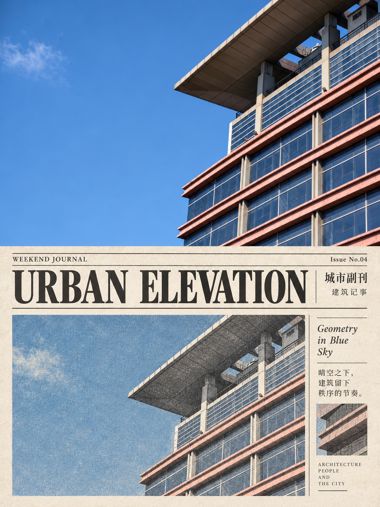
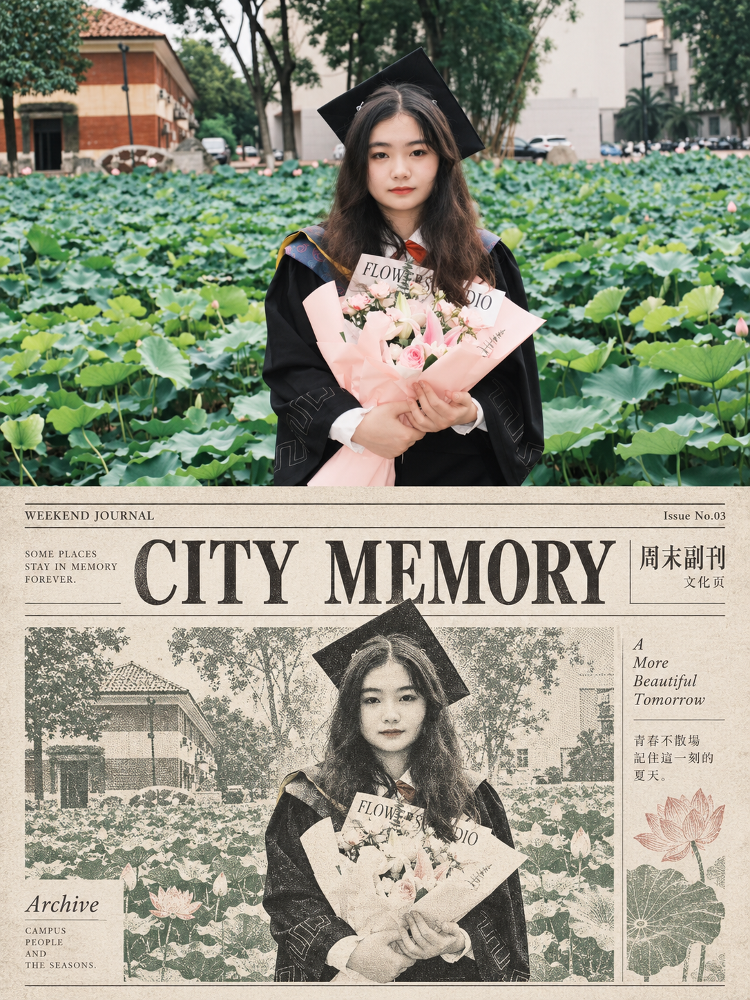

## 旧报纸图

请将我上传的每一张照片分别、独立处理，为每张照片生成一张独立的高级设计海报。每张输入照片只输出一张完整成品，不得将多张照片拼接、合并、并置或共享同一套图文结构；必须逐张单独分析、单独转化。整张画面统一采用严格的 3:4 竖版构图，上下严格按 1:1 对半划分，上半区占画面高度约 50%，下半区占画面高度约 50%，比例不得偏移，形成清晰、稳定、克制的上下对照关系。
上半区为原始照片展示区，必须尽可能忠实保留对应原图本身的摄影属性。人物身份、五官、发型、表情、姿态、动作、身体比例、穿搭、配饰、手中或身边道具、人物之间的关系、空间关系、透视、自然光影、真实材质、景深以及原有色彩氛围均应保持不变。只允许进行非常轻微、克制而高级的摄影调色与画面净化，使其更接近独立摄影杂志、艺术出版物或展览摄影的质感，例如统一色调、细腻梳理高光和暗部层次、减少杂乱感，但不得改变画面内容本身。为了适配竖版构图，可以对边缘环境进行少量、自然、无痕的延展，也可以进行合理裁切，但不得拉伸、扭曲、换脸、移动主体、改变动作、替换服饰或新增无关元素。
下半区必须以同一张上方照片为唯一视觉依据，将照片中最具识别性的 人物轮廓、表情、姿态、服饰、道具与场景记忆点 提炼出来，重构为一页具有真实出版气质的 Old Newspaper Supplement / Sunday Culture Page / Editorial Newsprint Layout。下半区不是普通插画，也不是现代时尚杂志封面，而应明确呈现为一张复古文化副刊、周末生活版、旧报纸专题页或文艺新闻增刊的编辑化版面。整体应让观者一眼感受到它和上半区来自同一张照片、同一个人物与同一个记忆场景，但视觉语言需要明显转化为旧报刊系统，而不是简单复制上方照片。
下半区应采用 旧报纸米白、浅暖灰或轻微泛黄的新闻纸底色，并建立清晰的多栏编辑排版结构。画面中可包含主图区、栏目标题区、图注区、边栏、小标签、细线分隔、页眉或小型期号信息，但整体必须克制、清楚、井然有序，不可排得过满，也不要堆砌过多栏目。版面应像真实存在的一页文化副刊：有明确的版式秩序、轻微层级变化和出版物感，但不做成密密麻麻的长篇正文，不模仿网页新闻界面，也不做成现代商业媒体大封面。
下半区的人物主体应作为整页的核心视觉焦点，通常占下半区视觉重心的 40%–60%，不能过小，也不能满版铺满。人物可以被转译为 报纸主图、半调网点肖像、局部线描肖像、低饱和专色插图，或这些方式的克制组合，但必须保留原图中最关键的人物识别特征，包括脸部轮廓、发型特征、神态气质、姿态方向、服饰关系和主要道具。背景不需要完整复制原照，只需保留最关键的 1–3 个视觉记忆点，例如一个建筑轮廓、一段窗边光线、一张椅子、一处街景线索、一个室内角落或少量环境结构，用来提示场景来源和人物处境。整体应强调“报刊式转译与编辑重组”，而不是做成写实翻版。
下半区的图像语言应明显带有旧报刊印刷特征。可以加入 半调网点、细密新闻纸颗粒、局部线描、专色块面、低饱和版画感处理，并适度呈现轻微的印刷不完美，例如轻微套印错位、边缘略有墨色不均、纸张纤维、轻浅折痕、局部压痕、油墨吸收后的轻微软化等，使其看起来像一页被保存下来的老副刊或周末文化页。所有这些质感都应真实、节制、精致，只起到强化纸媒年代感和收藏感的作用，不能做得脏乱、破损、过度发黄、仿古做旧过头，不能出现污渍、大片破损、咖啡渍或故意制造的廉价旧纸效果。
配色必须严格克制，整体以 黑、灰、旧纸白 为基础色，再辅以 1–2 种低饱和专色 作为点缀。专色可以从上方原图中提取并转化，例如暗红、雾蓝、橄榄绿、褪色棕、灰蓝、旧墨绿等，但必须控制在低饱和、印刷感、旧刊物感的范围内。色彩应更多服务于版面层级、人物识别和局部情绪提示，而不是制造鲜艳吸睛的商业海报效果。整体色彩必须安静、知性、温和、有年代感和出版物气质，避免高饱和撞色、荧光色、糖果色或现代社交媒体海报式强烈对比。
文字系统应建立一个精简、克制、具有报刊感的编辑排版框架。可加入极少量栏目标题、页眉、小标签、图注或期号信息，例如 WEEKEND JOURNAL / CITY MEMORY / SUNDAY NOTES / CULTURE PAGE / Issue No.03 / Archive，也可以使用简洁的中文栏目感词组，如 周末副刊 / 城市记事 / 今日一页 / 文化页 / 旧闻备忘。文字必须少而精，只作为排版层级和版式气质的一部分，不生成大段正文，也不要写成长篇新闻报道。所有文字应具有报刊与出版物感，可采用细衬线、窄体衬线、经典报刊字或克制的标题字体，保证清晰、优雅、可读，不可出现乱码、无意义伪文字、错误拼写或密集信息堆积。
整张海报的最终效果应呈现为：上半区是真实、细腻、克制、具有独立摄影出版质感的原始照片；下半区则是基于同一照片内容重构而成的一页复古文化副刊 / 周末生活版 / 旧报纸专题页。两部分之间必须保持清晰的身份呼应与主题一致性，上半区记录现实瞬间，下半区将同一人物与同一记忆转译为具有新闻纸纹理、半调印刷气质和编辑设计感的文化出版页面。整体气质应复古、文艺、知性、安静、克制、具有收藏级出版物质感，而不是现代广告页、时尚商业封面或普通插画拼贴。
负面提示词：多图拼接、多照片合成、共享同一套版式、上下比例错误、人物换脸、主体变形、错误五官、错误姿态、动作被改变、服饰被替换、背景被随意改写、现代杂志封面、商业广告、普通人物插画、少女手账、花哨拼贴、儿童绘本、网页新闻界面、社交媒体排版、密集长文、赛璐璐、厚涂、3D 渲染、光滑矢量、塑料质感、AI 感过强、元素堆砌、排版脏乱、过度发黄、过度做旧、污渍破损、咖啡渍、票据堆叠、Logo、水印、二维码、平台 UI、乱码、伪文字、高饱和撞色、荧光色、廉价糖果色。

  

**参考图**

   
          
图1
   
   
          
图2
   
 

