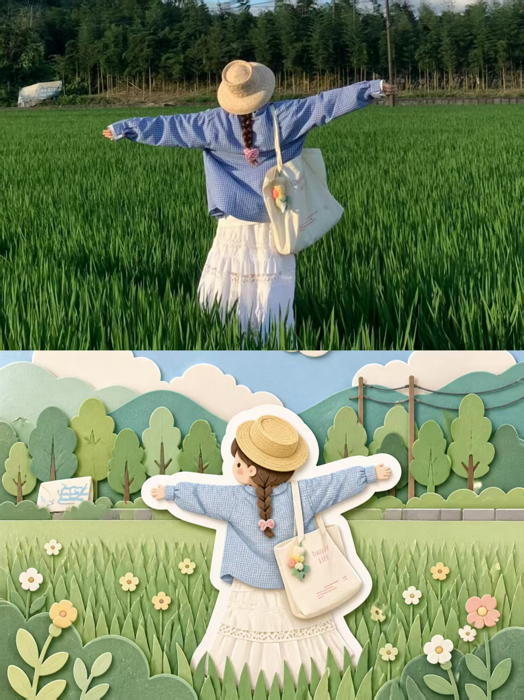
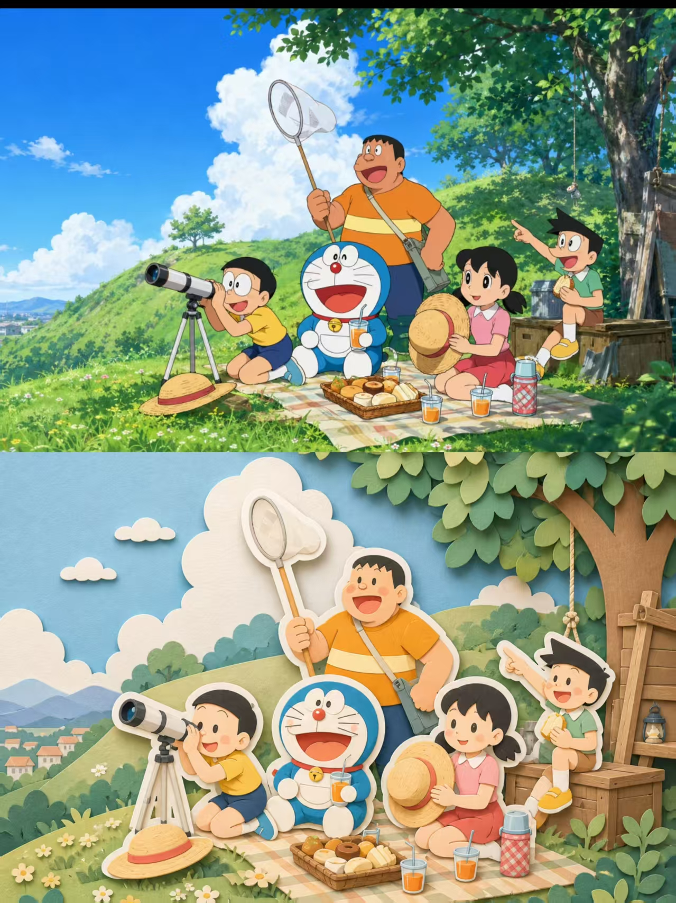

## 剪纸画风图

将每一张输入照片分别单独处理，生成一张3:4 竖版的纸胶带拼贴作品，不得多图合并。

画面采用上下分区构图：上半部分保留并清晰呈现原始照片内容，作为原图展示；下半部分根据上半部分照片内容进行再创作，从原图中提取最具识别性的主体、轮廓、姿态、结构与氛围，但不要直接完整复制原照片，而是将主体重新拆解、概括、重组，并使用约 10–18 块中等尺寸的纸胶带重新构建为一幅平面拼贴。

如果原图场景较复杂，仅保留 1–3 个关键识别特征，并可额外加入 1–2 个来自原始环境的简化元素辅助表达；允许细节不完整，但必须保留清晰可辨识的核心视觉特征。下半部分的主体必须使用平面、正面、结构化的纸胶带拼贴方式完成，通过不同明暗色块、胶带叠压顺序、半透明叠色、负形留白、细窄胶带切条来表现体积、边缘、局部细节与层次；不得使用铅笔线、墨线、涂鸦笔触、绘画笔刷或普通插画描边。

纸胶带材质需真实可信，呈现自然纸纤维质感、轻微磨损边缘、少量自然撕裂边、细微折痕、透明胶带叠压后的轻微色彩变化、胶带之间的小面积重叠阴影，保留明显手工制作痕迹，但整体仍然是二维平面拼贴，不要做成立体纸雕、厚重分层模型或悬浮纸艺装置。

背景使用干净的暖白色笔记本纸张，带有细腻、自然、不重复的纸纤维与轻微纸浆纹理，纸面克制、清爽，不泛黄，不过度复古，不带污渍、烧痕、咖啡渍或旧纸效果。整体画面需保留约 65%–80% 的大面积留白，主体通常占画面宽度的 40%–55%，位置可居中或略偏下，形成安静、克制、现代编辑感的版式，避免拥挤和密集堆叠。

色彩从原始照片中提取 4–6 种低饱和颜色，以纯色纸胶带为主，可少量加入非常克制的条纹、格纹、网格或圆点等简单纸胶带图案，并至多加入一点柔和的暖色作为点缀。整体配色必须柔和、统一、低饱和、具有设计感，避免碎色过多、颜色脏乱或形成密集马赛克感。如需文字，只允许加入 1–3 个英文单词的短标题，使用略微褪色的打字机字体，以小尺寸低调放置在主体附近，但不得遮挡主体，也不得添加无意义的小字。不要加入票据、邮票、标签、贴纸、印章、花边、手账装饰、Logo、水印或伪文字元素。

最终效果应呈现为：真实手工纸胶带拼贴 / masking tape art，简洁、松弛、触感真实、结构清晰、留白充足，同时兼具笔记本素材感、现代编辑插画气质与克制的艺术设计感。

负面提示词：普通矢量插画、照片滤镜、写实绘画、厚重3D纸雕、立体纸艺模型、激光切割纸层、Q版角色风、可爱卡通脸、白色粗描边、手绘线稿、铅笔线、墨线、数字渐变、塑料质感、过度锐化、过多碎片拼贴、密集手帐、装饰过量、复古票据元素、邮票、标签、贴纸、印章、伪文字、Logo、水印、脏污旧纸、泛黄纸面、过强折痕、过度阴影、复杂背景、多图合并。

  

**参考图**

   
          
图1
   
   
          
图2
   
 

