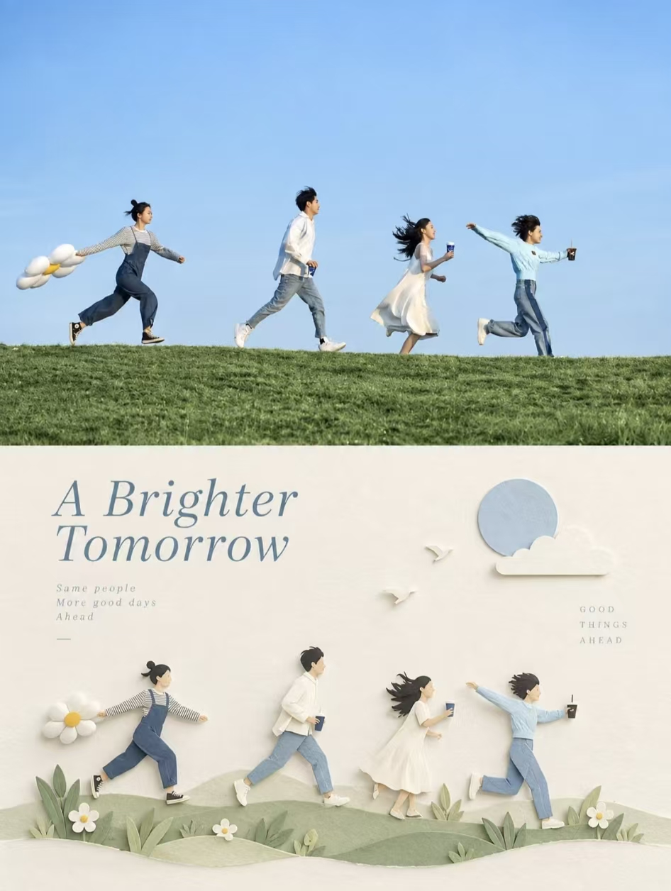
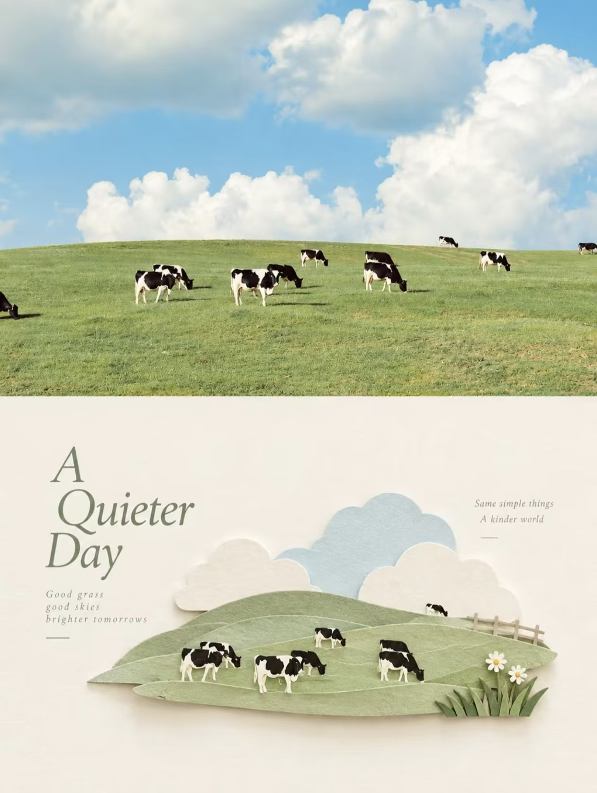

## 纸雕微缩插画

请将每一张上传的原始照片分别、独立处理，为每张照片生成一张独立的海报。每张输入照片只对应一张最终成品，不得将多张照片拼接、合成、并置或共享同一套图文内容；必须逐张单独分析、单独转化。整体统一采用 3:4 竖版构图，画面上下分为两个严格对等的区域，上半区与下半区各占画面高度约 50%，上下比例保持 1:1，不设置明显分隔线，让“真实照片”与“纸艺重构”自然衔接，同时形成清晰、克制而完整的上下对照关系。

上半区为原照实拍展示区，必须尽可能忠实保留上传照片本身的内容与摄影属性。主体身份、结构轮廓、比例、姿态、空间关系、透视关系、真实材质、自然光影、阴影层次以及原始色彩氛围都应保持不变。只允许进行非常轻微、克制的高级调色与画面净化，使其更接近艺术杂志、独立出版物或展览摄影的精致感，例如适度统一色调、轻微梳理反差、降低杂乱感、保留真实细腻的层次与现场气息，但不得改变画面原有叙事，不得重塑主体，不得替换、移动、扭曲或重绘关键景物。为了适配竖版构图，可以对天空、地面或非主体环境背景进行少量、自然、无痕的延展，也可以做合理裁切，但必须保证主体结构、姿态和核心构图不变。

下半区为留白构图的立体纸艺小景插画 / 极简留白式纸雕微缩场景插画，必须以同一张原照为唯一主要视觉依据。下半部分首先需要理解原照片中最值得被记住的核心主题、主体关系、结构走势、情绪气氛与视觉隐喻，再将这些信息重新提炼、删减、压缩并重构。不要逐物复制照片，不要照搬所有细节，也不要把整张照片完整翻译成满版纸艺；应主动删去无关细节，只保留最能代表原物的结构、走势、轮廓特征、空间线索和视觉记忆点。人物、建筑、动物、植物、器物或景观，都应被概括为一个小体量、集中式的纸艺主景，使观者一眼就能识别它与上方照片之间的对应关系，同时明显感受到这是经过重新设计与提炼后的纸艺转译，而非照片描摹或装饰性复制。

下半区的整体造型逻辑采用 layered papercraft / paper-cut collage / paper relief 的方式展开。画面应由一层层裁切、堆叠、拼贴的纸片构成立体小景，保留轻微厚度感、浅浮雕感与温和的层次起伏，但必须控制在克制、轻盈、精致的范围内。主体不追求复杂透视、繁复场景和铺满式细节，而应通过少量清晰形体、层叠纸片、简洁结构和前后关系来完成重构，形成精致、安静、治愈、带有微缩场景气质的小景式表达。可以保留 1–3 个最关键的辅助环境元素，用来帮助说明空间和主题，但它们必须服从主景，不可分散视觉中心，也不能把下半区变成拥挤的立体舞台。

构图上，下半区必须始终保持“小尺度主体 / 大面积留白”的关系。主体体量偏小，通常只占画面整体视觉重心的较小部分，应根据自身方向、比例、姿态与视觉重心自由安排位置，可偏心、贴边、悬置或进行轻微局部裁切，但始终要形成一个清晰、集中、安静的视觉落点。主体周围要保留大量有意识的留白，让负空间成为画面结构不可分割的一部分，与纸艺主体共同构成呼吸感、空间感与编辑式平衡。宁可删减，也不要填满；宁可留下空隙，也不要堆叠过多元素。下半区应更像一件被安放在展页中的纸艺微缩景观，或一则极简的立体视觉诗意注解，而不是热闹、装饰化的场景模型。

材质上要明确强调纸雕拼贴的真实手工感。保留纸张纤维、干净但自然的切边、纸层叠压形成的边缘、轻微纸厚、柔和接触阴影与温和触觉感，使整体看起来像一件精致、真实、克制的手工纸艺微缩场景。纸张应更接近高品质哑光艺术纸、卡纸或手工纸，层次清楚但不过厚，边缘利落但不机械。阴影应浅淡、柔软、自然，只用来提示层次关系与浅浮雕感，不能制造戏剧化打光。整体避免复杂纹理堆积、粗糙破损、廉价手作感、塑料感、光泽感、照片滤镜感和过度精修后的数码模型感，也不要做成写实 3D 模型、悬浮纸雕装置或厚重多层模型。

配色必须严格采用柔和纸艺色系。整体以低饱和、高明度、温暖米白基底为基础，纸面主色可围绕浅天蓝、粉雾蓝、米白、奶油白、暖灰、雾绿、鼠尾草绿、浅卡其、淡木色等柔和环境色展开，再根据上方原照提取 1–2 个最有识别度的颜色作为局部点睛色，用于少量强调主体焦点、关键轮廓或局部节奏。这些强调色可以被转化为克制的珊瑚红、砖橘红、柔和赭橙，或其他少量偏暖的重点色，但必须非常节制，不可让局部强调色变成大面积主导。整体气质应轻盈、温柔、清新、治愈且有设计感，避免灰脏、暗沉、闷浊、廉价高饱和、糖果色泛滥、过度粉嫩或过度童趣化。颜色关系要统一、柔和、有呼吸感，不可碎色过多，不可杂乱拥挤。

文字部分只作极少量、编辑性的介入，不限制语种，也不预设固定标题、编号或模板式说明。可以根据照片中的主体、地点感、动作、情绪、气候线索或象征意义，自由提炼少量字词、短语或一句极短的句子，安静地置于留白区域、主体边缘或纸层外缘。文字风格应采用纤细、克制、疏朗、略带出版物感的现代字体，具有安静的编辑设计气质，不做粗重装饰，不做大标题压迫，也不做大段文案堆砌。文字排布应与图形形成精致的图文混合关系，使其成为版式秩序的一部分，而不是额外贴上的说明标签。整体文字数量必须少而精，起到轻微提示、命名、注释或情绪补充的作用，不可喧宾夺主，也不可让画面显得商业化或模板化。

整张海报最终应呈现为：上半区是真实、细腻、克制的摄影图像，下半区是对同一场景进行高度提炼后的留白式立体纸艺小景重构。整体强调小体量主景、大面积留白、温和纸张材质、浅浮雕层次、柔和纸艺色彩与安静的编辑排版，形成一种高级、轻盈、清新、治愈、带有独立出版气质与展览感的视觉效果。无论原照内容是人物、建筑、植物、动物、器物、室内场景或自然景观，都必须在“真实摄影”与“纸艺转译”之间建立明确而高级的身份呼应，避免复杂背景、写实细节堆砌、装饰过强、过多文字、模板化设计与填满式构图。

负面提示词：多图拼接、多照片合成、共享同一套文字、上下比例错误、明显分隔线、主体被拉伸、主体变形、主体被替换、错误透视、错误空间关系、逐物复制照片、场景照搬、细节堆砌、复杂背景堆满、留白不足、普通照片滤镜、普通矢量插画、儿童手工课风格、可爱卡通风、Q版、动漫风、厚重 3D 纸雕、悬浮纸艺装置、舞台模型感、塑料质感、光泽卡纸感、廉价工艺纸、复杂纹理堆积、过度阴影、戏剧化打光、糖果色、高饱和撞色、灰脏暗沉、过量装饰、贴纸风、手账小碎片堆砌、复杂排版、过量文字、大标题压迫、模板化海报、伪文字、Logo、水印、品牌标识、平台角标、低清晰度、廉价视觉效果。

  

**参考图**

   
          
图1
   
   
          
图2
   
 

