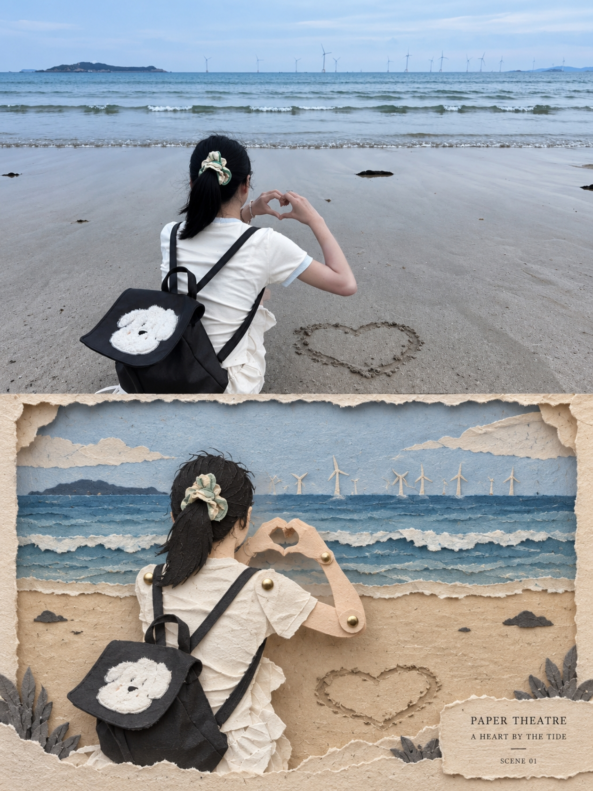
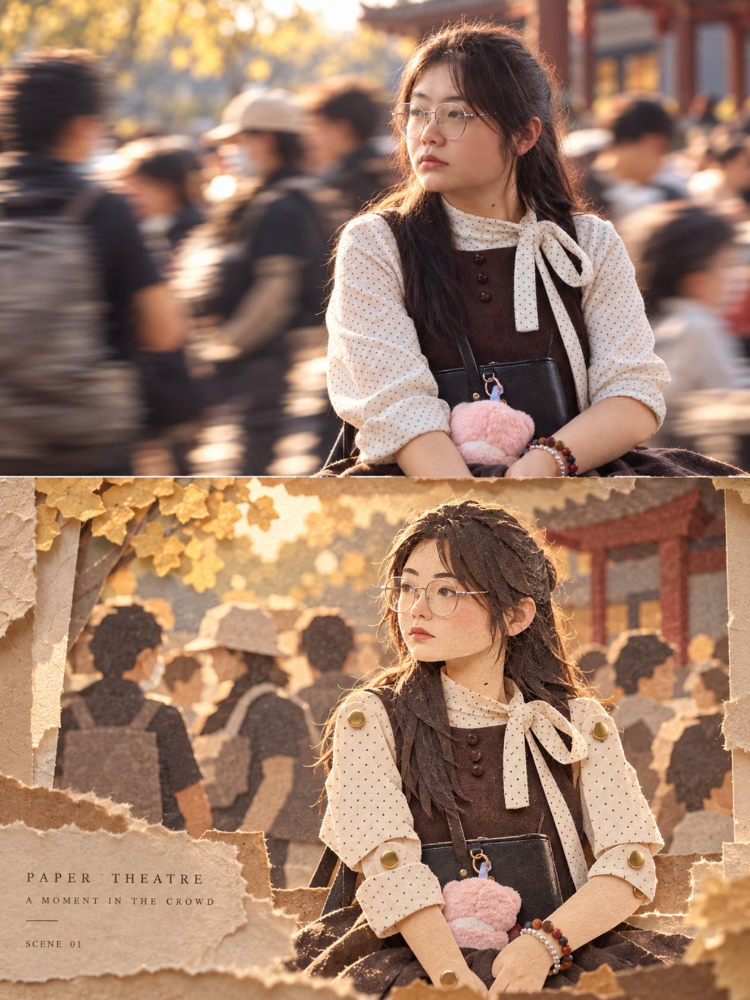

## 纸偶舞台图

请将上传照片制作成一张独立高级设计海报，一图一报，不拼接。整体采用 3:4 竖版构图，画面上下严格 1:1，各占 50%。

上半部分保留原始照片，最大程度保持主体身份、五官、发型、姿态、服饰、道具、自然光影、原有色彩与环境关系，仅做轻微高级调色，呈现独立摄影杂志与艺术出版物质感。为适配画幅可自然延展边缘环境，但不得拉伸、扭曲、换脸、移动主体或改变动作。

下半部分提取上方照片最具识别性的人物轮廓、姿态、服饰、道具与场景关系，重构为 Paper Puppet Theatre / Cut Paper Diorama / Handmade Paper Collage。不是普通插画，而是像真实手工制作的纸偶舞台：人物由多层裁切纸片、彩纸、纤维纸和厚卡纸拼接组成，头部、手臂、服装等部位可通过圆形纸钉、铆钉、活动关节连接，明显呈现纸偶结构。

背景采用前景—人物—后景多层纸景深，将天空、云朵、建筑、植物、旗帜或道具简化为不同高度的纸片层，形成小型纸剧场和立体纸雕效果。纸片边缘允许轻微毛边、撕裂、不规则裁切和手工误差，并保留纸纤维、折痕、压痕、胶水痕迹与自然投影，使画面一眼可见“真实纸张制作感”。

下半部分不要完整复制原场景，应主动删减复杂背景，只保留最重要的叙事元素。人物主体建议占下半部分 50%–70%，不要过小；可偏心、局部裁切，并利用纸层前后错位增强舞台感。

配色从原照片提取并简化为 3–5 种主色＋暖白/米白纸底，降低饱和度，保持统一。可加入极少量手写标题、日期、编号或剧场式小字，如 PAPER THEATRE / A MOMENT IN THE WIND / SCENE 01 / TRAVEL MEMORY，排版克制。

整体气质：手工、童话剧场感、艺术感、复古、温柔、叙事性、收藏级纸艺出版物感。

负面提示词：普通平面插画，水彩画，彩铅画，照片滤镜，光滑矢量，3D塑料模型，精致数码绘画，人物换脸，纸偶结构不明显，没有纸钉关节，纸张纹理太弱，背景过满，元素堆砌，色彩过多，高饱和糖果色，儿童手工课感，廉价卡通感，商业模板，AI塑料感。

  

**参考图**

   
          
图1
   
   
          
图2
   
 

