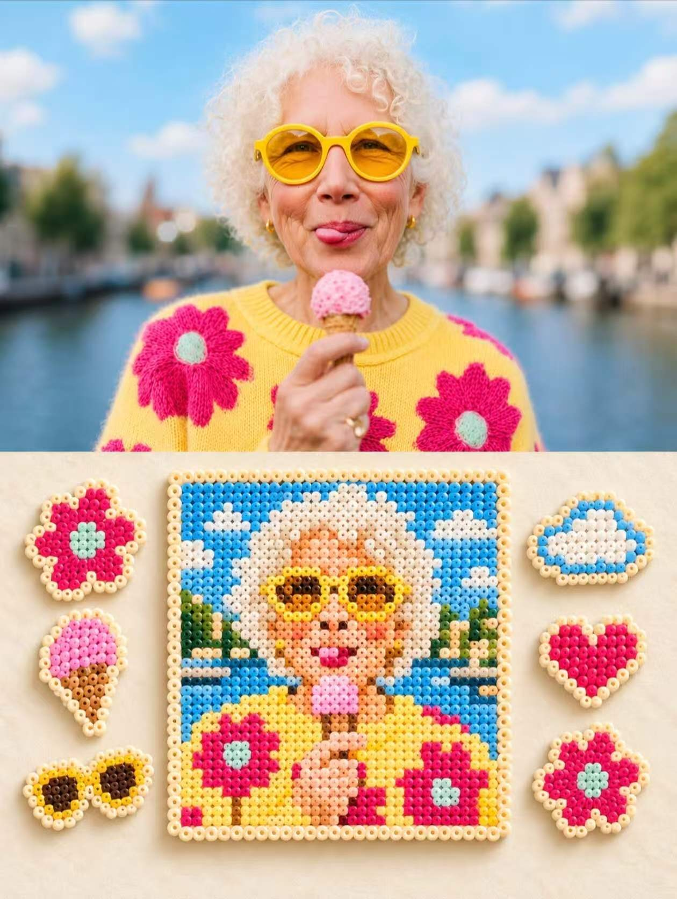
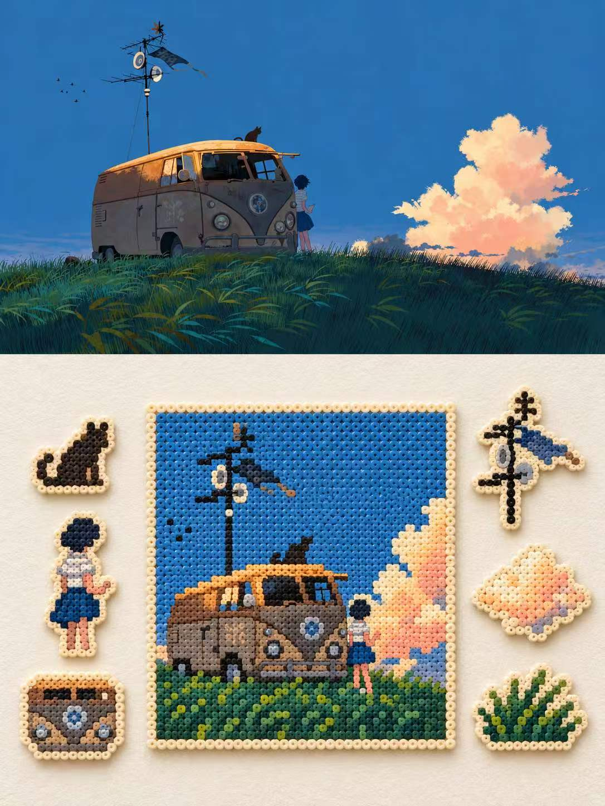

## 拼豆图

请以用户上传的每张照片为唯一视觉参考，分别生成一张独立3:4竖版设计海报，单张单出，不拼接、不合并。整张画布上下严格1:1分区，各占总高度50%，分界稳定清晰，任何一侧不得侵占另一半。
上半区完整使用对应原始照片，满版铺至边缘。保留原照中的人物或主体、五官、表情、动作、姿态、服装、配饰、物体、环境、构图、比例、透视、空间关系、真实材质、自然光影、景深和原有色彩，仅允许轻微高级摄影调色，使其具有艺术杂志或独立出版物质感。若比例不适配，可沿原有天空、地面或环境自然延展背景，但禁止拉伸、扭曲、重绘主体、改变身份、表情、动作、姿势或空间关系，也不得新增无关元素；上半区不加任何文字、图形、贴纸或装饰。
下半区使用温暖自然的米白色纹理纸，带细腻纸纤维、轻微颗粒和柔和漫反射光感，保持充足留白。所有内容必须来源于同一张原照，提取最重要的主体轮廓、人物关系、动作姿态、视觉中心、代表性色彩、背景符号、道具及标志性细节，再统一转译为真实手工Perler bead熔珠艺术。
下半区正中央放置一幅大号正方形熔珠作品，作为绝对视觉中心，将原照主要主体与核心构图转化为清晰可识别的像素艺术，保留关键轮廓、姿态、人物关系、颜色分区和代表性细节，不追求写实临摹。外围使用奶油白或暖米白熔珠边框。单颗圆形熔珠必须清晰可见，排列略带自然手作误差，表面有轻微熔化塑料高光、细小凹凸和不规则边缘，避免光滑数字插画或普通马赛克效果；整幅作品轻微悬浮于纸面，并投下柔软浅阴影。
中央作品左右两侧共放置6枚小型异形熔珠贴片，左3枚、右3枚，上下错落且平衡排列。每枚分别提取原照中的一个辨识度元素，如人物局部、服装、配饰、动作道具、背景物件、自然元素或环境符号。所有贴片使用奶油色描边，保留像素颗粒、轻微塑料质感和柔和投影，尺寸接近但轮廓随元素变化。整体采用“中央大主体＋左右六枚小元素”的层级构图，中央最大，周围更小，所有元素不贴边、不重叠、不拥挤。
整张海报完全禁止出现任何文字、英文、中文、数字、字母、标题、标签、Logo、水印、签名或类似字符。整体气质保持手工、极简、温柔、干净、真实、有收藏感，重点表现摄影、米白纸张与熔珠三种材质对比，避免过度卡通、塑料过亮、玩具感过强、像素过密、元素杂乱、贴片拥挤和上下比例失衡。

  

**参考图**

   
          
图1
   
   
          
图2
   
 

