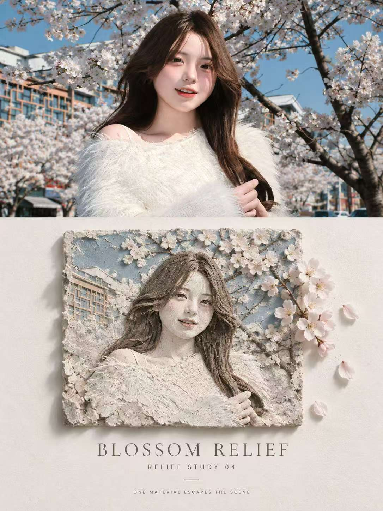
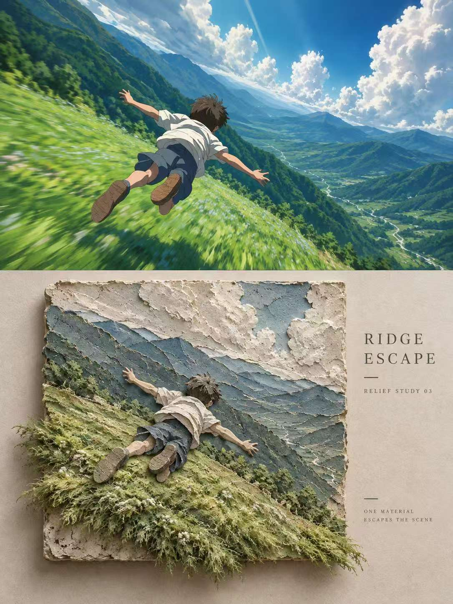

## 实体浮雕图

请将我上传的每一张照片分别、独立处理，为每张照片生成一张独立的高级设计海报。每张输入照片只输出一张完整成品，不得将多张照片拼接、合并、并置或共享同一套图文结构；必须逐张单独分析、单独转化。整体采用严格的 3:4 竖版构图，为“上下对比旅行转绘海报”结构，上半部分约占 40%–50%，下半部分约占 50%–60%，形成清晰、稳定、克制的上下对照。

上半区保留原始照片，忠实保持主体数量、人物或动物身份与姿态、道路与建筑结构、观察角度、空间透视、自然光影、真实材质和原有色彩氛围。仅允许轻微出版级调色，使其具有旅行杂志、独立出版物或展览摄影质感。不得把照片转成插画，不得替换地标，不得拉伸、扭曲、移动、重塑或改变主体；为适配画幅可自然延展天空、地面、水面或边缘环境，但不能破坏原场景逻辑。

下半区以同一张照片为唯一视觉依据，将场景提炼并重构为 可触摸的粗糙实体浮雕 / Relief Study。不要完整复制照片，而是从原图中提取最具识别度的建筑、道路、护栏、山脊、树冠、桌面、器物或其他关键结构，压缩为具有厚度、层次和前后关系的分层块体。允许调整主体坐标、裁切和信息密度，但必须保留原图最核心的结构走势与空间记忆，使人一眼能看出与上方照片的对应关系。

下半区底材可呈现为 石膏板、纸浆板、手工水泥、剖面景观墙或粗糙地形材料，必须有真实可见的颗粒、铲痕、压痕、缝隙、崩边、密度变化和接触遮挡。整体强调手工固体材料与浅浮雕厚度感，避免光滑塑料 3D、建筑沙盘感和过度精修的数字模型。

从原照片中只选择 一个具有叙事性的“逃逸元素”，例如海水、雨水、树根、藤蔓、道路边线、织物或建筑框架，让它从浮雕边缘、孔洞、底部或切面中自然延伸出来，约占画幅 5%–20%。它应保留自身真实材质特征，如反光、投影、颗粒、纤维或流动感，成为画面唯一的叙事突破口，不同时叠加多个逃逸元素。

色彩直接从上方照片提取，并压缩为 3–7 种哑光矿物色。保留原图最重要的综合色相与情绪记忆，转化为灰白、石灰色、沙色、青灰、陶土、矿蓝、鼠尾草绿、烟褐等克制的材料色。整体低饱和、哑光、自然，不做高饱和撞色、霓虹色或廉价糖果色。

下半区需保留充分留白与信息空场，浮雕主体不应铺满画面。整体更像一件被陈列在展页中的旅行记忆样本或材料实验，而不是完整风景复制。文字只做极少量编辑介入，可在留白处嵌入 RELIEF / RELIEF STUDY 01 / ONE MATERIAL ESCAPES THE SCENE 等少量标题或索引文字，字体纤细、现代、克制，不增加大段正文。

最终效果应呈现为：上半区记录真实旅行瞬间，下半区将同一场景压缩、凝固、剖开并转化为一件粗糙、可触摸的实体浮雕作品。整体气质安静、知性、克制，具有材料实验感、旅行档案感与展览海报气质。

负面提示词：多图拼接、网格、马赛克、左右分栏、上下比例错误、摄影区插画化、替换地标、主体变形、错误透视、完整复制原场景、细节堆砌、普通平面插画、平滑塑料 3D、泡沫模型感、材质过于光滑、没有颗粒与铲痕、没有厚度、多个逃逸元素、高饱和配色、霓虹色、商业海报感、复杂拼贴、卡通、动漫、AI 塑料感、文字过多、乱码、Logo、水印。

  

**参考图**

   
          
图1
   
   
          
图2
   
 

