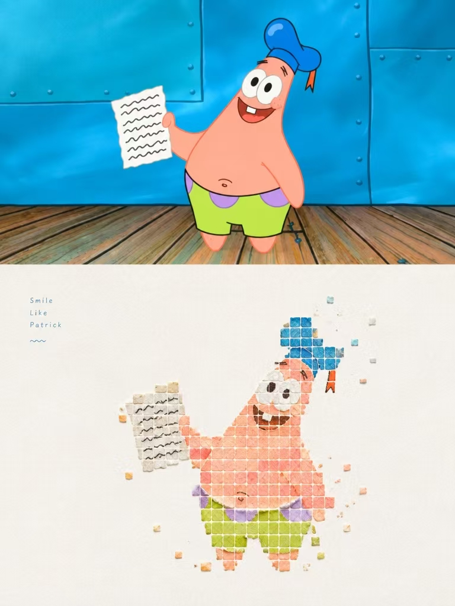
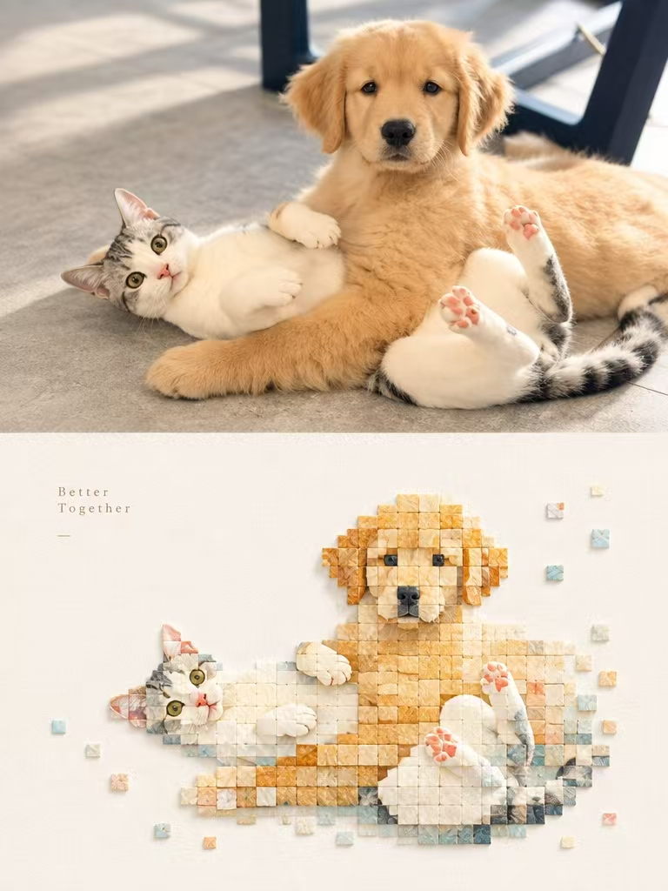

## 像素块图

每张原照独立制作一张海报，不做拼接。3:4竖版，上下两区高度严格1:1，各占画面50%。

上半区：保留原照主体身份、结构、姿态、真实质感、自然光影与色彩氛围，仅轻微高级调色，具艺术杂志与展览图像质感；可延展背景适配画幅，不拉伸扭曲改变主体。

下半区：先理解原照最具记忆点的主体、构图、透视、结构走势与气氛，再重构为材料拼贴感的极简像素景观。删去无关细节，只保留最能代表原物的结构与走势，用规则方块秩序与天然材料质感重新概括，一眼认出与上方照片对应。像素模块如粗粝贝壳、贝壳薄片或矿物壳层切割的小型方形碎片：保持几何网格秩序，边缘可略崩缺，表面带天然层理、粉质颗粒、轻微凹凸，哑光、自然、温和。主体核心区模块密集聚合，边缘逐步减少、缺失、断开、漂浮，向留白自然逸散。模块总量不超过200块，单块大小统一或接近，避免细碎噪点、标准马赛克、游戏像素感。

构图保持小尺度章印与大面积留白的关系，按主体方向、比例与视觉重心自由安排，可偏心、贴边、悬置或裁切；主体约占下半区30%–45%，其余留空。留白非空背景，是与正负形、疏密聚散、不对称平衡同等的构成元素；宁可删减信息也不填满画面，让主体像一枚安放于纸面的材料章印。

配色从原照提取最明亮鲜活、有生命力的颜色重新调制，不平均取色、不复制色值；适度提高明度纯净度通透感，由原图推出清澈天空蓝、湖水青、嫩绿、暖黄、珊瑚橙、桃粉等明快综合色，以清爽冷暖形成治愈节奏。以大量纯净暖白或与色温协调的极浅近白作呼吸空间，主色明亮不刺眼，局部暖橙、金黄、珊瑚红或柔粉点睛。保留贝壳天然色差与层理，避免变灰旧脏；杜绝灰脏、发旧、莫兰迪暗褐、阴郁大地色、荧光与廉价糖果感。

文字仅极少量编辑介入，不限语种，不预设标题编号；从主体、地点、动作、情绪或隐喻中提炼少量字词短句，安静置于留白或主体边缘，不喧宾夺主。

整体为天然材料拼贴、贝壳质感像素、规则几何秩序、渐进消隐、小尺度章印、大面积艺术留白与现代编辑排版的高级视觉，似当代材料艺术工作室重构海报；避免复制照片、复杂背景、真实细节、纯色色块、光滑矢量、塑料马赛克、强珠光、游戏UI、填满、过多文字和模板化效果。

  

**参考图**

   
          
图1
   
   
          
图2
   
 

