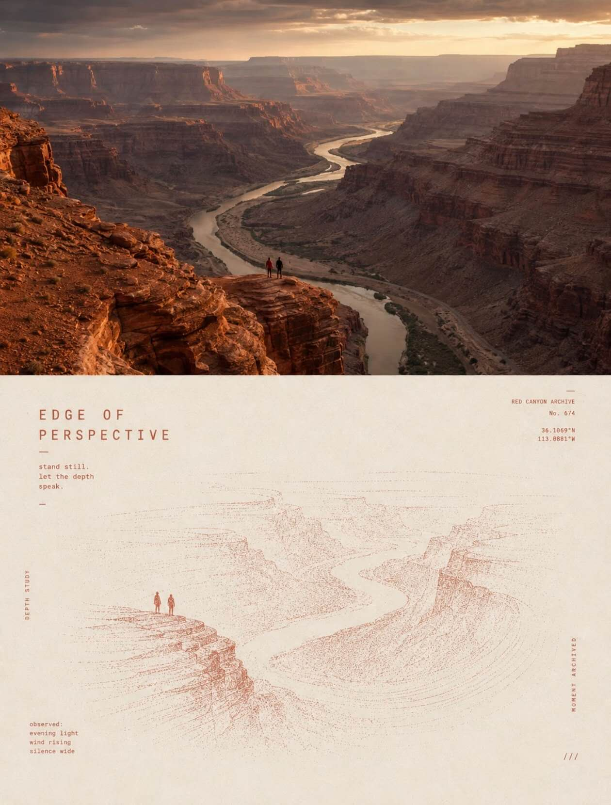
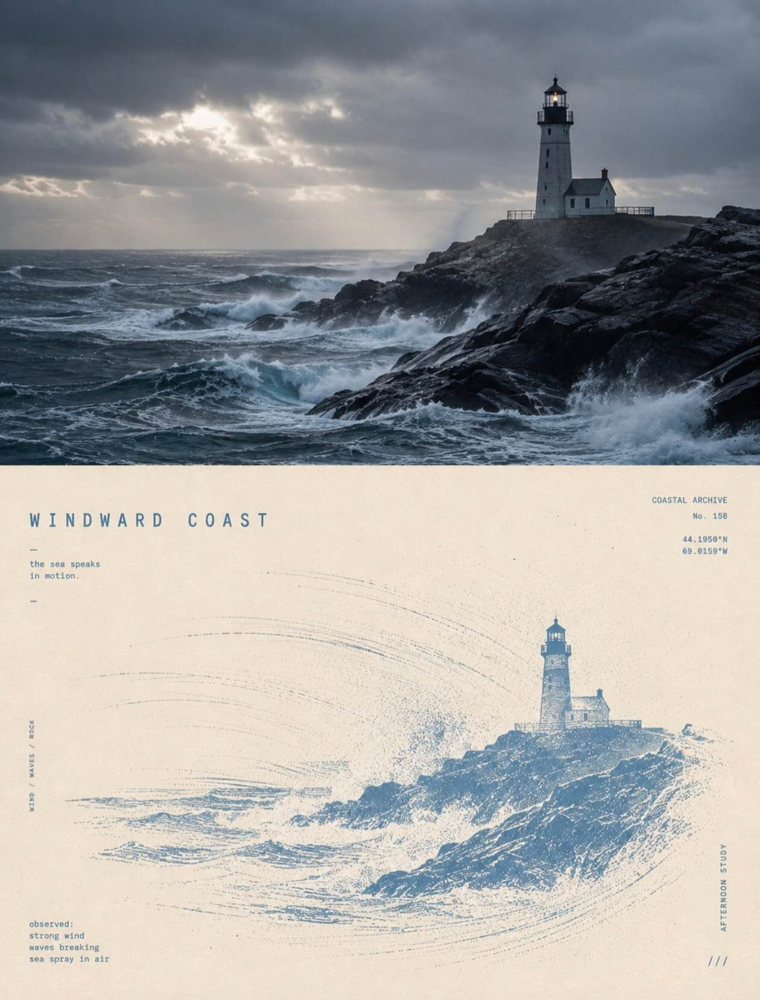

## 超现实极简版画

请将每一张上传照片分别、独立处理，为每张照片生成一张独立的高级设计海报。每张输入照片只输出一张成品，不得将多张照片拼接、合成、并置或共享同一套图文结构；每一张海报都必须只基于对应的那一张原始照片单独生成。整体统一采用 3:4 竖版构图，严格分为上下两个区域，上半部分与下半部分各占画面高度约 50%，上下比例保持 1:1，不设置明显分隔线，让两部分以安静、克制的方式自然衔接，形成“真实摄影”与“抽象转译”之间的清晰对照。

上半部分为原始照片展示区，必须尽可能忠实保留原图内容与摄影特征。主体的身份、结构、比例、姿态、朝向、空间关系、地形、建筑、植物、物体、透视、自然光线、阴影、景深、真实纹理以及原有色彩氛围均应保持不变。仅允许进行非常轻微且高级的摄影调色，使画面呈现出艺术杂志、独立出版物和展览摄影的质感，例如更统一的色调控制、适度压缩高光、略微降低杂色与杂乱感，并保持真实细腻的影调层次。为了适配竖版构图，可以对天空、地面或环境背景进行自然、无痕的轻微延展，也可以做合理裁切，但不得拉伸、扭曲、替换、移动或重绘主体，不得破坏原始照片的真实性与现场感。

下半部分以同一张照片为唯一视觉来源，将照片中最具识别性的主体、轮廓、姿态与叙事关系重新提炼并转化为一张超现实极简版画式海报。不要直接复制上半部分的复杂细节，而应主动删减、压缩、抽象与重组，只保留能够清晰辨认主题的核心视觉信息。主体通常应被处理为一个清晰、克制、尺度较小的视觉锚点，置于大面积留白之中，形成明显的尺度反差与孤独感。主体可以是人物、动物、植物、建筑、器物、交通工具，或自然景观中的关键形体；无论对象为何，都必须保留与原照片之间清晰可辨的身份呼应，使观者能够感受到上下两部分来自同一张图像，但下半部分必须是一种转译与再组织，而不是简单描边、缩小复制或加滤镜处理。

下半部分的核心不只是“一个主体”，还必须围绕主体建立一个具有方向性和情绪张力的动态场域。根据原图主体自身的动作、姿态、朝向、空间趋势或光影暗示，自然选择一种主要运动逻辑进行发展，例如由上而下的坠落感、沿纵向上升的牵引感、朝某一方向持续流动的推进感、由核心向外扩散的回响感，或不规则波纹般的振荡感。整张下半区只保留一种主要运动逻辑，不要同时叠加多种特效。动态场主要通过细线、断裂轨迹、粗粝网点、颗粒密度变化、局部压印感和空间中的留白节奏来构成。靠近主体核心的位置可以更密集、更有力量，向外则逐渐稀疏、破碎、减弱并最终消失在大面积留白中，形成一种安静但具有牵引力的空间关系。避免复杂图案、过多装饰和多重视觉中心，让“一个主体、一种运动、一个巨大空间关系”成为画面的绝对核心。

配色需从上方原始照片中提炼最有辨识度、最能代表整张照片精神气质的一个主色，并围绕这个主色建立严格克制的 2–3 色体系。除主色外，只可搭配暖白、象牙白、自然纸色以及少量黑色或接近黑色的深墨色。主色可以适度提纯与强化，使其在画面中具有辨识度和精神强度，但不得显得数码荧光化、商业海报化或高饱和失控。层次变化主要通过网点密度、墨色叠压、纸面留白和套印关系来实现，而不是使用光滑的数字渐变。整体质感应明确偏向丝网印刷、Risograph、实验版画和独立出版印刷物的方向，保留粗颗粒、纸张纤维、油墨覆盖不均、轻微错位套印和印刷边缘的自然误差，但控制在高级、克制、可设计化的范围内，避免低清、脏污、廉价或过度做旧。

文字部分建立一个克制而有设计感的实验艺术书式微排版系统。根据对应照片中的动作、距离、状态、情绪、氛围或潜在隐喻，为每一张海报分别提炼一个极短的英文标题，并搭配 2–4 组微型文字信息。文字内容可由短句、状态词、地点感描述、对象信息、序列号、坐标式数字、方向词、档案标签、观察注释或近似出版目录的片段构成，但必须与该照片的视觉线索相关，不得机械重复，不得所有海报共用相同文字，也不要直接照搬原图中已有的文字、Logo 或水印内容。画面内文字应自然参与构图与运动逻辑，可沿地平线、主体轴线、动态轨迹、留白边缘或隐含方向进行排列，也可以采用纵排、旋转、拉大字距、轻微错位、嵌入颗粒场或被细线轻微穿过的方式，使文字成为空间与节奏的一部分，而不是后贴上去的说明标签。整体排版应小而精、弱而准，具有实验编辑设计感，但不喧宾夺主。

整张海报的最终气质应呈现为：上半部分是真实、安静、细腻的摄影图像，下半部分是基于同一图像转译而来的极简、超现实、粗粝而诗性的抽象场域。整体强调极小主体、极大留白、强烈尺度反差、单一动态场和克制的实验排版，营造安静、孤独、神秘、诗意、略带超现实感的高级编辑视觉。无论原图内容为何，都必须在“真实摄影”与“抽象重构”之间保持清楚而高级的身份呼应，避免复杂场景并置、多重焦点、过量装饰、普通渐变、商业宣传海报感、模板化设计和泛滥的视觉特效。

负面提示词：多图拼接、多照片合成、共享同一套文字、上下比例错误、明显分隔线、主体被拉伸、主体变形、主体被替换、错误透视、错误结构、复杂场景堆叠、多重视觉中心、细节过满、留白不足、普通矢量插画、商业海报模板、社交媒体封面风、写实绘画、数字绘画、3D 渲染、CG 光效、镜头光斑、发光特效、金属质感、塑料质感、光滑数字渐变、普通滤镜、照片描边、卡通化、Q版、可爱风、漫画风、花哨拼贴、装饰元素泛滥、无意义排版、伪文字、密集小字、过量文案、Logo、水印、品牌标识、脏污纸面、破损旧纸、过度做旧、过重颗粒、低清晰度、廉价印刷感、复古噪点过强、模板感、商业广告感。

  

**参考图**

   
          
图1
   
   
          
图2
   
 

