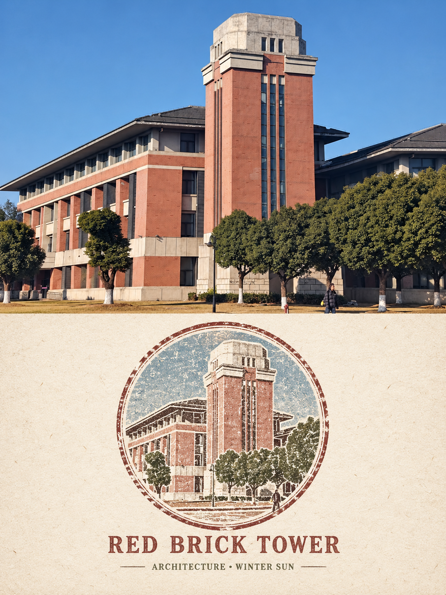
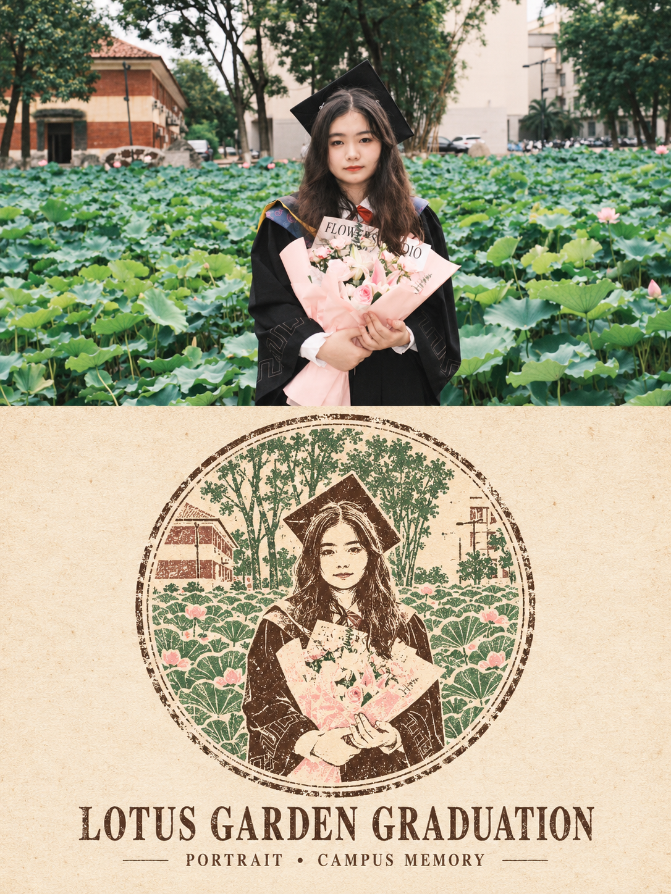

## 复古印章图

请将我上传的每一张照片分别、独立处理，为每张照片生成一张独立的竖版 3:4 复古纪念明信片风格海报。每张输入照片只输出一张完整成品，不得将多张照片拼接、合并、并置或共享同一套图文结构；必须逐张单独分析、单独转化。整张画布严格采用上下对半分的版式结构，上半区占画面高度约 50%，下半区占画面高度约 50%，比例不得偏移，形成清晰明确的上下分区关系，不改成左右分栏，也不做多格拼贴。

整张作品必须始终以对应上传照片为**唯一创作基础**。照片中所有人物、动物、植物、器物、建筑或其他可辨识主体的数量、身份、姿势、外形特征、相对位置、互动关系与场景逻辑都必须忠实保留，不得新增，也不得删除，不得替换，不得借用其他图像中的内容，不得改变原图的核心叙事关系。允许的改动仅限于版式适配、轻微调色以及下半部分的风格化转译，但不得篡改照片本身的信息来源和主体关系。

上半区为原始照片展示区，必须完整承接原照片的真实摄影质感，保留原图中的主体结构、构图关系、空间透视、真实材质、自然光影、色彩氛围和清晰细节。为了适配竖版明信片构图，可以进行合理、自然、无痕的横向或纵向裁切，也可以对天空、地面或非主体背景进行少量延展，但不得拉伸、扭曲、替换、移动、重绘或美化主体，不得改变主体数量、姿态和位置关系。上半区只允许进行非常轻微、克制的高级摄影调色与画面净化，使其更接近艺术杂志、独立出版物或展览摄影的质感，但原图内容本身不能被改写。

下半区必须以同一张上方照片为唯一依据，铺设温暖、柔和、略带岁月感的象牙白纸张底色，并将照片中最核心、最具识别度的主体提炼出来，再搭配 1–2 个最有辨识度的环境小元素，一并转译成一枚**居中摆放的圆形复古纪念印章**。下半区的重点不是复刻整张照片，而是从原图中筛选出最能代表场景和记忆点的核心视觉信息，通过高度概括和图形化处理，形成一枚清晰、集中、具有纪念性和收藏感的老式旅行印章。主体必须一眼能与上半区原照对应，观者能够明确识别这是对同一张照片内容的复古印章式转写，而不是脱离原图的自由创作。

下半区的印章必须严格采用**手工木刻橡皮章 + 蚀刻版画**的视觉语言来表现。画面需要使用粗细不均、带有自然磨损毛边、局部断续、略有刀刻感和手工不完美感的线条来概括形体。写实细节需要被显著简化和压缩，但主体轮廓、动作姿态、外形特征和关键识别点必须被准确保留，不能因为过度概括而失去辨识度。环境小元素也应以同样语言处理，只保留最必要的 1–2 个，用于辅助说明场景身份、地点感或空间线索，避免堆砌细节，避免下半区过满。整体应更像一枚经过人工雕刻、反复使用后留下痕迹的纪念印章，而不是现代平滑图标、精确矢量标志或数字插画。

印章配色必须从上方原始照片中直接提取 2–3 种最具代表性的主色调，再将这些颜色转化为略微褪色、具有旧印泥感的复古色彩体系。可优先落在砖红、赭石、姜黄、橄榄绿、深棕、暗酒红、旧蓝灰、褪色森林绿等老式印章常见色域中，但颜色选择必须与原图本身的综合色彩气氛相呼应，而不是套用固定色卡。下半区应真实呈现盖印时墨色浓淡不均、压力不一致、局部轻微漏印、纸面透白、套色之间轻微偏移、边缘略有脱墨和细部断裂的自然手工痕迹，使其看起来像真实印泥盖在纸上的结果，而不是电脑生成的完美平涂。颜色要温暖、克制、复古、统一，有时间感但不脏污，不可过艳、过亮或过分现代。

纸张底材应明确表现为温暖象牙白、略带轻微旧化感的纸面，具有真实可见但不过分夸张的纸纤维、细腻颗粒与柔和纸张纹理。整体纸面应显得干净、安静、有收藏感，可以带一点年代感和手账纸品感，但不能过分发黄、破损、污渍化，也不要做成烧边、咖啡渍、霉斑或严重破旧的旧纸效果。整体气质应更接近 20 世纪中期的旅行手账、户外自然观察笔记、老式纪念明信片或收藏印刷品，而不是夸张仿古做旧海报。

下半区的版式需要为文字预留出克制而明确的排版空间。在圆形印章下方，应预留一行英文大标题的位置；大标题下方再预留一行小号关键词或短信息的位置。文字区的存在是版式的一部分，应与印章共同形成稳定、居中、经典的明信片式结构。若可以生成清晰、自然、正确的英文标题和关键词，则可使用极简、复古、印刷感较强的排版风格进行呈现；但如果无法稳定生成准确文字，则**宁可保留干净空白区域，也不要输出乱码、错字、无意义字符或伪文字**。文字必须宁缺毋滥，绝不允许因为排版需要而出现错误英文、破碎字形或难以阅读的假文字。

整体氛围应明确指向 **20 世纪中期老式旅行手账、户外自然观察笔记、盖有纪念邮戳的旧明信片** 这一方向。整张作品需要温暖、怀旧、安静、克制、有收藏感与时间感，同时具备一定的编辑设计完成度。上半区是真实、细腻、未经篡改的旅行摄影，下半区则是对同一场景进行高度提炼后的复古印章式纪念转译，两部分在主题上必须明确呼应，在气质上则形成“真实记录 / 纪念印记”的对照关系。整张画面应简洁、稳定、具有中期印刷品的雅致气息，而不是热闹拼贴、装饰堆积或泛滥手账元素。

负面提示词：多图拼接、多照片合成、左右分栏布局、主体数量改变、主体被替换、增减原照片人物或动物、错误姿态、错误互动关系、透视错误、复杂细节照搬、环境元素过多、现代光滑矢量、扁平图标风、二次元动漫、水彩晕染、油画厚涂、3D 渲染、塑料质感、亮面图标、现代 UI 风格、卡通化、Q版、廉价手账拼贴、装饰过量、多枚印章堆砌、邮票堆满、票据杂乱、过度做旧、烧边、咖啡渍、脏污旧纸、过深发黄、墨色过脏、霓虹色、高饱和撞色、错误英文、乱码、伪文字、无意义字符、水印、Logo、平台播放按钮、中文字幕、二维码、粗黑边框、低清晰度、模糊、压缩痕迹。

  

**参考图**

   
          
图1
   
   
          
图2
   
 

